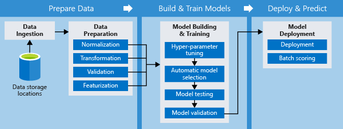

# MLOps, Enterprise Readiness and Security

[1. Enterprise challenges in ML](#1-enterprise-challenges-in-ml)

[2. MLOps (Machine Learning Operations)](#2-mlops-machine-learning-operations)

- [2.1. MLOps and traditional DevOps application CI/CD pipelines](#21-mlops-and-traditional-devops-application-cicd-pipelines)
  - [2.1.1. Azure DevOps pipelines](#211-azure-devops-pipelines)
  - [2.1.2. Azure Machine Learning pipelines](#212-azure-machine-learning-pipelines)
  - [2.1.3. MLFlow](#213-mlflow)
  - [2.1.4. Kubeflow](#214-kubeflow)
  - [2.1.5. Github Actions](#215-github-actions)
  
- [2.2. Model management](#22-model-management)

- [2.3. Post-deployment monitoring and management tasks](#23-post-deployment-monitoring-and-management-tasks)

  - [2.3.1. Model data collection](#231-model-data-collection)
  - [2.3.2. Application Insights integration](#232-application-insights-integration)
  - [2.3.3. Monitoring a deployed model's collected data and telemetry](#233-monitoring-a-deployed-models-collected-data-and-telemetry)
  
- [2.4. Executing an end-to-end DevOps pipeline with Azure Machine Learning and Azure DevOps](#24-executing-an-end-to-end-devops-pipeline-with-azure-machine-learning-and-azure-devops)

[3. Enterprise Security](#3-enterprise-security)

- [3.1. Overview](#31-overview)

- [3.2. Authentication](#32-authentication)

- [3.3. Authorization](#33-authorization)

- [3.4. Network security](#34-network-security)

  - [3.4.1. Virtual networks](#341-virtual-networks)
  - [3.4.2. Private link](#342-private-link)

- [3.5. Data encryption](#35-data-encryption)

  - [3.5.1. Encryption at rest](#351-encryption-at-rest)
  - [3.5.2. Encryption in transit](#352-encryption-in-transit)
  - [3.5.3. Azure KeyVault](#353-azure-keyvault)

- [3.6. Data collection and handling](#36-data-collection-and-handling)

  - [3.6.1. Data collected by Microsoft](#361-data-collected-by-microsoft)
  - [3.6.2. Data generated by Microsoft](#362-data-generated-by-microsoft)

- [3.7. Monitoring](#37-monitoring)

  - [3.7.1. Azure Monitor metrics](#371-azure-monitor-metrics)
  - [3.7.2. Workspace Activity Log](#372-workspace-activity-log)

- [3.8. Differential privacy](#38-differential-privacy)

- [3.9. Confidential computing](#39-confidential-computing)

[4. Enterprise Governance](#4-enterprise-governance)

- [4.1. Roles and responsibilities](#41-roles-and-responsibilities)

- [4.2 Processes](#42-processes)

  - [4.2.1. Technical development, implementation, and use](#421-technical-development-implementation-and-use)
  - [4.2.2. Human Resources Management](#422-human-resources-management)
  - [4.2.3. Risk Management](#423-risk-management)
  - [4.2.4. Responsible AI Monitoring](#424-responsible-ai-monitoring)
  - [4.2.5. Security Management](#425-security-management)

## 1. Enterprise challenges in ML

Traditional software development processes have posed several categories of challenges to enterprise, among which the most important ones are grouped in the following areas:

- Execute the process
- Secure the process
- Govern the process

With ML development projects becoming ubiquitous, these categories of challenges get additional problems derived from the special nature of the ML development process. Perhaps the most important source of these additional problems is the duality code + data that is specific to ML and has not traditionally been encountered in traditional software development.

Some of the challenges in executing the process include:

- Versioning for both data and code - the source code of the model training process has limited value if it's not also accompanied by the dataset or datasets that were used to create the trained model
- Extensive quality checks on trained models - interoperability, fairness, accuracy, and the like.
- Extensive quality checks on deployed models - detecting data drift, monitoring, logging, and the like.
- Ensuring full traceability, from the result of an inference created in a production environment all the way back to the source code and training data sets used to build a model in the first place.

Some of the challenges in securing the process include:

- Identity management across multiple, heterogeneous systems (e.g. development environment, production environment, various managed ML services, data sources, etc.).
- Controlling access at every step of the lifecycle.
- Securing the complex infrastructure required to develop and operate ML models.
- Handling privacy, encryption, and confidentiality while still using as much data as possible to develop and operate ML models.
- Monitoring, detecting, and reacting to security threats or vulnerabilities.

Finally, some of the challenges in governing the process include:

- Defining roles
- Managing all processes
- Establishing clear responsibilities

## 2. MLOps (Machine Learning Operations)

DevOps has become ubiquitous in the world of classical development. Almost all projects that exceed a certain level of complexity become inevitably DevOps projects. Yet, there is one category of projects that are stepping out of the line. You’ve guessed it right, it’s the category of Data Science projects.

When it comes to DevOps, Data Science projects pose a range of unique challenges, whether it’s about the technical side of things, the philosophy of the people involved, or the actors involved. Think about a straightforward example: versioning. While in a “classical” development project, versioning refers almost exclusively to source code, in the world of data science, it gets another vital aspect: data versioning. It’s not enough to know the version of the code for your model, it’s equally important to know the “version” of the data it was trained on. Another interesting question is, for example, what does a “build” mean in the world of data science? Or a “release”?

This section is dedicated to the topic of MLOps, which is basically the discipline that deals with the application of “classical” DevOps principles to projects that have at least one data science component. As the title implies, MLOps is `DevOps for AI`.


MLOps empowers data scientists and machine learning engineers to bring together their knowledge and skills to simplify the process of going from model development to release/deployment. ML Ops enables you to track, version, test, certify and reuse assets in every part of the machine learning lifecycle and provides orchestration services to streamline managing this lifecycle. This allows practitioners to automate the end-to-end machine learning lifecycle to frequently update models, test new models, and continuously roll out new ML models alongside your other applications and services.

Please also check the [MLOpsPython Git repo](https://github.com/microsoft/MLOpsPython) for a reference architecture on MLOps with Azure ML, which will help you understand how to build a Continuous Integration and Continuous Delivery pipeline for an ML/AI project.

Another good reference on the subject is this [Microsoft Cloud Workshop on MLOps with Azure ML](https://github.com/microsoft/MCW-ML-Ops), which is a practical example of how to design and implement end-to-end solutions that fully operationalize deep learning models, inclusive of all application components that depend on the model.

### **2.1. MLOps and traditional DevOps application CI/CD pipelines**

When it comes to DevOps principles, any non-trivial project that includes a data science component will need to take advantage of a combination of features from the following two major platforms:

- [Azure Machine Learning service](https://azure.microsoft.com/services/machine-learning-service/)
- [Azure DevOps](https://azure.microsoft.com/services/devops)

The official definition of **Azure Machine Learning service** is:

> *Azure Machine Learning service provides a cloud-based environment you can use to prep data, train, test, deploy, manage, and track machine learning models. Start training on your local machine and then scale out to the cloud. The service fully supports open-source technologies such as PyTorch, TensorFlow, and scikit-learn and can be used for any kind of machine learning, from classical ml to deep learning, supervised, and unsupervised learning.*

The official definition of **Azure DevOps** is:

> *Azure DevOps provides developer services to support teams to plan work, collaborate on code development, and build and deploy applications. Developers can work in the cloud using Azure DevOps Services or on-premises using Azure DevOps Server, formerly named Visual Studio Team Foundation Server (TFS).*

The DevOps mindset applied to data science solutions is commonly referred to as Machine Learning Operations (MLOps). The most essential aspects of MLOps are:

- Deploying Machine Learning projects from anywhere
- Monitoring ML solutions for both generic and ML-specific operational issues
- Capturing all data that is necessary for full traceability in the ML lifecycle
- Automating the end-to-end ML lifecycle using a combination of Azure Machine Learning service and Azure DevOps

#### Two complementary platforms

If you plan on implementing an end-to-end DevOps approach for your project, you will need to use both platforms (Azure Machine Learning service and Azure DevOps). Although Azure DevOps is a native, all-purpose DevOps platform, it lacks specific features required in data science projects. At the same time, Azure Machine Learning service is a native, all-purpose Data Science platform, but it does not have some of the core DevOps features you will most certainly need.

Because of the particular DevOps-type needs that data science projects have, the Azure Machine Learning service has started to provide DevOps-like services centered around the concept of ML Pipelines and model management. ML Pipelines provide the backend for data scientists, data engineers, and IT professionals to collaborate on specific tasks like data preparation (e.g., transformation, normalization), model training and evaluation, and deployment. Because of the term `pipelines`, one might get the sense that ML Pipelines are somewhat of a competitor to Azure DevOps pipelines. In fact, the two of them are designed to work together, and their functionalities are complementary.

Next, we will explore the relationships between the various features of the Azure Machine Learning service and Azure DevOps.

#### Feature comparison

The following table provides details about how the most important MLOps concepts are interpreted by the Azure Machine Learning service and Azure DevOps.

MLOps concept | Azure Machine Learning service | Azure DevOps | Primary Choice
--- | --- | --- | ---
Boards | Not supported | Provides a set of services that enable you to plan, track, and discuss work across different teams involved in the project. | Azure DevOps
Code Repos | Not Supported | Provides a set of services that enable you to work with Git repositories, and collaborate using advanced file management and pull requests. Integrates with boards, enabling you to link source code, branches, and pull requests with work items. | Azure DevOps
Artifacts Management | Provides extensive support for managing machine learning-specific artifacts like experiments, runs, models, compute resources, models, images, deployments, and activities. It can also handle various by-products of the ML processes like outputs, logs, images, performance metrics, and many more. | Provides generic support for build artifacts management as well as services for storing Maven, npm, NuGet, and Python packages together. | Azure Machine Learning service (Azure DevOps will be used to handle artifacts required by the CI/CD pipelines).
Pipelines | Provides services geared towards data preparation, model training and evaluation, and deployment. Enables optimization of ML workflows with simplicity, speed, portability, and reuse. It also enables explicit naming and versioning of data sources, inputs, and outputs. | Provides support for generic, all-purpose Continuous Integration / Continuous Delivery pipelines for building, testing, and deploying solutions. Works with any code repo provider, any language, any platform, and any cloud. | Azure DevOps (for high-level orchestration, coordination, build, and release using a CI/CD approach). Specific steps from the Azure DevOps CI/CD pipelines call into Azure Machine Learning service through the Python SDK (includes the launch of ML pipelines driven by the Azure Machine Learning service).
Data Versioning | Provides support through Azure ML Datasets. | Not supported | Azure Machine Learning service
Model Training, Deployment, and Monitoring | Provides extensive support for registering, tracking, packaging, debugging, validating, profiling, converting, and using ML models. Provides support for understanding what data is sent to the model and what predictions it returns. | Not supported | Azure Machine Learning service

Looking at this table, it is easy to observe the complementary nature of Azure Machine Learning service and Azure DevOps in the context of MLOps. Furthermore, the integration between the two is simplified by the [Azure Machine Learning extension](https://marketplace.visualstudio.com/items?itemName=ms-air-aiagility.vss-services-azureml) from Azure DevOps, which enables the following:

- Azure Machine Learning workspace selection when defining a service connection in Azure DevOps
- Azure DevOps release pipeline triggering by a trained model created in a training pipeline

#### A typical scenario

The typical scenario is defined by the following:

- Uses a combination of Azure DevOps and Azure Machine Learning service
- Azure Machine Learning Datasets help track and version data
- Azure Machine Learning experiments and runs manage code, data, and compute used to train a model
- Azure Machine Learning model registry captures all the metadata around models
- Azure DevOps Boards are used to manage the agile development process
- Azure DevOps Code Repos are used to manage all source code, including code that controls and interacts with the Azure Machine Learning service (through the Python SDK)
- Azure DevOps release and build pipelines are used to implement the high-level processes. In turn, they rely on the Python SDK to interact with ML pipelines from the Azure Machine Learning service
- When a data scientist checks in code into the repo, an Azure DevOps pipeline will start a training run. The results will be then inspected to assess the performance characteristics of the trained model. If the newly trained model passes the quality checks, a different (release) pipeline will be triggered to deploy the model as a service.

#### 2.1.1. Azure DevOps Pipelines

Azure DevOps provides developer services to support teams to plan work, collaborate on code development, and build and deploy applications. Developers can work in the cloud using Azure DevOps Services or on-premises using Azure DevOps Server, formerly named Visual Studio Team Foundation Server (TFS).

##### Why Use Azure DevOps?

- It is perfect for turning your idea into a piece of Software.
- Helps you plan your solution with Agile Tools
- Enables source code management using Git and other first-class source control systems
- Deploys your solution to Cross-Platform CI/CD-enabled systems
- Provides full traceability and visibility across your entire solution development lifecycle.

##### Create a Project

To start a new Project in [Azure DevOps](http://dev.azure.com) , click on the **+ New project** button.


Once the project is created, you will be able to manage **Your project**, **Boards**, **Repositories**, **Pipeline**, **Test Plans**, **Artifacts**, and all your **Project Settings** from your DevOps Project screen.


##### Overview

In the **Overview** tab, you will see a summary of your project, project stats, and participating members on the team.

From the **Dashboards** sub-tab, you will be able to generate screens that utilize widgets to drag and drop into your dashboards to make it easy to oversee your project's health and progress.


On the **Wiki** sub-tab, you will be able to create a **Wiki repository** for your project to share information with the rest of your team regarding the project, where markdown is supported.

##### Boards

You can use **Azure Boards** to display Kanban boards to plan and check your entire release. You will be able to create sprints and move work items from different states until completion and release of your product.

In **Backlogs**, you will be able to drag and drop your items to the desired sprint and monitor all your backlog items in the system that are yet to be completed.

In **Sprints**, you will be able to track your progress on the **TaskBoard** and move items from one sprint to another easily. You can even create **Branches** right from the board, if need be.

In **Queries**, this is where you would create your favorite queries about a group of items in the project's work items to quickly execute them in the future.


##### Repos


**Repos** in Azure DevOps are extremely important to manage your project files and source control, whether you are using a centralized source control or Distributed source control (like Git)

The **Files** sub-tab will allow you to view the files and structure of your repository and make changes if desired.


**Commits** allows you to see how all your branches come together.


**Pushes** give you a historical view of all the changes made to the remote repository.

**Branches** will enable to view all the branches and see if they are ahead or behind master.

**Tags** will allow you to view all the Tags created for the project and even create new ones.

**Pull Requests** will allow you to review and participate in **Pull Requests** in the project. You can also create policies to fire up a build automatically based on a pull request.

##### Azure Pipelines

Azure DevOps Pipelines is a rich Cross-Platform CI/CD system capable of building any language targeting any platform.

From the **Summary** page, you will be able to review commits, test results, and perform many actions on your project. The **Deployment** section in the summary will show you where in the release your project is currently.

The real power of Azure Pipelines starts manifesting itself when you get to the **Build** edit screen.

Azure Pipelines can pull your code from the most popular source control systems.


Azure Pipelines also offer hosted Windows, Mac, and Linux operating build agents.

On the **Releases** sub-tab, you will be able to create a new pipeline where you can start with an empty job or drag and drop a featured deployment pipeline from the many templates available in Azure Pipelines.


You are able to deploy to any platform with Releases on Mac, Linux, and Windows using their respective OS agents. With the integration with App Center, you can also deploy directly to mobile as well.

You can create a pipeline by adding Stages and Artifacts.


You can pull the Artifacts from several sources, for example, Jenkins...


For **Stages**, you have a wide variety of **Tasks** to choose from by a simple drag and drop to run on **Agents**.


##### Artifacts

Artifacts allow you to apply the same DevOps best practices to the packages you develop and maintain.

The reality of the great features of Azure DevOps is that you can use them in conjunction with AI & Machine Learning. You can use all the features, whether Projects, Boards, Repositories, Pipelines, Test Plans, or Artifacts, to effectively be on top of your ML project, your models, and your notebooks deployments, and web services.

#### 2.1.2. Azure Machine Learning pipelines

Machine Learning pipelines are cyclical and iterative in nature that facilitate continuous improvement of model performance, model deployment, and making inferences on the best performing model to date. The pipelines comprise distinct steps, such as data preparation, model training, and batch predictions. Data scientists, data engineers, and IT professionals need to collaborate on building robust, scalable, and reusable machine learning pipelines.

The following diagram shows an example pipeline:



The [Azure Machine Learning SDK for Python](https://docs.microsoft.com/python/api/azureml-pipeline-core/?view=azure-ml-py) allows you to create ML pipelines and also submit and track individual pipeline runs. You can build reusable pipelines that optimize your specific workflows and enable you to focus on your expertise, for example, machine learning, instead of the infrastructure to build and manage the pipelines.

The purpose of this article to show how to build an example machine learning pipeline workflow that includes repeatable data preparation, model training, and batch predictions using the Azure Machine Learning SDK for Python within Azure notebooks.

##### Create a New Notebook in Azure Notebooks

One of the ways to use the Azure Machine Learning SDK for Python is with Azure notebooks. In the introduction, we saw how to get started with Azure notebooks. Here we will show how to create a new notebook to get started.

In Azure notebooks, you can add a new notebook **(1)** and attach it to a compute node **(2)** to start writing Python **(3)** code.


Now you are ready to write your code in the notebook.

##### Create AML Compute Cluster

Azure Machine Learning Compute is a service for provisioning and managing clusters of Azure virtual machines for running machine learning workloads. In the introduction, we saw how to create an Azure Machine Learning workspace in your subscription. The following steps create a new Aml Compute in the workspace if it doesn't already exist. This compute target will be used to run all the pipelines.

```python
from azureml.core.compute import AmlCompute
from azureml.core.compute import ComputeTarget
from azureml.core.compute_target import ComputeTargetException

aml_compute_target = "aml-compute"

try:
    # Look to see if the compute target already available in the workspace (ws)
    aml_compute = AmlCompute(ws, aml_compute_target)
    print("found existing compute target.")
except ComputeTargetException:
    print("creating new compute target")
    provisioning_config = AmlCompute.provisioning_configuration(vm_size = "STANDARD_D2_V2",
                                                                min_nodes = 1, 
                                                                max_nodes = 1)    
    aml_compute = ComputeTarget.create(ws, aml_compute_target, provisioning_config)
    aml_compute.wait_for_completion(show_output=True, min_node_count=None, timeout_in_minutes=20)
```

##### Create the Run Configuration

Run configuration defines the environment needed to run the pipelines on the above created compute target. In this example, we will be using the numpy, pandas, and the scikit-learn libraries for data preparation, modeling training, and batch prediction tasks. These required libraries are included in the environment as application dependencies.

```python
from azureml.core.runconfig import RunConfiguration
from azureml.core.conda_dependencies import CondaDependencies
from azureml.core.runconfig import DEFAULT_CPU_IMAGE

# Create a new runconfig object
run_amlcompute = RunConfiguration()

# Use the cpu_cluster you created above
run_amlcompute.target = aml_compute_target

# Enable Docker
run_amlcompute.environment.docker.enabled = True

# Set Docker base image to the default CPU-based image
run_amlcompute.environment.docker.base_image = DEFAULT_CPU_IMAGE

# Use conda_dependencies.yml to create a conda environment in the Docker image for execution
run_amlcompute.environment.python.user_managed_dependencies = False

# Auto-prepare the Docker image when used for execution (if it is not already prepared)
run_amlcompute.auto_prepare_environment = True

# Specify CondaDependencies obj, add necessary packages
run_amlcompute.environment.python.conda_dependencies = CondaDependencies.create(pip_packages=[
    'numpy',
    'pandas',
    'scikit-learn',
    'sklearn_pandas'
])
```

##### Creating a Pipeline for Repeatable Data Prep and Model Training

In this section, we will describe how to use the Azure notebooks to build repeatable data preparation and model training pipeline with explicit dependency between the two pipeline steps.

##### Create Data Preparation Pipeline Step

In the data preparation pipeline step, we take the raw input data, process the input data, and output the processed data that will be used in the model training step.


##### Create a DataReference for the raw input data

Assuming that you have uploaded the raw input data file('s) to the default datastore in your workspace. You can first get the default datastore associated with the workspace. Then create a DataReference for the raw input data by specifying the path of the raw input data file('s) in the datastore. You will pass this DataReference as input to your Data Prep Pipeline step.

```python
from azureml.data.data_reference import DataReference

# Get reference to the default data store in your workspace
def_blob_store = ws.get_default_datastore()

# Create a DataReference to the raw data input file
raw_data = DataReference(datastore=def_blob_store, 
                                      data_reference_name="raw_data", 
                                      path_on_datastore=".../...")
```

##### Create a PipelineData object for the processed data

The intermediate data (or output of a Step) is represented by the PipelineData object. PipelineData can be produced by one step and consumed in another step by providing the PipelineData object as an output of one step and the input of one or more steps. Thus, to save the processed data/output from the Data Prep Pipeline step, you need to create a PipelineData object. We will use the default datastore to save the processed data.

```python
from azureml.pipeline.core import PipelineData

# Create the PipelineData object to host the processed data
processed_data = PipelineData('processed_data', datastore=def_blob_store)
```

#### Create the Data Prep Pipeline Step object

In this example, we will create a PythonScriptStep object that will run the code in the specified python script file as part of the Data Prep Pipeline Step execution. Your script, `process.py`, can define custom input parameters, such as `process_mode` that is unique to your needs. In this example, since the Data Prep pipeline step will be used to process input data at both training and inference time, the script file expects a custom input parameter named `process_mode` to distinguish the context in which it is called. We will look at the code to create the pipeline step, followed by an example python script file that will be used in the step.

Here are some key parameters used to create the pipeline step:

- The `source_directory` is the path to the python file `process.py`
- The script takes three arguments as inputs: process_mode: 'train' or 'inference', input location, and output location
- This step is created to be used in the **Data Prep - Model Train** pipeline, thus process_mode is set to `train`
- `inputs` specify the DataReference object where the raw input file(s) are available
- `outputs` takes the PipelineData object to save the intermediate processed data generated as part of this step
- Specify the compute target and run the configuration

```python
from azureml.pipeline.steps import PythonScriptStep

# Create the Data Prep Pipeline Step Object
dataPrepStep = PythonScriptStep(
    name="process_data",
    source_directory="...",
    script_name="process.py", 
    arguments=["--process_mode", 'train',
               "--input", raw_data,
               "--output", processed_data],
    inputs=[raw_data],
    outputs=[processed_data],
    compute_target=aml_compute,
    runconfig=run_amlcompute
)
```

Next, we will look at an example for the Data Prep python script file `process.py`

```python
import argparse
import os
import pandas as pd
import numpy as np

print("In process.py")

parser = argparse.ArgumentParser("process")
parser.add_argument("--process_mode", type=str, help="process mode: train or inference")
parser.add_argument("--input", type=str, help="input raw data")
parser.add_argument("--output", type=str, help="output directory for processed data")

args = parser.parse_args()

print("Argument 1: %s" % args.process_mode)
print("Argument 2: %s" % args.input)
print("Argument 3: %s" % args.output)

# Load the raw input data csv file in a pandas data frame
data = pd.read_csv(args.input)

# Process the raw input data based on the process_mode parameter
if(args.process_mode == 'train'):
    ...
elif(args.process_mode == 'inference'):
    # raw data at inference time will not include labels / target values
    ...
else:
    print('Invalid process_mode!')
    
# Save the processed data in the output folder
os.makedirs(args.output, exist_ok=True)
data.to_csv(os.path.join(args.output, "processed-data.csv"), header=True, index=False)
print('Processed data file saved!')
```

##### Create Model Training Pipeline Step

In the model training pipeline step, we take the `processed_data` PipelineData as input and save the trained model in another PipelineData object named `trained_model`:

```python
trained_model = PipelineData('trained_model', datastore=def_blob_store)

trainStep = PythonScriptStep(
    name="train",
    source_directory="...",
    script_name="train.py", 
    arguments=["--input", processed_data, "--output", trained_model],
    inputs=[processed_train_data],
    outputs=[trained_model],
    compute_target=aml_compute,
    runconfig=run_amlcompute
)
```

The training script file `train.py` includes the code to take the processed data from the Data Prep pipeline step, train the model, and save the trained model in the datastore.

##### Create and Run the Data Prep - Model Training Pipeline

In the preceding sections, we created two pipeline step objects - `Data Prep` and `Model Training`. Next, we will look at creating a pipeline, creating an experiment, submitting the pipeline run, and monitoring the pipeline run. Note that there is an implicit data dependency between the Data Prep and Model Training pipeline steps. The Model Training depends on the output from the Data Prep step. Thus, when we create the pipeline object, we only use the Model Training pipeline step. When you submit the pipeline run, it will resolve the dependency by first running the Data Prep step followed by the Model Training step.

```python
from azureml.pipeline.core import Pipeline
from azureml.core import Experiment
from azureml.widgets import RunDetails

# Create the pipeline object
pipeline = Pipeline(workspace=ws, steps=[trainStep])
print ("Pipeline is built")

# Validate the pipeline
pipeline.validate()
print("Simple validation complete")

# Create an experiment and submit the pipeline run
experiment_name = 'Sample-ML-Pipeline'
pipeline_run = Experiment(ws, experiment_name).submit(pipeline)
print("Pipeline is submitted for execution")

# Monitor the pipeline run
RunDetails(pipeline_run).show()
```

The RunDetails show the different steps of the pipelines. You can click the link to Azure Machine Learning Portal to see their execution status and a visual of the implicit order and dependencies between different pipeline steps.

   

   

Note that as new training data is available, you can reuse the pipeline steps to train a new model with the new data to improve model performance.

##### Creating a pipeline for repeatable data prep and batch scoring

In this section, we will learn how to set up a `Batch Scoring` pipeline that leverages the data processing logic encapsulated in `process.py`, and uses the trained model from the `Data Prep – Model Training` pipeline to generate batch predictions on new input data.

The **Batch Scoring** pipeline comprises of two steps:

- **Data Prep Pipeline Step**: process the new batch input data

- **Inference Pipeline Step**: make inferences on the newly processed data using the trained model from the `Data Prep – Model Training` pipeline

Thus the `Inference` step has implicit data dependencies on the output from the new instance of the `Data Prep` step and the output from the previous instance of the `Model Training` step.

In this example, raw input data is periodically uploaded in bulk to the Azure blob storage. After each upload, we want to invoke the `Batch Scoring` pipeline to make predictions. This workflow would require us to use a schedule to monitor changes to the blob storage and repeatably use the `Batch Scoring` pipeline. There are four basic steps in this workflow: (1) new input dataset is uploaded to blob storage, (2) the schedule triggers the `Batch Scoring` pipeline, (3) The `Batch Scoring` pipeline runs the `Data Prep` step, and (4) The `Batch Scoring` pipeline runs the `Inference` step. The following diagram illustrates this workflow.


##### Create the Data Prep Pipeline Step object

The new `Data Prep` pipeline step to process the input dataset requires the following:

- Create a new `DataReference` object for the location of the batch input data

- Create a new `PipelineData` object to output the processed data

- Create a new `PythonScriptStep` using the same `process.py` script file

There are two key differences in this `Data Prep` step compared to the `Data Prep` step used in the `Data Prep – Model Training` pipeline. First, the `process_mode` is set to `inference`, and second, the `allow_reuse` property is set to `False`. The `allow_reuse` controls if the step can reuse previous results when re-run with the same settings. However, we want to repeatably call the pipeline step as new data is uploaded to the storage, and thus we set `allow_reuse = False`.

```python
from azureml.data.data_reference import DataReference
from azureml.pipeline.core import PipelineData

# Create a DataReference to the raw data input file for batch scoring
raw_batch_scoring_data = DataReference(datastore=def_blob_store, 
                                        data_reference_name="raw_batch_scoring_data", 
                                        path_on_datastore=".../...")
                                  
# Create a PipelineData to ouput the processed data
batch_scoring_processed_data = PipelineData('batch_scoring_processed_data', datastore=def_blob_store)

# Create the new Data Prep Pipeline Step Object for batch scoring data
batchDataPrepStep = PythonScriptStep(
    name="process_batch_scoring_data",
    source_directory="...",
    script_name="process.py", 
    arguments=["--process_mode", 'inference',
               "--input", raw_batch_scoring_data,
               "--output", batch_scoring_processed_data],
    inputs=[raw_batch_scoring_data],
    outputs=[batch_scoring_processed_data],
    allow_reuse = False,
    compute_target=aml_compute,
    runconfig=run_amlcompute
)
```

##### Create the Inference Pipeline Step object

Next, we will create the `Inference` pipeline step to make predictions on the `batch_scoring_processed_data`.

This step, takes two PipelineData objects as inputs: (1) `batch_scoring_processed_data` and (2) `trained_model`. Note that the `trained_model` is the output from the `Model Training` pipeline step. The batch scoring results are saved in a new PipelineData object named `batch_scoring_results`. The code in the python script file `inference.py` has four steps (not shown): (1) load the trained model from `trained_model`, (2) load the data from `batch_scoring_processed_data`, (3) make predictions on the data using the model, and (4) save the predictions in `batch_scoring_results`.

```python
batch_scoring_results = PipelineData('batch_scoring_results', datastore=def_blob_store)

inferenceStep = PythonScriptStep(
    name="inference",
    source_directory="...",
    script_name="inference.py", 
    arguments=["--input", batch_scoring_processed_data,
               "--model", trained_model,
               "--output", batch_scoring_results],
    inputs=[batch_scoring_processed_data, trained_model],
    outputs=[batch_scoring_results],
    compute_target=aml_compute,
    runconfig=run_amlcompute
)
```

##### Create and Publish Batch Scoring Pipeline

As described above, the Batch Scoring pipeline is made up of two steps: (1) Data Prep for Batch Input and (2) Inference. The Inference pipeline step has implicit data dependencies on the outputs from the `Data Prep for Batch Input` and the `Trained Model` steps. Thus, we can define the Batch Scoring pipeline with just the Inference pipeline step.

Since we want to repeatably use the Batch Scoring pipeline as new input data is available, we will **publish** the pipeline so that it is available to run as needed. Later we will define a schedule to monitor the datastore and trigger the published pipeline when new data is available.

```python
batch_scoring_pipeline = Pipeline(workspace=ws, steps=[inferenceStep])
print ("Batch Scoring Pipeline is built")

batch_scoring_pipeline.validate()
print("Simple validation complete")

pipeline_name = 'Batch Scoring Pipeline'
published_pipeline = batch_scoring_pipeline.publish(name = pipeline_name)
```

##### Create a Pipeline Schedule

Once a Pipeline is published, a Schedule can be used to submit the Pipeline at a specified interval or when changes to a Blob storage location are detected. In this case, want to run the 'Batch Scoring Pipeline' when a new input data is uploaded to the `def_blob_store`. Next, we will create a Schedule to monitor the datastore for changes, and run the 'Batch Scoring Pipeline' when it detects a new input data is uploaded to the datastore at a specified location.

```python
from azureml.pipeline.core.schedule import Schedule

schedule = Schedule.create(workspace=ws, name=pipeline_name + "_sch",
                           pipeline_id=published_pipeline.id, 
                           experiment_name=experiment_name,
                           datastore=def_blob_store,
                           wait_for_provisioning=True,
                           description="Datastore scheduler for Pipeline: " + pipeline_name,
                           path_on_datastore="...", # folder where the new input data is uploaded
                           polling_interval=1 # in minutes
                           )

print("Created schedule with id: {}".format(schedule.id))
```

##### Review Batch Scoring Pipeline Run

In this section, we will look at the details of a Batch Scoring Pipeline Run that was triggered by the `schedule`. Note that you will have to upload input data to the datastore for the `schedule` to trigger a pipeline run. As before, the run details will show all the involved steps in completing the Batch Scoring Pipeline, and you will also observe the implicit order and dependencies between different steps in the pipeline.

```python
# Get the latest run from the schedule
batch_scoring_pipeline_run = schedule.get_last_pipeline_run()

# Monitor the pipeline run
RunDetails(batch_scoring_pipeline_run).show()
```

   

Note that the Batch Scoring Pipeline Run **reused** the previous runs of the pipeline steps `process_data` and `train`. Thus it only needed to run the two new steps: `process_batch_scoring_data` and `inference`. And since we have set `allow_reuse = False` for `process_batch_scoring_data` step, and the `inference` step has data dependency with `process_batch_scoring_data` step, the Batch Scoring Pipeline, when triggered, will always run the two steps: `process_batch_scoring_data` and `inference`.

##### Download the Batch Scoring Results

Lastly, we will look at how to download the predictions generated by the inference step on the input data.

```python
# access the output named 'batch_scoring_results' from the step named 'inference'
step_run = batch_scoring_pipeline_run.find_step_run('inference')[0]
data = step_run.get_output_data('batch_scoring_results')

# download the predictions to local path
data.download('.', show_progress=True)
```

#### 2.1.3. MLFlow

[MLflow](https://github.com/mlflow/mlflow/) is an open-source platform to manage the ML lifecycle, including experimentation, reproducibility, deployment, and a central model registry. MLflow currently offers four components:

Component | Description
--- | ---
MLflow Tracking | Record and query experiments: code, data, config, and results. It is an API to log parameters, code, and results in machine learning experiments and compare them using an interactive UI.
MLflow Projects | Package data science code in a format to reproduce runs on any platform. It is a code packaging format for reproducible runs using Conda and Docker, so you can share your ML code with others.
MLflow Models | Deploy machine learning models in diverse serving environments. A model packaging format and tools that let you easily deploy the same model (from any ML library) to batch and real-time scoring on platforms such as Docker, Apache Spark, Azure ML, and AWS SageMaker.
Model Registry | Store, annotate, discover, and manage models in a central repository. A centralized model store, set of APIs, and UI, to collaboratively address the entire lifecycle of MLflow Models.

##### MLflow Tracking

MLflow Tracking is an API and UI for logging parameters, code versions, metrics, and output files when running your machine learning code to visualize them later. With a few simple lines of code, you can track parameters, metrics, and artifacts:

```python
import mlflow

# Log parameters (key-value pairs)
mlflow.log_param("num_dimensions", 8)
mlflow.log_param("regularization", 0.1)

# Log a metric; metrics can be updated throughout the run
mlflow.log_metric("accuracy", 0.1)
...
mlflow.log_metric("accuracy", 0.45)

# Log artifacts (output files)
mlflow.log_artifact("roc.png")
mlflow.log_artifact("model.pkl")
```

##### MLflow Projects

MLflow Projects provide a standard format for packaging reusable data science code. Each project is simply a directory with code or a Git repository and uses a descriptor file to specify its dependencies and how to run the code. An MLflow Project is defined by a simple YAML file called MLproject.

```yaml
name: My Project
conda_env: conda.yaml
entry_points:
  main:
    parameters:
      data_file: path
      regularization: {type: float, default: 0.1}
    command: "python train.py -r {regularization} {data_file}"
  validate:
    parameters:
      data_file: path
    command: "python validate.py {data_file}"
```

##### MLflow Models

MLflow Models is a convention for packaging machine learning models in multiple formats called **flavors**. MLflow offers a variety of tools to help you deploy different flavors of models. Each MLflow Model is saved as a directory containing arbitrary files and an `MLmodel` descriptor file that lists the flavors it can be used in.

```yaml
time_created: 2018-02-21T13:21:34.12
flavors:
  sklearn:
    sklearn_version: 0.19.1
    pickled_model: model.pkl
  python_function:
    loader_module: mlflow.sklearn
    pickled_model: model.pkl
```

In this example, the model can be used with tools that support either the `sklearn` or `python_function` model flavors.

To learn more about MLflow, follow the instructions at [mlflow.org](https://www.mlflow.org/) or check out the code repository on [Github](https://github.com/databricks/mlflow).

#### 2.1.4. Kubeflow

Kubeflow is the ML toolkit for Kubernetes. It is a Cloud-Native platform for machine learning based on Google’s internal machine learning pipelines. Kubeflow is also for ML engineers and operational teams who want to deploy ML systems to various environments for development, testing, and production-level serving.

Azure Kubernetes Service (AKS) on Azure allows you to deploy containerized applications, within which you describe the resources your application needs, and AKS will manage the underlying resources automatically. This workflow is especially efficient at scale.

To build your pipeline with Kubeflow, you must create and build containers using Docker images. Containers are used to abstract the dependencies for each step of the pipeline. You can manage your containers in the Azure portal, explicitly using the Container Registry to store the containers in the cloud. Kubelfow pulls the containers from this registry as they are needed in each step of the pipeline.

If you want to learn more about Kubeflow and how it can be used in Azure, please check this [end-to-end guide to creating a pipeline in Azure](https://www.kubeflow.org/docs/azure/azureendtoend/) that can train, register, and deploy an ML model that can recognize the difference between tacos and burritos.

#### 2.1.5 GitHub Actions

GitHub Actions represents an entirely new way to automate your development workflow, consisting of a collection of open-source actions that facilitate ML Ops.
We'll focus on the GitHub Actions relevant to machine learning and data science that you can use to automate tasks.

The [GitHub Action for creating or connecting to Azure Machine Learning Workspace](https://github.com/marketplace/actions/azure-machine-learning-workspace) can be used to log in / connect to Azure Machine Learning. You can later use this context to train your model remotely, deploy your models to endpoints, etc. You can also use this action to create a new workspace if you provide the appropriate parameters.

The `aml-workspace` action is one in a series of actions that can be used to set up an ML Ops process. Exploring the available template repositories in GitHub Actions, will help you to create an ML Ops process in less than 5 minutes.

1. **Simple template repository**: [ml-template-azure](https://github.com/machine-learning-apps/ml-template-azure)

    Go to this template and follow the getting started guide to set up an ML Ops process within minutes and learn how to use the Azure Machine Learning GitHub Actions in combination. This template demonstrates a straightforward process for training and deploying machine learning models.

2. **Advanced template repository**: [aml-template](https://github.com/Azure/aml-template)

    This template demonstrates how the actions can be extended to include the normal pull request approval process and how training and deployment workflows can be split. More enhancements will be added to this template in the future to make it more enterprise-ready.

Other Azure Machine Learning Actions:

- aml-workspace - Connects to or creates a new workspace
- aml-compute - Connects to or creates a new compute target in Azure Machine Learning
- aml-run - Submits a ScriptRun, an Estimator, or a Pipeline to Azure Machine Learning
- aml-registermodel - Registers a model to Azure Machine Learning
- aml-deploy - Deploys a model and creates an endpoint for the model

### **2.2. Model version management**

Extending the classical DevOps approach to Machine Learning requires, among other things, extending the concept of source code management and versioning to model management and versioning.

Model management enables you to register and track trained ML models based on their name and version. Through its model registry, the Azure Machine Learning service provides the necessary capabilities to register, version, and manage trained machine learning models.

Here is an example of how to register a model:

```python
from azureml.core.model import Model

model_description = 'Deep learning model to classify the descriptions of car components as compliant or non-compliant.'
model = Model.register(
    model_path='model.h5',  # this points to a local file
    model_name=args.model_name,  # this is the name the model is registered as
    tags={"type": "classification", "run_id": run.id, "build_number": args.build_number},
    description=model_description,
    workspace=run.experiment.workspace
)
```

The code above is from a `train.py` file used to train a model on a remote compute resource provided by the Azure Machine Learning service. Notice the `tags` parameter, which includes the `build_number` property that gets its value from the `build_number` parameter passed to the script when it's executed. When the script is executed from a build pipeline in Azure DevOps, this tag property can be used to provide a handy link between the trained model managed in the Azure Machine Learning service and the build that runs in Azure DevOps.

**Note**: Multiple calls to `Model.register()` using the same model name (in the same workspace) will result in new versions being created for the model. Version numbers start from 1 and are incremented by one each time the same model (based on name) is registered in a given workspace.

Here is an example of the result of multiple registrations of the same model:


Version 3 of the `compliance-classifier` model has been tagged with the build number `20200316.2`:


Once a model is registered, it can be retrieved later in time, either for deployment or for analysis/reevaluation.

To retrieve the latest version of a model, use the `Model` class:

```python
model = Model(ws, 'compliance-classifier')
```

To retrieve a model with a specific version, use the `Model` class and specify the version number:

```python
model = Model(ws, 'compliance-classifier', version=1)
```

To retrieve a model based on the value of one of its tags (e.g. `build_number`), the the `Model` class and specify the tag value:

```python
model = Model(ws, 'compliance-classifier', tags={'build_number': '20200316.2'})
```

### **2.3. Post-deployment monitoring and management tasks**

When it comes to trained machine learning models, the typical data science project lifecycle includes the following stages:

- Initial model development
- Model training for production
- Trained model deployment into production
- Production use of the model
- Model retraining for production (a new cycle starts when the updated model is re-deployed into production)

Identifying the right moment to retrain a model for production is not a trivial task. Retraining too often means too many disruptions for systems that rely on the model and potentially no significant performance improvements. Retraining not often enough means potential degradation to the performance of the model. You will need to collect data for your production models to be able to perform the following tasks:

- Identify potential data drifts
- Correctly determine the right moment to retrain and/or optimize your model
- Incorporate monitoring data into the training dataset

This section addresses the problem of data collection and model versioning in post-deployment (production) environments.

#### 2.3.1. Model data collection

With Azure Machine Learning model data collection, the following types of data can be collected for monitoring purposes:

- Production model input data
- Model predictions based on production input data

Azure Machine Learning service will save all data in Azure blob storage (in the associated storage account that gets automatically provisioned when the service itself is provisioned). The path has the following template:

```
/modeldata/<subscriptionid>/<resourcegroup>/<workspace>/<webservice>/<model>/<version>/<identifier>/<year>/<month>/<day>/data.csv
```

Here is an example of a `data.csv` file generated by the data collection feature:


##### Querying and analyzing monitoring data

Since the collected data is made available in CSV format in blob storage, you can use any tool to query and analyze the data. Some of the most popular options are [Power BI](https://powerbi.microsoft.com/desktop/) and [Azure Databricks](https://azure.microsoft.com/services/databricks/).

##### Power BI Desktop

Using Power BI Desktop, you can connect to the storage account used by Azure Machine Learning service to store collected data:


Once you are connected, you can select the `modeldata` container and access all files:


Finally, using Power BI data language capabilities, you can combine all CSV files into a single virtual data space that will provide data for your Power BI reports and dashboards:

##### Azure Databricks

In cases where you need some more advanced data processing capabilities and/or superior computing power (e.g. when you collect significant amounts of data), Azure Databricks might be your choice.

Using an Azure Databricks workspace, you can upload the collected data:


From there, you can map the data in the blob storage account container using the Azure Blob Storage connector:


All that's left is to use the `spark.conf` utility to set the credentials needed to access the storage account:


You can now use Azure Databricks to perform complex analysis and reporting on data collected from you production model.

You can learn more about production monitoring of model input data and model predictions by reviewing these links to additional resources:

- [Collect data for models in production](https://docs.microsoft.com/azure/machine-learning/service/how-to-enable-data-collection)

#### 2.3.2. Application Insights integration

Azure Machine Learning is integrated with [Azure Application Insights](https://docs.microsoft.com/azure/azure-monitor/app/app-insights-overview).

The official definition of Azure Application Insights is:

> _Application Insights is an extensible Application Performance Management (APM) service for web developers on multiple platforms. Use it to monitor your live web application. It will automatically detect performance anomalies. It includes powerful analytics tools to help you diagnose issues and understand what users do with your app. It's designed to help you continuously improve performance and usability. It works for apps on various platforms, including .NET, Node.js, and Java EE, hosted on-premises, hybrid, or any public cloud. It integrates with your DevOps process and has connection points to a variety of development tools. It can monitor and analyze telemetry from mobile apps by integrating with Visual Studio App Center._

Enabling Application Insights telemetry on your production model provides the following benefits:

- Accurate measurement of request rates, response times, and failure rates
- Traceability for all usage
- History of exceptions

##### Enabling Application Insights integration

You can use the Azure portal to enable Application Insights integration for a model during deployment to production:


##### Querying and analyzing monitoring data

You can use the Azure Portal to view and analyze the telemetry data collected by Application Insights:


If you prefer to use Power BI to analyze telemetry data, you can do this using one of the following approaches:

- [Export Analytics queries](https://docs.microsoft.com/azure/azure-monitor/app/export-power-bi#export-analytics-queries)
- [Continuous export and Azure Stream Analytics](https://docs.microsoft.com/azure/azure-monitor/app/export-stream-analytics)

You can learn more about production model telemetry with Azure Application Insights by reviewing these links to additional resources:

-[Monitor your Azure Machine Learning models with Application Insights](https://docs.microsoft.com/azure/machine-learning/service/how-to-enable-app-insights)

#### 2.3.3. Monitoring a deployed model's collected data and telemetry

##### Enable or disable data collection for a production model

A typical example for a scoring file used when deploying a trained machine learning model looks like this:

```python
#example: scikit-learn and Swagger
import json
import numpy as np
from sklearn.externals import joblib
from sklearn.linear_model import Ridge
from azureml.core.model import Model

from inference_schema.schema_decorators import input_schema, output_schema
from inference_schema.parameter_types.numpy_parameter_type import NumpyParameterType


def init():
    global model
    # note here "sklearn_regression_model.pkl" is the name of the model registered under
    # this is a different behavior than before when the code is run locally, even though the code is the same.
    model_path = Model.get_model_path('sklearn_regression_model.pkl')
    # deserialize the model file back into a sklearn model
    model = joblib.load(model_path)


input_sample = np.array([[10, 9, 8, 7, 6, 5, 4, 3, 2, 1]])
output_sample = np.array([3726.995])


@input_schema('data', NumpyParameterType(input_sample))
@output_schema(NumpyParameterType(output_sample))
def run(data):
    try:
        result = model.predict(data)
        # you can return any datatype as long as it is JSON-serializable
        return result.tolist()
    except Exception as e:
        error = str(e)
        return error
```

To add data collection support, you need to make several changes to the scoring file.

First, add the necessary imports at the beginning:

```python
from azureml.monitoring import ModelDataCollector
```

Next, declare the necessary data collection variables in the `init()` function:

```python
global inputs_dc, prediction_dc
inputs_dc = ModelDataCollector("best_model", identifier="inputs", feature_names=["feat1", "feat2", "feat3". "feat4", "feat5", "feat6"])
prediction_dc = ModelDataCollector("best_model", identifier="predictions", feature_names=["prediction1", "prediction2"])
```

Finally, you need to add the the actual collection code to the `run(data)` function:

```python
data = np.array(data)
result = model.predict(data)
inputs_dc.collect(data) #this call is saving our input data into Azure Blob
prediction_dc.collect(result) #this call is saving our input data into Azure Blob
```

Once your scoring file is prepared, you can enable data collection. This can be done either during initial publishing or later, after the model has already been published.

To enable data collection during deployment, you will set the value of the `collect_model_data` parameter to `True`:

```python
aks_config = AksWebservice.deploy_configuration(collect_model_data=True)
```

To enable data collection for an already published model, you will use the `update()` method on `AksWebService`:

```python
from azureml.core.webservice.aks import AksWebservice

aks_service = AksWebservice(ws, 'compliance-classifier-service')
aks_service.update(collect_model_data=True)
```

To disable data collection for an already published model, you will use the `update()` method on `AksWebService`:

```python
from azureml.core.webservice.aks import AksWebservice

aks_service = AksWebservice(ws, 'compliance-classifier-service')
aks_service.update(collect_model_data=False)
```

##### Enable or disable Application Insights telemetry for a production model

To enable telemetry during deployment, you will set the value of the `enable_app_insights` parameter to `True`:

```python
aks_config = AksWebservice.deploy_configuration(enable_app_insights=True)
```

To enable data collection for an already published model, you will use the `update()` method on `AksWebService`:

```python
from azureml.core.webservice.aks import AksWebservice

aks_service = AksWebservice(ws, 'compliance-classifier-service')
aks_service.update(enable_app_insights=True)
```

To disable data collection for an already published model, you will use the `update()` method on `AksWebService`:

```python
from azureml.core.webservice.aks import AksWebservice

aks_service = AksWebservice(ws, 'compliance-classifier-service')
aks_service.update(enable_app_insights=False)
```

You can learn more about monitoring a deployed model's collected data and telemetry by reviewing these links to additional resources:

- [Collect data for models in production](https://docs.microsoft.com/en-us/azure/machine-learning/service/how-to-enable-data-collection)
- [Monitor your Azure Machine Learning models with Application Insights](https://docs.microsoft.com/en-us/azure/machine-learning/service/how-to-enable-app-insights)

### **2.4 Executing an end-to-end DevOps pipeline with Azure Machine Learning and Azure DevOps**

To apply an MLOps-oriented approach to a data science project, you need to address the following issues:

- Implement a CI/CD pipeline with well-defined build and deployment pipelines
- Ensure source code versioning plus machine learning model versioning
- Combine DevOps features from Azure DevOps and Azure Machine Learning service

#### Prepare your code repository for MLOps

To implement a proper CI/CD pipeline for your data science projects, your source code repository must contain a set of referenced files by the Azure DevOps build and release pipelines. The code in these files is used to link Azure DevOps with the Azure Machine Learning service.

The following table provides details about these files (`Path` represents the relative path of the file to the repo, you are free to organize the files as you see fit and, thus, change the path):

File Name | Path | Description
--- | --- | ---
`create_aml_cluster.py` | /aml_service | Creates an Azure Machine Learning service compute resource used by the build pipeline to train the machine learning model.
`deploy.py` | /aml_service | Deploys an image containing a trained machine learning model to an Azure Kubernetes Cluster.
`pipelines_master.py` | /aml_service | Creates an Azure Machine Learning pipeline containing two steps - a training step and a model evaluation stept - that is executed in the context of an Experiment. This script is used by the Azure DevOps build pipeline to train, evaluate, and register the machine learning model.
`dependencies.yml` | /environment_setup | Conda environment specification used to prepare Python environments.
`install_requirements.sh` | /environment_setup | Shell file used to set up the Linux environments in which both the Azure DevOps build and release pipelines are run (via the Azure DevOps agents).
`train.py` | /scripts | Implements the training of the machine learning model and its registration with Azure Machine Learning service model registry. Referred by `pipelines_master.py` to define the first step of the pipeline.
`evaluate.py` | /scripts | Implements the evaluation of the trained machine learning model and creating the Docker container image used in deployment. The image is created only if the trained machine learning model performs better than the latest model registered.
`score.py` | /scripts | Provides the scoring script used to build the image for a trained model. Referred by `evaluate.py` to build the image.
`azure_pipelines.yml` | / | YML definition of the Azure DevOps build pipeline used to train the machine learning model. Refers `install_requirements.sh`, `dependencies.yml`, `create_aml_cluster.py`, and `pipelines_master.py`.

The [MLOps starter repo](https://github.com/solliancenet/mcw-mlops-starter) contains all these files. You can either download and add the files to your repo or clone the starter repo directly into your repo. For the remainder of this section, we will assume your code repo is an Azure DevOps Git repo, and you have successfully cloned the `MLOps starter repo` into it.

#### Connect Azure DevOps with Azure Machine Learning service

Several steps in both the build and the release Azure DevOps pipelines rely on the capability of successfully accessing the Azure Machine Learning service from Azure DevOps. To enable this, you need to create a new Azure DevOps service connection to the Azure Machine Learning service.

You will use the Azure Resource Manager service connection template and the Service Principal Authentication at the resource group level:


Once you've done this, Azure DevOps and Azure Machine Learning service are connected from the point of view of authentication. The Azure DevOps pipelines are able to communicate (via the Python SDK) with the Azure Machine Learning service.

#### Create and test your Azure DevOps build pipeline

Using the `azure-pipelines.yml` file, you can create a new Azure DevOps build pipeline. If this is your first pipeline, Azure DevOps will recognize the file (provided it is placed in the root of the repo) and offer to create the pipeline from it.

To configure the build pipeline, update the variables at the top of the YML file with the correct values:

```yml

variables:
  resourcegroup: 'Quick-Starts-XXXXX'
  workspace: 'quick-starts-ws-XXXXX'
  experiment: 'quick-starts-mlops'
  aml_compute_target: 'gpucluster'
  model_name: 'compliance-classifier'
  image_name: 'compliance-classifier-image'
```

Notice the code used in the `create_aml_cluster.py` to connect to the compute resource defined by the `aml_compute_target` variable:

```python
try:
    aml_compute = AmlCompute(ws, args.aml_compute_target)
    print("found existing compute target.")
except ComputeTargetException:
    print("creating new compute target")
    
    provisioning_config = AmlCompute.provisioning_configuration(vm_size = "STANDARD_D2_V2",
                                                                min_nodes = 1, 
                                                                max_nodes = 1)    
    aml_compute = ComputeTarget.create(ws, args.aml_compute_target, provisioning_config)
    aml_compute.wait_for_completion(show_output=True, min_node_count=None, timeout_in_minutes=20)
```

The approach we are taking in this code is to re-use the compute target between various Azure DevOps build pipeline executions. Also, if it's not already in place when the first build pipeline is executed, we will create it using `ComputeTarget.create()`. An alternate approach can be to provision a separate compute target for each different execution and then delete it at the end of the execution. The advantage of this approach is it avoids having a compute cluster that is fully allocated (during a month, for example). Instead, it will allocate Azure Machine Learning service compute resources only as needed for the limited period of time each Azure DevOps build pipeline is running. The downside of the approach is it makes build pipelines run for more extended periods of time (as they always need to wait for the actual provisioning of compute resources to complete).

Once everything is in place, you can test your Azure DevOps build pipeline. For example, you can change your `train.py` file by updating line 146 (change the learning rate specified for the optimizer):

```python
opt = optimizers.RMSprop(lr=0.1) # change this to 0.3
```

If you performed the change directly on the `master` branch, just commit it, and the build pipeline will be triggered. If you used a branch, create and approve a new pull request to merge your commit into the `master` branch.

The core part of the build pipeline is the execution of the `pipelines_master.py`, which creates, in turn, an Azure Machine Learning service pipeline consisting of two steps - a training step (implemented by `train.py`) and an evaluation step (implemented by `evaluate.py`):

```python
trainStep = PythonScriptStep(
    name="train",
    script_name="train.py", 
    arguments=["--model_name", args.model_name,
              "--build_number", args.build_number],
    compute_target=aml_compute,
    runconfig=run_amlcompute,
    source_directory=scripts_folder,
    allow_reuse=False
)
print("trainStep created")

evaluate_output = PipelineData('evaluate_output', datastore=def_blob_store)

evaluateStep = PythonScriptStep(
    name="evaluate",
    script_name="evaluate.py", 
    arguments=["--model_name", args.model_name,  
               "--image_name", args.image_name, 
               "--output", evaluate_output],
    outputs=[evaluate_output],
    compute_target=aml_compute,
    runconfig=run_amlcompute,
    source_directory=scripts_folder,
    allow_reuse=False
)
print("evaluateStep created")

evaluateStep.run_after(trainStep)
steps = [evaluateStep]

pipeline = Pipeline(workspace=ws, steps=steps)
print ("Pipeline is built")
```

Notice the `--build_number` parameter we're sending out to `train.py`. This will be used to tag the trained model (when it's registered with the Azure Machine Learning service model registry) with the Azure DevOps build number. This will enable you to trace every single trained machine learning model back to the source code that was used to train it.

Once the pipeline is created, all that's left is to submit it for execution in the context of an Experiment:

```python
pipeline_run = Experiment(ws, experiment_name).submit(pipeline)
print("Pipeline is submitted for execution")

pipeline_run.wait_for_completion(show_output=True)
```

#### Training the machine learning model

The `train.py` provided by the [MLOps starter repo](https://github.com/solliancenet/mcw-mlops-starter) trains a simple classifier aimed to identify wheater the free text description of a particular car component is compliant or not. The training data set is loaded from a public URL and then prepared to be fed into a neural network.

```python
# Load the car components labeled data
print("Loading car components data...")
data_url = ('https://quickstartsws9073123377.blob.core.windows.net/'
            'azureml-blobstore-0d1c4218-a5f9-418b-bf55-902b65277b85/'
            'quickstarts/connected-car-data/connected-car_components.csv')
car_components_df = pd.read_csv(data_url)
components = car_components_df["text"].tolist()
labels = car_components_df["label"].tolist()
print("Loading car components data completed.")

```

The Keras `Tokenizer` class is used to learn a vocabulary from the entire input data set. The result is then applied to embed all input texts into 100-dimensional index vectors (left padded as needed):

```python
# use the Tokenizer from Keras to "learn" a vocabulary from the entire car components text
print("Tokenizing data...")
from keras.preprocessing.text import Tokenizer
from keras.preprocessing.sequence import pad_sequences
import numpy as np

maxlen = 100                                           
training_samples = 90000                                 
validation_samples = 5000    
max_words = 10000      

tokenizer = Tokenizer(num_words=max_words)
tokenizer.fit_on_texts(components)
sequences = tokenizer.texts_to_sequences(components)

word_index = tokenizer.word_index
print('Found %s unique tokens.' % len(word_index))

data = pad_sequences(sequences, maxlen=maxlen)
```

Finally, [GloVe](https://nlp.stanford.edu/projects/glove/) vectors are used to embed the elements of the vocabulary (words) into numerical vectors. In turn, these are used to train a neural network that classifies each item as `Compliant` (0) or `Not Compliant` (1). The resulting trained machine learning model is then saved, evaluated, and registered with the Azure Machine Learning service model registry:

```python
model.save('./outputs/model.h5')
print("model saved in ./outputs folder")
print("Saving model files completed.")

print('Model evaluation will print the following metrics: ', model.metrics_names)
evaluation_metrics = model.evaluate(x_test, y_test)
print(evaluation_metrics)

run = Run.get_context()
run.log(model.metrics_names[0], evaluation_metrics[0], 'Model test data loss')
run.log(model.metrics_names[1], evaluation_metrics[1], 'Model test data accuracy')

os.chdir("./outputs")

model_description = 'Deep learning model to classify the descriptions of car components as compliant or non-compliant.'
model = Model.register(
    model_path='model.h5',  # this points to a local file
    model_name=args.model_name,  # this is the name the model is registered as
    tags={"type": "classification", "run_id": run.id, "build_number": args.build_number},
    description=model_description,
    workspace=run.experiment.workspace
```

#### Evaluating the trained model

The `evaluate.py` script attempts to decide whether the newly trained model is good enough to be a candidate for deployment. To achieve this, the script compares the new model's accuracy with the accuracy of the latest model available in the model registry. If the accuracy of the new model is better, a new image will be created for it. If not, it will be simply discarded.

```python
current_model_accuracy = -1 # undefined
if current_model != None:
    current_model_run = Run(run.experiment, run_id = current_model.tags.get("run_id"))
    current_model_accuracy = current_model_run.get_metrics().get("acc")
    print('accuracies')
    print(latest_model_accuracy, current_model_accuracy)
    if latest_model_accuracy > current_model_accuracy:
        deploy_model = True
        print('Current model performs better and will be deployed!')
    else:
        print('Current model does NOT perform better and thus will NOT be deployed!')
```

This step is particularly important in CI/CD scenarios where you don't want to get into a situation where a trained model that is significantly worse than its predecessors ends up being published.

In case the newly trained model passes the accuracy test, the final result of the evaluation step of the Azure Machine Learning service pipeline will be a container image built using the model and the scoring logic provided by `score.py`:

```python
import os
import json
import numpy as np
from keras.models import load_model
from azureml.core.model import Model
from azureml.monitoring import ModelDataCollector

def init():
    global model
    global inputs_dc, prediction_dc
    
    try:
        model_name = 'MODEL-NAME' # Placeholder model name
        print('Looking for model path for model: ', model_name)
        model_path = Model.get_model_path(model_name = model_name)
        print('Loading model from: ', model_path)
        model = load_model(model_path)
        print("Model loaded from disk.")
        print(model.summary())

        inputs_dc = ModelDataCollector("model_telemetry", identifier="inputs")
        prediction_dc = ModelDataCollector("model_telemetry", identifier="predictions", feature_names=["prediction"])
    except Exception as e:
        print(e)
        
# note you can pass in multiple rows for scoring
def run(raw_data):
    import time
    try:
        print("Received input: ", raw_data)
        
        inputs = json.loads(raw_data)     
        inputs = np.array(inputs).reshape(-1, 100)
        results = model.predict(inputs).reshape(-1)

        inputs_dc.collect(inputs) #this call is saving our input data into Azure Blob
        prediction_dc.collect(results) #this call is saving our output data into Azure Blob

        print("Prediction created " + time.strftime("%H:%M:%S"))
        
        results = results.tolist()
        return json.dumps(results)
    except Exception as e:
        error = str(e)
        print("ERROR: " + error + " " + time.strftime("%H:%M:%S"))
        return error
```

Notice the use of the `ModelDataCollector` class and its `collect()` method in the scoring script. This is a necessary step in order to be able to enable data collection on the trained model once it is published as a web service.

#### Create and test your Azure DevOps release pipeline

To create your release pipeline, you will need to use the build artifacts produced by the build pipeline as an input. In a CI/CD scenario you will set the continuous deployment trigger flag to `Enabled` in Azure DevOps. This will create a release every time a new build is available.

As opposed to the build pipeline, the release pipeline will be created manually in Azure DevOps. Make sure the pipeline is set to run on a `Hosted Ubuntu 1604` build agent and add the following steps:

Step Name | Configuration
--- | ---
`Use Python version` | Set version spec to 3.6.
`Bash` | Specify ```$(System.DefaultWorkingDirectory)/_mlops-quickstart/devops-for-ai/environment_setup/install_requirements.sh``` as the script path and ```$(System.DefaultWorkingDirectory)/_mlops-quickstart/devops-for-ai/environment_setup``` as working directory. `devops-for-ai` is the name of your build artifact (published by the build pipeline) and `_mlops-quickstart` is its alias in the release pipeline.
`Azure CLI` | Use the following inline script to run the `deply.py` script: ```python aml_service/deploy.py --service_name $(service_name) --aks_name $(aks_name) --aks_region $(aks_region) --description $(description)```. Use ```$(System.DefaultWorkingDirectory)/_mlops-quickstart/devops-for-ai``` as working directory.

Finally, make sure you define the following variables on your Azure DevOps release pipeline:

Variable Name | Description
--- | ---
`aks_name` | The name of the Azure Kubernetes Service instance used to deploy the trained machine learning model.
`aks_region` | The region where the AKS cluster will be created (if it's not already available).
`description` | The description of the published web service.
`service_name` | The name of the published web service.

An important note on the `aks_region` variable. Since deploying a Docker container involves copying the image file, it is highly recommended to create the AKS cluster in the same region where the Azure Machine Learning service workspace was originally created. This will prevent cross-region image file movement.

First, the `deploy.py` script will attempt to find a web service with the same name and delete it:

```python
aks_service_name = args.service_name

try:
    service = Webservice(name=aks_service_name, workspace=ws)
    print("Deleting AKS service {}".format(aks_service_name))
    service.delete()
except:
    print("No existing webservice found: ", aks_service_name)
```

Next, it checks whether the AKS cluster is already created (creates a new one if needed):

```python
compute_list = ws.compute_targets
aks_target = None
if aks_name in compute_list:
    aks_target = compute_list[aks_name]
    
if aks_target == None:
    print("No AKS found. Creating new Aks: {} and AKS Webservice: {}".format(aks_name, aks_service_name))
    prov_config = AksCompute.provisioning_configuration(location=aks_region)
    # Create the cluster
    aks_target = ComputeTarget.create(workspace=ws, name=aks_name, provisioning_configuration=prov_config)
    aks_target.wait_for_completion(show_output=True)
    print(aks_target.provisioning_state)
    print(aks_target.provisioning_errors)
```

Next, it deploys the trained machine learning model as a web service on the AKS cluster:

```python
print("Creating new webservice")
# Create the web service configuration (using defaults)
aks_config = AksWebservice.deploy_configuration(description = args.description, 
                                                tags = {'name': aks_name, 'image_id': image.id})
service = Webservice.deploy_from_image(
    workspace=ws,
    name=aks_service_name,
    image=image,
    deployment_config=aks_config,
    deployment_target=aks_target
)
service.wait_for_deployment(show_output=True)
print(service.state)
```

In the end, the deployment script performs one final step - it calls the newly deployed web service with some test data to make sure everything is properly configured and the service is ready for real-time scoring.

You have now created an end-to-end CI/CD pipeline that implements the most important MLOps concepts and approaches for a data science project.

You can learn more about applying MLOps concepts to data science projects by reviewing these links to additional resources:

- [Train and deploy machine learning models](https://docs.microsoft.com/en-us/azure/devops/pipelines/targets/azure-machine-learning)

## 3. Enterprise Security

### **3.1. Overview**

When you use a cloud service, a best practice is to restrict access to only the users who need it. Start by understanding the authentication and authorization model used by the service. You might also want to limit network access or securely join resources in your on-premises network with the cloud. Data encryption is also vital, both at rest and while data moves between services. Finally, you need to be able to monitor the service and produce an audit log of all activity.

### **3.2. Authentication**

Multi-factor authentication is supported if Azure Active Directory (Azure AD) is configured to use it. Here's the authentication process:

  1. The client signs in to Azure AD and gets an Azure Resource Manager token. Users and service principals are fully supported.
  2. The client presents the token to Azure Resource Manager and to all Azure Machine Learning.
  3. The Machine Learning service provides a Machine Learning service token to the user compute target (for example, Machine Learning Compute). This token is used by the user compute target to call back into the Machine Learning service after the run is complete. The scope is limited to the workspace.


In general, there are two types of authentication that you can use with Azure Machine Learning:

**Interactive**: You use your account in Azure Active Directory to either directly authenticate or get a token used for authentication. Interactive authentication is used during experimentation and iterative development. Or where you want to control access to resources (such as a web service) on a per-user basis.

- **Service principal**: You create a service principal account in Azure Active Directory and use it to authenticate or get a token. A service principal is used when you need an automated process to authenticate to the service without requiring user interaction. For example, a continuous integration and deployment script that trains and tests a model every time the training code changes. You might also use a service principal to retrieve a token to authenticate to a web service if you don't want to require the end-user of the service to authenticate. Or where the end-user authentication isn't performed directly using Azure Active Directory.

Regardless of the authentication type used, role-based access control (RBAC) is used to scope the level of access allowed to the resources. For example, an account that is used to get the access token for a deployed model only needs read access to the workspace.

### **3.3. Authorization**

**Securing an Azure Machine Learning Workspace**

In Azure Machine Learning, you can create multiple workspaces, and each workspace can be shared by multiple people. When you share a workspace, you can control access to it by assigning these roles to users:

- Owner
- Contributor
- Reader
The following table lists some of the major Azure Machine Learning operations and the roles that can perform them:

Azure Machine Learning operation |  Owner | Contributor | Reader
--- | --- | --- | ---
Create workspace |  ✓ |✓  |
Share workspace | ✓| |
Upgrade workspace to Enterprise edition | ✓ | |
Create compute target|    ✓|    ✓|
Attach compute target|    ✓|    ✓
Attach data stores|   ✓|    ✓|
Run experiment|   ✓ | ✓|
View runs/metrics|    ✓ | ✓|    ✓
Register model|   ✓|    ✓
Create image|   ✓|    ✓ |
Deploy web service|   ✓|    ✓|
View models/images|   ✓|    ✓ | ✓
Call web service|   ✓|    ✓|    ✓

If the built-in roles don't meet your needs, you can create custom roles. Custom roles are supported to control all operations inside a workspace, such as creating a compute, submitting a run, registering a datastore, or deploying a model. Custom roles can have read, write, or delete permissions on the various resources of a workspace, such as clusters, datastores, models, and endpoints. You can make the role available at a specific workspace level, a specific resource-group level, or a particular subscription level. For more information, see Manage users and roles in an Azure Machine Learning workspace.

Azure Machine Learning is supported with Azure Active Directory business-to-business collaboration but is not currently supported with Azure Active Directory business-to-consumer collaboration.

**Securing compute targets and data**

Owners and contributors can use all compute targets and data stores that are attached to the workspace.

Each workspace also has an associated system-assigned managed identity that has the same name as the workspace. The managed identity has the following permissions on attached resources used in the workspace.

Resource|  Permissions
--- | ---
Workspace|  Contributor
Storage account|  Storage Blob Data Contributor
Key vault | Access to all keys, secrets, certificates
Azure Container Registry|  Contributor
Resource group that contains the workspace|  Contributor
Resource group that contains the key vault (if different from the one that contains the workspace)|  Contributor
We don't recommend that admins revoke the access of the managed identity to the resources mentioned in the preceding table. You can restore access by using the resync keys operation.

Azure Machine Learning creates an additional application (the name starts with aml- or Microsoft-AzureML-Support-App-) with contributor-level access in your subscription for every workspace region. For example, if you have one workspace in East US and one in North Europe in the same subscription, you'll see two of these applications. These applications enable Azure Machine Learning to help you manage compute resources.

### **3.4. Network security**

Azure Machine Learning relies on other Azure services for compute resources. Compute resources (compute targets) are used to train and deploy models. You can create these compute targets in a virtual network. For example, you can use Azure Data Science Virtual Machine to train a model and then deploy the model to AKS. You can also enable Azure Private Link for your workspace. Private Link allows you to restrict communications to your workspace from an Azure Virtual Network.

#### 3.4.1. Virtual networks

In this section, we'll see how to secure your machine learning lifecycles by isolating Azure Machine Learning training and inference jobs within an **Azure Virtual Network (vnet)**.

Azure Machine Learning relies on other Azure services for compute resources, also known as compute targets, to train, and deploy models. The targets can be created within a virtual network. For example, you can use Azure Machine Learning compute to train a model and then deploy the model to Azure Kubernetes Service (AKS).

A **virtual network** acts as a security boundary, isolating your Azure resources from the public internet. You can also join an Azure virtual network to your on-premises network. By joining networks, you can securely train your models and access your deployed models for inference.

##### Private endpoints

You can also enable Azure Private Link to connect to your workspace using a private endpoint. The private endpoint is a set of private IP addresses within your virtual network.
You can combine virtual network and Private Link together to protect communication between your workspace and other Azure resources. However, some combinations require an Enterprise edition workspace. Use the following table to understand what scenarios require Enterprise edition:

**Scenario** | **Enterprise edition** | **Basic edition**
---|---|---
No virtual network or Private Link |  ✔  | ✔
Workspace without Private Link. Other resources (except Azure Container Registry) in a virtual network |  ✔ |  ✔
Workspace without Private Link. Other resources with Private Link |  ✔ |  
Workspace with Private Link. Other resources (except Azure Container Registry) in a virtual network  | ✔  | ✔
Workspace and any other resource with Private Link |  ✔  |
Workspace with Private Link. Other resources without Private Link or virtual network |  ✔ |  ✔
Azure Container Registry in a virtual network  | ✔  |
Customer Managed Keys for workspace  | ✔  |

##### Machine Learning studio

If your data is stored in a virtual network, you must use a workspace managed identity to grant the studio access to your data.

>Important
>
>While most of the studio works with data stored in a virtual network, integrated notebooks do not. Integrated notebooks do not support using storage that is in a virtual network. Instead, you can use Jupyter Notebooks from a compute instance. For more information, see the Access data in a Compute Instance notebook section.

If you fail to grant studio access, you will receive this error, `Error: Unable to profile this dataset.` This might be because your data is stored behind a virtual network, or your data does not support a profile. and disable the following operations:

- Preview data in the studio.
- Visualize data in the designer.
- Submit an AutoML experiment.
- Start a labeling project.

The studio supports reading data from the following datastore types in a virtual network:

- Azure Blob
- Azure Data Lake Storage Gen1
- Azure Data Lake Storage Gen2
- Azure SQL Database

##### Add resources to the virtual network

Add your workspace and storage account to the same virtual network so that they can access each other.

1. To connect your workspace to the virtual network, enable Azure Private Link. This capability is currently in preview and is available in the US East, US West 2, US South Central regions.

2. To connect your storage account to the virtual network, configure the Firewalls and virtual networks settings.

##### Configure a datastore to use managed identity

After you add your workspace and storage service account to the virtual network, you need to configure datastores to use managed identity to access your data. These steps add the workspace managed identity as a **Reader** to the storage service using Azure resource-based access control (RBAC). **Reader** access lets the workspace retrieve firewall settings, and ensure that data doesn't leave the virtual network.

For **Azure Blob storage**, the workspace managed identity is also added as a Blob Data Reader so that it can read data from blob storage.

The **Azure Machine Learning designer** uses the storage account attached to your workspace to store output by default. However, you can specify it to store output to any datastore that you have access to. If your environment uses virtual networks, you can use these controls to ensure your data remains secure and accessible.

To set a new default storage for a pipeline:

   1. In a pipeline draft, select the Settings gear icon near the title of your pipeline.
   2. Select Select default datastore.
   3. Specify a new datastore.

You can also override the default datastore on a per-module basis. This gives you control over the storage location for each individual module.

   1. Select the module whose output you want to specify.
   2. Expand the Output settings section.
   3. Select Override default output settings.
   4. Select Set output settings.
   5. Specify a new datastore.

##### Connecting to the Azure Machine Learning studio

If you are accessing the studio from a resource inside of a virtual network (for example, a compute instance or virtual machine), you must allow outbound traffic from the virtual network to the studio.

For example, if you are using network security groups (NSG) to restrict outbound traffic, add a rule to a service tag destination of AzureFrontDoor.Frontend.

##### Required ports

If you plan on securing the virtual network by restricting network traffic to/from the public internet, you must allow inbound communications from the Azure Batch service.

The Batch service adds network security groups (NSGs) at the level of network interfaces (NICs) that are attached to VMs. These NSGs automatically configure inbound and outbound rules to allow the following traffic:

- Inbound TCP traffic on ports 29876 and 29877 from a Service Tag of BatchNodeManagement.
- Optional) Inbound TCP traffic on port 22 to permit remote access. Use this port only if you want to connect by using SSH on the public IP.

- Outbound traffic on any port to the virtual network.

- Outbound traffic on any port to the internet.

- For compute instance inbound TCP traffic on port 44224 from a Service Tag of AzureMachineLearning.

>Exercise caution if you modify or add inbound or outbound rules in Batch-configured NSGs. If an NSG blocks communication to the compute nodes, the compute service sets the state of the compute nodes to unusable.
>
>You don't need to specify NSGs at the subnet level, because the Azure Batch service configures its own NSGs. However, if the subnet that contains the Azure Machine Learning compute has associated NSGs or a firewall, you must also allow the traffic listed earlier.

##### Limit outbound connectivity from the virtual network

If you don't want to use the default outbound rules and you do want to limit the outbound access of your virtual network, use the following steps:

- Deny outbound internet connection by using the NSG rules.

- For a compute instance or a compute cluster, limit outbound traffic to the following items:

  - Azure Storage by using Service Tag of Storage.RegionName. Where {RegionName} is the name of an Azure region.
  - Azure Container Registry, by using Service Tag of AzureContainerRegistry.RegionName. Where {RegionName} is the name of an Azure region.
  - Azure Machine Learning, by using Service Tag of AzureMachineLearning
  - Azure Resource Manager, by using Service Tag of AzureResourceManager
  - Azure Active Directory, by using Service Tag of AzureActiveDirectory

#### 3.4.2. Private Link

Azure Private Link enables you to connect to your workspace using a private endpoint. The private endpoint is a set of private IP addresses within your virtual network. You can then limit access to your workspace to only occur over the private IP addresses. Private Link helps reduce the risk of data exfiltration.

Azure Private Link does not affect Azure control plane (management operations), such as deleting the workspace or managing compute resources. For example, creating, updating, or deleting a compute target. These operations are performed over the public Internet as normal.

Azure Machine Learning compute instances preview is not supported in a workspace where Private Link is enabled.

You may encounter problems trying to access the private endpoint for your workspace if you are using Mozilla Firefox. This problem may be related to DNS over HTTPS in Mozilla. We recommend using Microsoft Edge of Google Chrome as a workaround.

Using Azure Private Link with Azure Machine Learning workspace is currently in public preview. This functionality is only available in the **US East** and **US West 2** regions. This preview is provided without a service level agreement, and it's not recommended for production workloads. Certain features might not be supported or might have constrained capabilities.

Currently, enabling a private endpoint is supported only when creating a new Azure Machine learning workspace. The following templates are provided for several popular configurations:

- Workspace with customer-managed keys and auto-approval for Private Link
- Workspace with customer-managed keys and manual approval for Private Link
- Workspace with Microsoft-managed keys and auto-approval for Private Link
- Workspace with Microsoft-managed keys and manual approval for Private Link

Once a template has been submitted, and provisioning completes, the resource group that contains your workspace will include three new artifact types related to Private Link:

- Private endpoint
- Network interface
- Private DNS zone

The workspace also contains an Azure Virtual Network that can communicate with the workspace over the private endpoint.

Accessing resources from your workspace is described in the table below.

Resource | Details
--- | ---
**Using a workspace over a private endpoint** | Using a workspace over a private endpoint Since communication to the AML workspace is only allowed from the virtual network, any development environments that use the workspace must be members of the virtual network. For example, a virtual machine in the virtual network.
**Using Azure Storage** | To secure the Azure Storage account used by your workspace, put it inside the virtual network.
**Using Azure Kubernetes Services** | To secure the Azure Kubernetes services used by your workspace, put it inside a virtual network. Azure Machine Learning now supports using an Azure Kubernetes Service that has private link enabled.
**Azure Container Registry** | If you are using Private Link for your Azure Machine Learning workspace and put the Azure Container Registry for your workspace in a virtual network, you must also apply the following Azure Resource Manager template. This template enables your workspace to communicate with ACR over the Private Link.

>Important
>
>To avoid temporary disruption of connectivity, Microsoft recommends flushing the DNS cache on machines connecting to the workspace after enabling Private Link.
  
### **3.5. Data encryption**

For production-grade encryption during **training**, Microsoft recommends using Azure Machine Learning compute cluster. For production-grade encryption during **inference**, Microsoft recommends using Azure Kubernetes Service.

Azure Machine Learning compute instance is a dev/test environment. We recommend that you store your files, such as notebooks and scripts, in a file share when using it. Your data should be stored in a datastore.

#### 3.5.1. Encryption at rest

If your workspace contains sensitive data, it is recommended to set the **hbi_workspace** flag while creating your workspace.

The hbi_workspace flag controls the amount of data Microsoft collects for diagnostic purposes and enables additional encryption in Microsoft-managed environments. In addition, it allows the following actions:

- Starts encrypting the local scratch disk in your Azure Machine Learning compute cluster provided you have not created any previous clusters in that subscription. Else, you need to raise a support ticket to enable encryption of the scratch disk of your compute clusters
- Cleans up your local scratch disk between runs
- Securely passes credentials for your storage account, container registry, and SSH account from the execution layer to your compute clusters using your key vault
- Enables IP filtering to ensure the underlying batch pools cannot be called by any external services other than AzureMachineLearningService

#### 3.5.2. Encryption in transit

Azure Machine Learning uses TLS to secure internal communication between various Azure Machine Learning microservices. All Azure Storage access also occurs over a secure channel.

To secure external calls made to the scoring endpoint, Azure Machine Learning uses TLS.

The Azure Machine Learning SDK uses the term "SSL" for properties that are related to secure communications. This doesn't mean that your web service doesn't use TLS. SSL is just a more commonly recognized term.

Specifically, web services deployed through Azure Machine Learning only support TLS version 1.2.

This is the general process to secure a web service:

1. Get a domain name.

2. Get a digital certificate.

3. Deploy or update the web service with TLS enabled.

4. Update your DNS to point to the web service.

To learn more about how to secure a web service that's deployed through Azure Machine Learning, follow the steps described in this [article](https://docs.microsoft.com/en-us/azure/machine-learning/how-to-secure-web-service).

#### 3.5.3. Azure KeyVault

Azure Machine Learning uses the Azure Key Vault instance associated with the workspace to store credentials of various kinds:

- The associated storage account connection string
- Passwords to Azure Container Repository instances
- Connection strings to data stores
  
SSH passwords and keys to compute targets like Azure HDInsight and VMs are stored in a separate key vault that's associated with the Microsoft subscription. Azure Machine Learning doesn't store any passwords or keys provided by users. Instead, it generates, authorizes, and stores its own SSH keys to connect to VMs and HDInsight to run the experiments.

Each workspace has an associated system-assigned managed identity that has the same name as the workspace. This managed identity has access to all keys, secrets, and certificates in the key vault.

### **3.6. Data collection and handling**

#### 3.6.1. Data collected by Microsoft

Microsoft may collect non-user identifying information like resource names (for example, the dataset name or the machine learning experiment name), or job environment variables for diagnostic purposes. All such data is stored using Microsoft-managed keys in storage hosted in Microsoft-owned subscriptions and follows Microsoft's standard Privacy policy and data handling standards.

Microsoft also recommends not storing sensitive information (such as account key secrets) in environment variables. Environment variables are logged, encrypted, and stored by us. Similarly, when naming run_id, avoid including sensitive information such as user names or secret project names. This information may appear in telemetry logs accessible to Microsoft Support engineers.

You may opt-out from diagnostic data being collected by setting the hbi_workspace parameter to TRUE while provisioning the workspace. This functionality is supported when using the AzureML Python SDK, CLI, REST APIs, or Azure Resource Manager templates.

#### 3.6.2. Data generated by Microsoft

When using services such as Automated Machine Learning, Microsoft may generate transient, pre-processed data for training multiple models. This data is stored in a datastore in your workspace, which allows you to enforce access controls and encryption appropriately.

You may also want to encrypt diagnostic information logged from your deployed endpoint into your Azure Application Insights instance.

### **3.7. Monitoring**

Enabling observability across today's complex computing environments running distributed applications that rely on both cloud and on-premises services requires the collection of operational data from every layer and every component of the distributed system. You need to be able to perform deep insights on this data and consolidate it into a single pane of glass with different perspectives to support the multitude of stakeholders in your organization.

Azure Monitor collects and aggregates data from a variety of sources into a common data platform where it can be used for analysis, visualization, and alerting. It provides a consistent experience on top of data from multiple sources, which gives you deep insights across all your monitored resources and even with data from other services that store their data in Azure Monitor.


#### 3.7.1. Azure Monitor metrics

Metrics in Azure Monitor are lightweight and capable of supporting near real-time scenarios making them particularly useful for alerting and fast detection of issues.

You can use Azure Monitor metrics to view and monitor metrics for your Azure Machine Learning workspace. In the Azure portal, select your workspace and then select Metrics:


The metrics include information on runs, deployments, and registrations.
Data collected by Azure Monitor Metrics is stored in a time-series database which is optimized for analyzing time-stamped data. Each set of metric values is a time series with the following properties:

- The time the value was collected
- The resource the value is associated with
- A namespace that acts as a category for the metric
- A metric name
- The value itself
- Some metrics may have multiple dimensions as described in Multi-dimensional metrics. Custom metrics can have up to 10 dimensions.

#### 3.7.2. Workspace Activity Log

Logs in Azure Monitor are beneficial for performing complex analysis across data from a variety of sources. This article describes how Logs are structured in Azure Monitor, what you can do with the data, and identifies different data sources that store data in Logs.

You can view the activity log of a workspace to see various operations that are performed on the workspace. The log includes basic information like the operation name, event initiator, and time-stamp.

This screenshot shows the activity log of a workspace:


Scoring request details are stored in Application Insights. Application Insights is created in your subscription when you create a workspace. Logged information includes fields such as:

- HTTPMethod
- UserAgent
- ComputeType
- RequestUrl
- StatusCode
- RequestId
- Duration

Note that some actions in the Azure Machine Learning workspace don't log information to the activity log. For example, the start of a training run and the registration of a model aren't logged.

Also, some of these actions appear in the Activities area of your workspace, but these notifications don't indicate who initiated the activity.

### **3.8. Differential privacy**

As the amount of data that an organization collects and uses for analyses increases, so do privacy and security concerns. Analyses require data. Typically, the more data used to train models, the more accurate they are. When personal information is used for these analyses, it's especially important that the data remains private throughout its use.

Differential privacy is a set of systems and practices that help keep the data of individuals safe and private.


In traditional scenarios, raw data is stored in files and databases. When users analyze data, they typically use the raw data. This is a concern because it might infringe on an individual's privacy. Differential privacy tries to deal with this problem by adding "noise" or randomness to the data to identify any individual data points. At the least, such a system provides plausible deniability. A small amount of statistical noise is added to each result to mask the contribution of individual data points. The noise is significant enough to protect an individual's privacy but still small enough that it will not materially impact the accuracy of the answers extracted by analysts and researchers.

In differentially private systems, data is shared through requests called **queries**. When a user submits a query for data, operations known as **privacy mechanisms** add noise to the requested data. Privacy mechanisms return an approximation of the data instead of the raw data.
The amount of information revealed from each query is calculated and deducted from an overall privacy-loss budget, which will stop additional queries when personal privacy may be compromised. This can be thought of as a built-in shutoff switch in place that prevents the system from showing data when it may begin compromising someone's privacy.
This privacy-preserving result appears in a **report**. Reports consist of two parts, the actual data computed and a description of how the data was created.

**Differential privacy metrics**

Differential privacy tries to protect against the possibility that a user can produce an indefinite number of reports to eventually reveal sensitive data. A value known as epsilon measures how noisy or private a report is. Epsilon has an inverse relationship to noise or privacy. The lower the epsilon, the more noisy (and private) the data is.

Epsilon values are non-negative. Values below 1 provide full plausible deniability. Anything above 1 comes with a higher risk of exposure of the actual data. As you implement differentially private systems, you want to produce reports with epsilon values between 0 and 1.

Another value directly correlated to epsilon is delta. Delta is a measure of the probability that a report is not fully private. The higher the delta, the higher the epsilon. Because these values are correlated, epsilon is used more often.

**Privacy budget**

To ensure privacy in systems where multiple queries are allowed, differential privacy defines a rate limit. This limit is known as a **privacy budget**. Privacy budgets are allocated an epsilon amount, typically between 1 and 3 to limit the risk of reidentification. As reports are generated, privacy budgets keep track of the epsilon value of individual reports as well as the aggregate for all reports. After a privacy budget is spent or deleted, users can no longer access data.

**reliability of data**

Although the preservation of privacy should be the goal, there is a tradeoff when it comes to usability and reliability of the data. In data analytics, accuracy can be thought of as a measure of uncertainty introduced by sampling errors. This uncertainty tends to fall within certain bounds. **accuracy** from a differential privacy perspective instead measures the reliability of the data, which is affected by the uncertainty introduced by the privacy mechanisms. In short, a higher level of noise or privacy translates to data that has a lower epsilon, accuracy, and reliability. Although the data is more private, it's not reliable, the less likely it is to be used.

### **3.9. Confidential computing**

In addition to data privacy, organizations are looking to ensure the security and confidentiality of all ML assets.

There are a few common questions that customers may have when thinking of moving sensitive workloads to the cloud:

- How do I make sure Microsoft can't access data that isn't encrypted?
- How do I prevent security threats from privileged admins inside my company?
- What are more ways that I can prevent third-parties from accessing sensitive customer data?

Confidential computing is the protection of data-in-use through isolating computations to a hardware-based trusted execution environment (TEE). While data is traditionally encrypted at rest and in transit, confidential computing protects your data while it's being processed.

A TEE provides a protected container by securing a portion of the hardware's processor and memory. You can run software on top of the protected environment to shield portions of your code and data from view or modification from outside of the TEE.

Azure confidential computing allows you to isolate your sensitive data while it's being processed in the cloud. Many industries use confidential computing to protect their data. These workloads include:

- Securing financial data
- Protecting patient information
- Running machine learning processes on sensitive information
- Performing algorithms on encrypted data sets from multiple sources

While traditional encryption schemes can be used to outsource data storage to the cloud privately, the data cannot be used for computations without first decrypting it. This results in a huge loss of utility. For example, a secure cloud service may require a user to download their encrypted data, decrypt it locally, and perform necessary computations, instead of simply returning an encrypted result to the user.

**Homomorphic encryption** solves this problem, as it allows for computations to be done directly on encrypted data without requiring access to a secret (decryption) key. The results of the computations are encrypted and can be revealed only by the owner of the secret key. Using homomorphic encryption, cloud operators will never have unencrypted access to the data they're storing and computing on. Computations are performed directly on encrypted data. Data privacy relies on state-of-the-art cryptography, and the data owner controls all information releases. This way, you can run machine learning on anonymized datasets without losing context.

**Microsoft SEAL** is an open-source homomorphic encryption library that allows additions and multiplications to be performed on encrypted integers or real numbers.

The goal of this library aims is to make homomorphic encryption easy to use and available for everyone. Microsoft SEAL provides a convenient and straightforward API with state-of-the-art performance. It comes with several detailed and thoroughly commented examples, demonstrating how the library can be used correctly and securely and explaining any necessary background material.

To get started with homomorphic encryption in Azure Machine Learning, use the [**Encrypted inference SDK**](https://pypi.org/project/encrypted-inference/) which represents the Python bindings for Microsoft SEAL.

## 4. Enterprise Governance

The general structure of teams involved in ML projects, although depending on the specific business, may vary scale and complexity, involves almost the same roles and responsibilities every time.
A small data science team would have to collect, preprocess, and transform data and train, validate, and (possibly) deploy a model to make a single prediction.
Large-scale teams of data scientists in complex business would follow similar cycle steps to provide predictions and recommendations using machine learning models.

We'll focus on a common scenario for ML the project implementation and define the project processes, the data science team members who work on each project stage, and the responsibilities involved.

### **4.1. Roles and responsibilities**

The following list describes the main roles involved in almost every enterprise data science project:

- Project Manager

The Project Manager role is similar to the one existing in traditional software development projects.

- Business analyst

Business analysts are collecting information about the requirements regarding the system, service, and performance in the organization and deliver all this data in an actionable format, shaping the problem in a form that is presentable to the solution architects, data engineers, and data scientists.

- Solution architect

Solution architects are responsible for designing and maintaining the architecture of ML-based solutions. They are responsible for selecting platforms and services, defining approaches for communication and integration between them, and detailed specifications for the various flows involved in ML-based processes.

- Data engineer
  
Data engineers are responsible for making available and giving access to the appropriate data for data science efforts. They are the team members who design, develop, and code data-focused applications as part of the data wrangling and transformation phase. This role is also responsible for ensuring the consistency of datasets.

- Data scientist

Data Scientists prepare and transform rich data sources, merge data sources, create visualizations, and are involved in building machine learning models. They implement the end-to-end data exploration process and are responsible for presenting and communicating data insights and findings to the other team members. In other words, they are involved in developing data-related knowledge related to the scientific or business problem.

- ML engineer

ML engineers are tasked to integrate the ML models into various line-of-business applications.

- Model risk manager

Handles the risk management process.

- Responsible ML manager

Ensures all Responsible ML principles are enforced in every step of each process.

- Infrastructure

Manages the infrastructure required for each workload.

- Security

Manages all security-related aspects.

- Readiness

Manages the team's readiness and ensures the necessary skills and knowledge are present and available when required by the project.

### **4.2. Processes**

#### 4.2.1. Technical development, implementation, and use

Some of the most important technical processes involved in an ML project include:

  1. Outlining the strategic goals of the solution, defining the scope, and planning the development
  
  2. Workspace management
  
  3. Source code management
  
  4. Dataset preparation and preprocessing: data collection, selection, preprocessing, and transformation
  
  5. Modeling: Training, Evaluation, and testing, Improving predictions

  6. Model quality management: assessing accuracy, fairness, interpretability
  
  7. Deployment for

     1. Batch predictions
     2. Real-time prediction

  8. Monitoring: Querying runs and metrics

  9. Updating and improving models

#### 4.2.2. Human Resources Management

Two of the most important HR processes are:

- Talent management
- Readiness

#### 4.2.3. Risk Management

Some of the most critical risk management processes involved in an ML project include:

- Validation
- Verification
- Prevention
- Stress testing
- Human override
- Compliance

#### 4.2.4. Responsible ML Monitoring

Some of the most important responsible ML processes involved in an ML project include:

- Understanding models
- Protecting models
- Controlling models

#### 4.2.5. Security Management

The security management process handles all security-related aspects outlined in [the security section of this whipaper](#3-enterprise-security).
