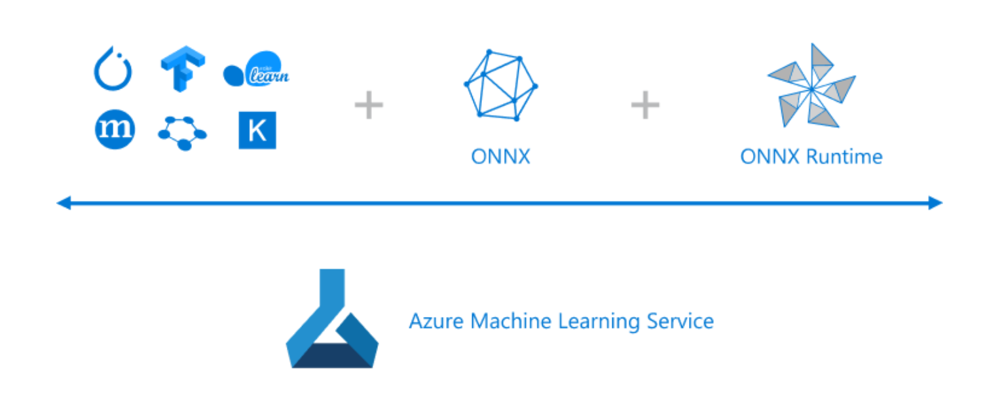
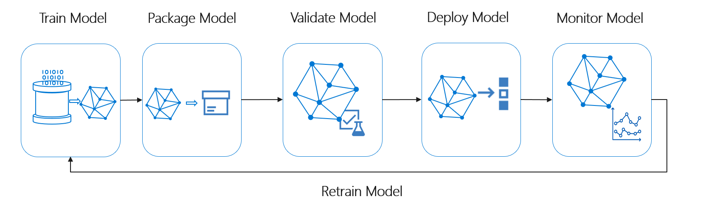
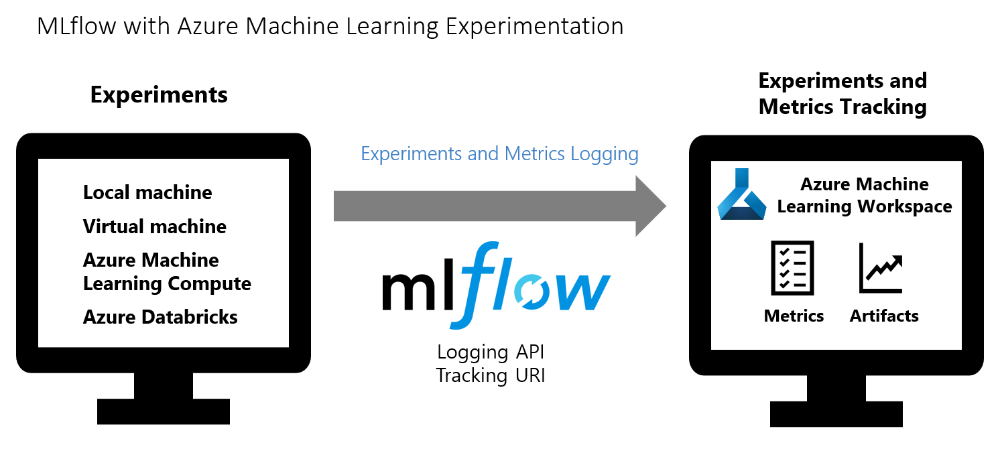
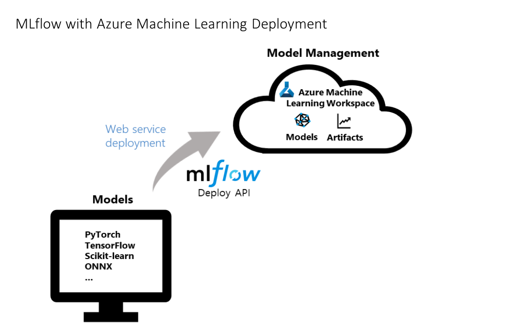
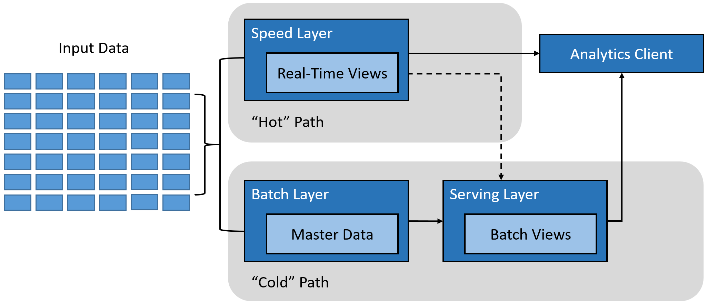
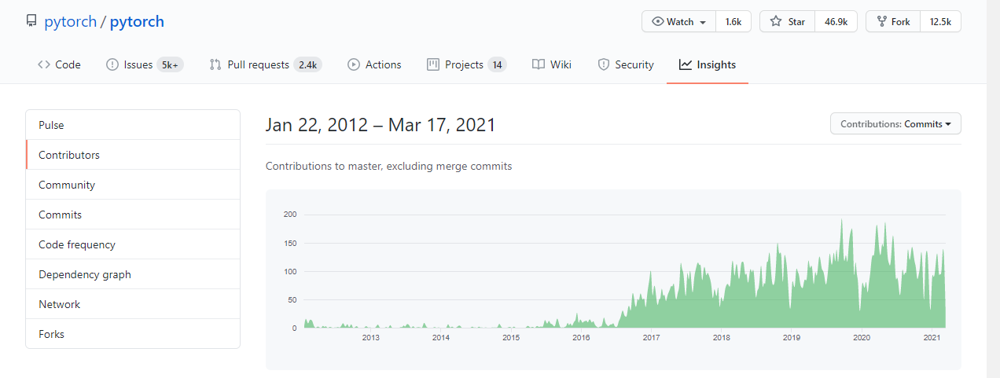
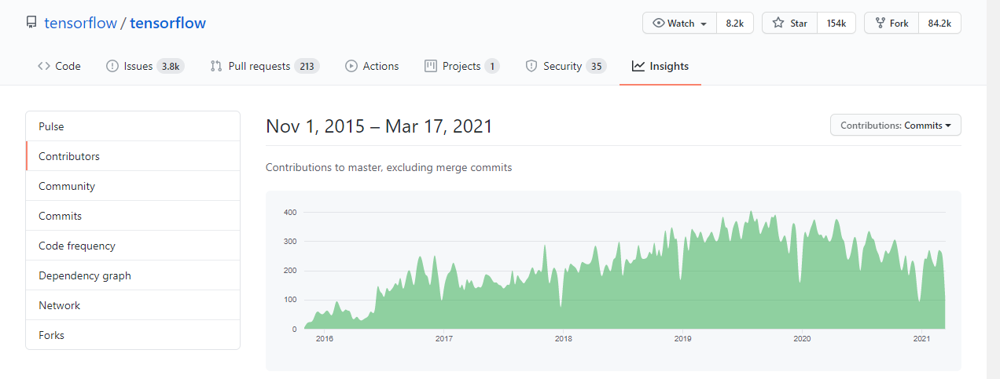
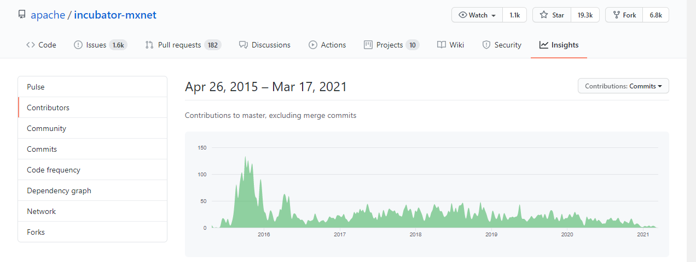

# Open Source Readiness

[1. OSS in Azure ML](#1-oss-in-azure-machine-learning)

- [1.1. ML Frameworks and libraries](#11-ml-frameworks-and-libraries)

- [1.2. File formats](#12-file-formats)

  - [1.2.1. Open Neural Network eXchange (ONNX)](#121-open-neural-network-exchange-onnx)
  - [1.2.2. PKL (Scikit-Learn)](#122-pkl-scikit-learn)
  - [1.2.3. PT (PyTorch)](#123-pt-pytorch)

- [1.3. Development tools and environments](#13-development-tools-and-environments)

  - [1.3.1. JupyterLab and Jupyter Notebooks in Compute Instances](#131-jupyterlab-and-jupyter-notebooks-in-compute-instances)
  - [1.3.2. Visual Studio Code](#132-vs-code)
  - [1.3.3. Visual Studio Codespaces](#133-visual-studio-codespaces)
  - [1.3.4. Custom Python environments](#134-custom-python-environments)
  - [1.3.5. RStudio in Compute Instances](#135-rstudio-in-compute-instances)

- [1.4. Programming languages: Python, R](#14-programming-languages-python-r)

  - [1.4.1. Python support in Azure ML](#141-python-support-in-azure-ml)
  - [1.4.2. R support in Azure ML](#142-r-support-in-azure-ml)

- [1.5. MLOps](#15-mlops)

  - [1.5.1. Github](#151-github)
  - [1.5.2. MLFlow](#152-mlflow)
  - [1.5.3. Kubeflow](#153-kubeflow)

[2. End to end OSS-based ML process in Azure ML](#2-end-to-end-oss-based-ml-process-in-azure-ml)

- [2.1. MLOps - DevOps for machine learning](#21-mlops---devops-for-machine-learning)

  - [2.1.1. Github](#211-github)
  - [2.1.2. MLFlow](#212-mlflow)
  - [2.1.3. Kubeflow](#153-kubeflow)

- [2.2. Model training](#22-model-training)

  - [2.2.1. Exploratory Data Analysis and Data Preparation](#221-exploratory-data-analysis-and-data-preparation)
  - [2.2.2. Model training](#222-model-training)
  - [2.2.3. Model explainability](#223-model-explainability)
  - [2.2.4. Model fairness](#224-model-fairness)

- [2.3. Model deployment](#23-model-deployment)

  - [2.3.1. Real time inference](#231-real-time-inference)
  - [2.3.2. Batch inference](#232-batch-inference)

[3. Azure ML - the platform of choice for open source ML](#3-azure-ml---the-platform-of-choice-for-open-source-ml)

- [3.1. Unbiased support for deep learning](#31-unbiased-support-for-deep-learning)

- [3.2. Commitment to open source-based standardization of model format](#32-commitment-to-open-source-based-standardization-of-model-formats)

- [3.3. Commitment to open source-based Responsible ML](#33-commitment-to-open-source-based-responsible-ml)

- [3.4. A comprehensive end-to-end platform that combines open source with productivity](#34-a-comprehensive-end-to-end-platform-that-combines-open-source-with-productivity)

## 1. OSS in Azure Machine Learning

Microsoft Azure provides an open and interoperable ecosystem to use the frameworks of your choice without getting locked in, accelerate every phase of the machine learning lifecycle and run your models anywhere from the cloud to the edge:



Microsoft's open-source approach in machine learning is based on the following principles:

- **Use your favorite open-source frameworks** - Azure supports popular open-source tools and frameworks like scikit-learn, PyTorch, TensorFlow, MXNet, and Keras.

- **Use your favorite development environments** - Azure supports Jupyter, JupyterLabs, RStudio, or customized environments. Developers can also choose between Python and R as their development language.
  
- **Easily move between frameworks** - allows data scientists to use their preferred frameworks for development without needing to worry about the implications of downstream inferencing. Models trained in one framework can be transferred to another one for inferencing using **O**pen **N**eural **N**etwork e**X**change ([ONNX](https://onnx.ai/)), an open-source model format co-developed by Microsoft and other AI companies.

- **Run your models efficiently across platforms** - using the [ONNX Runtime](https://github.com/Microsoft/onnxruntime), inferencing can be optimized on a wide variety of hardware platforms. A model trained with any popular framework can be transferred to the ONNX format and used for inferencing with speed gains of up to 10x. For optimal performance, ONNX Runtime integrates the latest CPU and GPU hardware acceleration from partners such as Intel and NVIDIA.

- **Accelerate machine learning**: - productivity can be significantly boosted by using Azure Machine Learning, which supports popular frameworks and tools. Automated machine learning can be used to identify suitable algorithms and tune hyperparameters quickly. The complete machine learning lifecycle can be managed with MLOps - DevOps for machine learning - including simple deployment from the cloud to the edge. Finally, all these capabilities can be accessed from a tool-agnostic Python SDK.

### 1.1. ML Frameworks and libraries

Azure Machine Learning allows the use of preferred frameworks without being opinionated about either of them. Some of the most popular open-source frameworks and libraries you can use with Azure Machine learning include:

**Core**

- [Numpy](https://numpy.org/) - the fundamental package for scientific computing with Python
- [Pandas](https://pandas.pydata.org/) - fast, powerful, flexible and easy to use open-source data analysis and manipulation tool, built on top of the Python programming language
- [SciPy](https://www.scipy.org/) - provides many user-friendly and efficient numerical routines, such as routines for numerical integration, interpolation, optimization, linear algebra, and statistics

**Machine Learning and Deep Learning**

- [Scikit-learn](https://scikit-learn.org/) - Python module for machine learning built on top of SciPy
- [PyTorch](https://pytorch.org/) - open-source machine learning framework that accelerates the path from research prototyping to production deployment
- [TensorFlow](https://www.tensorflow.org/) - end-to-end open-source platform for machine learning
- [fast.ai](https://www.fast.ai/) - single consistent API to the most important deep learning applications and data types in PyTorch
- [Keras](https://keras.io/) - a deep learning API written in Python, running on top of the machine learning platform TensorFlow
- [MXNet]|(<https://mxnet.apache.org/>) - open-source deep learning framework suited for flexible research prototyping and production

**Visualization**

- [Plotly](https://github.com/plotly/plotly.py) - interactive, open-source, and browser-based graphing library for Python
- [Matplotlib](https://matplotlib.org/) - comprehensive library for creating static, animated, and interactive visualizations in Python
- [Seaborn](https://seaborn.pydata.org/) - Python data visualization library based on matplotlib; provides a high-level interface for drawing attractive and informative statistical graphics
- [Bokeh](https://bokeh.org/) - interactive visualization library for modern web browsers; provides elegant, concise construction of versatile graphics, and affords high-performance interactivity over large or streaming datasets

**Responsible AI**

- [InterpretML](http://interpret.ml/) - helps developers, data scientists and business stakeholders in the organization gain a comprehensive understanding of their machine learning models; can also be used to debug models, explain predictions and enable auditing to meet compliance with regulatory requirements
- [Fairlearn](https://fairlearn.github.io/) - a toolkit to assess and improve the fairness of machine learning models
- [Open Differential Privacy](https://opendifferentialprivacy.github.io/) - uses state-of-the-art differential privacy (DP) techniques to inject noise into data, to prevent disclosure of sensitive information and manage exposure risk

**MLOps**

- [Github](https://github.com) - a development platform inspired by the way individuals and teams work; from open source to business, you can host and review code, manage projects, and build software
- [MLFlow](https://mlflow.org/) - an open-source platform for the machine learning lifecycle
- [Kubeflow](https://www.kubeflow.org/) - dedicated to making deployments of machine learning (ML) workflows on Kubernetes simple, portable and scalable

### 1.2. File formats

Big Data has become part of the lexicon of organizations worldwide, as more and more organizations look to leverage data to drive more informed business decisions. With this evolution in business decision-making, the amount of raw data collected, along with the number and diversity of data sources, is growing at an astounding rate. For the data scientist, the ability to combine these large, disparate data sets into a format more appropriate for conducting advanced analytics is an increasingly crucial skill. Thus, the data science process typically starts with collecting and preparing the data before moving on to training, evaluating, and deploying the model. During each of these steps, the data can be stored in a variety of data formats. The formats define the structure and encoding of the stored data, and the file extension identifies the data format. In this section, we will review summarize the key model serving serialization formats supported in Azure ML.

#### 1.2.1. Open Neural Network eXchange (ONNX)

The [Open Neural Network Exchange](https://onnx.ai/) (ONNX) format is an open standard for representing machine learning models. ONNX is supported by a [community of partners](https://onnx.ai/supported-tools), including Microsoft, who create compatible frameworks and tools. Microsoft is committed to open and interoperable AI so that data scientists and developers can:

- Use the framework of their choice to create and train models
- Deploy models cross-platform with minimal integration work

Microsoft supports ONNX across its products, including Azure and Windows, to help you achieve these goals.

The interoperability you get with ONNX makes it possible to get great ideas into production faster. With ONNX, data scientists can choose their preferred framework for the job. Similarly, developers can spend less time getting models ready for production and deploy across the cloud and edge.

You can create ONNX models from many frameworks, including PyTorch, Chainer, Microsoft Cognitive Toolkit (CNTK), MXNet, ML.Net, TensorFlow, Keras, SciKit-Learn, and more.
There is also an ecosystem of tools for visualizing and accelerating ONNX models. Several pre-trained ONNX models are also available for common scenarios.
[ONNX models can be deployed](https://docs.microsoft.com/azure/machine-learning/service/how-to-build-deploy-onnx#deploy) to the cloud using Azure Machine Learning and ONNX Runtime. They can also be deployed to Windows 10 devices using [Windows ML](https://docs.microsoft.com/windows/ai/). They can even be deployed to other platforms using converters that are available from the ONNX community.

#### 1.2.2. PKL (Scikit-Learn)

The pickle serialization format (PKL) is commonly used to persist Scikit-learn model training pipelines. The pickle format can be used to recover the full Scikit-learn estimator object or be deployed for model prediction. The Scikit-learn pickle model can also be exported to ONNX format for downstream inferencing tasks.

#### 1.2.3. PT (PyTorch)

In PyTorch, the common convention is to save the trained model using the .pt file extension. PyTorch uses Python's pickle utility for serialization. The trained PyTorch model can also be converted to the ONNX format for inferencing tasks.

#### 1.2.4. TF SavedModel and H5 (Keras)

An entire TensorFlow model can be saved as a single artifact that includes the model's architecture/config, weight values, compilation information, and the optimizer and its state. There are two formats that can be used: the TensorFlow SavedModel format and the Keras H5 format.

### 1.3. Development tools and environments

#### 1.3.1. JupyterLab and Jupyter Notebooks in Compute Instances

[Jupyter](https://jupyter-notebook.readthedocs.io/en/latest/) is an open-source project that lets you easily combine Markdown text and executable Python source code on one canvas called a notebook and [JupyterLab](https://jupyterlab.readthedocs.io/en/stable/) is the next-generation user interface including notebooks.

An Azure Machine Learning compute instance is a managed cloud-based workstation for data scientists. Data scientists can use the compute instance as a fully configured and managed development environment in the cloud for machine learning. They can also be used as a compute target for training and inferencing for development and testing purposes. Azure Machine Learning compute instance enables data scientists to author, train, and deploy models in a fully integrated notebook experience in the machine learning workspace. JupyterLabs and Jupyter are configured and installed on the compute instance.

#### 1.3.2. Visual Studio Code

 Visual Studio Code supports working with [Jupyter Notebooks natively](https://code.visualstudio.com/docs/python/jupyter-support), as well as through Python code files. VS code offers native support for Jupyter Notebooks that include key capabilities such as:

- Create, open, and save Jupyter Notebooks
- Work with Jupyter code cells
- IntelliSense support in Jupyter Notebook Editor
- Plot viewer
- View, inspect, and filter variables using the Variable explorer and Data viewer
- Connect to a remote Jupyter server
- Debug a Jupyter notebook

#### 1.3.3. Visual Studio Codespaces

[Visual Studio Codespaces](https://azure.microsoft.com/en-us/services/visual-studio-online/#overview) allow developers to be ready to code in minutes, with cloud-powered development environments that can be used for day-to-day development or short-term tasks like pull requests.

Visual Studio Codespaces provides cloud-hosted environments where you can edit your notebooks using Visual Studio Code or your web browser and store them on GitHub. Visual Studio Codespaces offers the same great Jupyter experience as VS Code, but without needing to install anything on your device.
If you don’t want to set up a local environment and prefer a cloud-backed solution, then creating a codespace is an excellent option.

#### 1.3.4. Custom Python environments

In Azure Machine Learning, you can use environments to track and reproduce your projects' software dependencies as they evolve. The Azure Machine Learning Environment class accounts for local development solutions such as pip and Conda and distributed cloud development through Docker capabilities.

The Azure ML Python SDK allows you to create an Azure ML compute environment either as a persistent resource or on-demand when you schedule a machine learning experiment. Here is an example of how to create an environment configuration for a persistent compute target:

```python
   from azureml.core.runconfig import RunConfiguration
   from azureml.core.conda_dependencies import CondaDependencies
   from azureml.core.runconfig import DEFAULT_CPU_IMAGE

   # Create a new runconfig object
   run_amlcompute = RunConfiguration()

   # Use the cpu_cluster you created above.
   run_amlcompute.target = cpu_cluster

   # Enable Docker
   run_amlcompute.environment.docker.enabled = True

   # Set Docker base image to the default CPU-based image
   run_amlcompute.environment.docker.base_image = DEFAULT_CPU_IMAGE

   # Use conda_dependencies.yml to create a conda environment in the Docker image for execution
   run_amlcompute.environment.python.user_managed_dependencies = False

   # Auto-prepare the Docker image when used for execution (if it is not already prepared)
   run_amlcompute.auto_prepare_environment = True

   # Specify CondaDependencies obj, add necessary packages
   run_amlcompute.environment.python.conda_dependencies = CondaDependencies.create(conda_packages=['scikit-learn'])
   ```

#### 1.3.5. RStudio in Compute Instances

The Azure Machine Learning R SDK is currently in public preview. The Azure Machine Learning cloud resources work with R to provide a scalable environment for training and deploying a model. The RStudio Server Open Source Edition is configured and installed on the Azure Machine Learning compute instance.

### 1.4. Programming languages

#### 1.4.1. Python support in Azure ML

Data scientists and AI developers use the Azure Machine Learning SDK for Python to build and run machine learning workflows with the Azure Machine Learning service. You can interact with the service in any Python environment, including Jupyter Notebooks, Visual Studio Code, or your favorite Python IDE.

Key areas of the SDK include:

- Explore, prepare and manage the lifecycle of your datasets used in machine learning experiments.
- Manage cloud resources for monitoring, logging, and organizing your machine learning experiments.
- Train models either locally or by using cloud resources, including GPU-accelerated model training.
- Use automated machine learning, which accepts configuration parameters and training data. It automatically iterates through algorithms and hyperparameter settings to find the best model for running predictions.
- Deploy web services to convert your trained models into RESTful services that can be consumed in any application.

#### 1.4.2. R support in Azure ML

Azure Machine Learning also has support for the R language. The R package provides the interface to the Azure Machine Learning service. With R functions, you can provision new computing clusters in Azure and use those to train models with R and deploy them as prediction endpoints for use from any app. You can also launch R-based notebooks in the Azure Machine Learning studio web interface or even launch a complete RStudio server instance in the Azure Machine Learning compute instance.

### 1.5. MLOps

#### 1.5.1. Github

Azure Machine Learning fully supports Git repositories for tracking work - you can clone repositories directly onto your shared workspace file system, use Git on your local workstation, or use Git from a CI/CD pipeline.

#### 1.5.2. MLFlow

[MLFlow](https://mlflow.org/) is an open-source platform to manage the ML lifecycle, including experimentation, reproducibility, deployment, and a central model registry. MLflow currently offers four components:

- MLFlow Tracking - Record and query experiments: code, data, config, and results
- MLFlow Projects - Package data science code in a format to reproduce runs on any platform
- MLFlow Models - Deploy machine learning models in a diverse serving environment
- Model Registry - Store, annotate, discover, and manage models in a central repository

#### 1.5.3. Kubeflow

[Kubeflow](https://www.kubeflow.org/) is a solution dedicated to making deployments of machine learning (ML) workflows on Kubernetes simple, portable and scalable. The goal is not to recreate other services but to provide a straightforward way to deploy best-of-breed open-source systems for ML to diverse infrastructures. Anywhere you are running Kubernetes, you should be able to run Kubeflow.

## 2. End to end OSS-based ML process in Azure ML

The Azure ML supports the use of a wide range of OSS along with the ML processes. In this section, we will look at some examples of how Azure ML leverages OSS in essential parts of the ML processes such as exploratory data analysis, model training, model explainability, model fairness, and operationalizing ML models.

### 2.1. MLOps - DevOps for machine learning

When it comes to DevOps principles, any non-trivial project that includes a data science component will need to take advantage of a combination of features from the following two major platforms:

- [Azure Machine Learning service](https://azure.microsoft.com/services/machine-learning-service/)
- [Azure DevOps](https://azure.microsoft.com/services/devops)
- [Github](https://github.com)

The DevOps mindset applied to data science solutions is commonly referred to as Machine Learning Operations (MLOps). The most critical aspects of MLOps are:

- Deploying Machine Learning projects from anywhere
- Monitoring ML solutions for both generic and ML-specific operational issues
- Capturing all data that is necessary for full traceability in the ML lifecycle
- Automating the end-to-end ML lifecycle using a combination of Azure Machine Learning service and Azure DevOps

A typical MLOps process with Azure Machine Learning involves an end-to-end, automated ML workflow that handles all the major stages of a model's lifecycle: train, package, validate, deploy, monitor, and retrain:



#### Two complementary platforms

If you plan on implementing an end-to-end DevOps approach for your project, you will need to use both platforms (Azure Machine Learning service and Azure DevOps). Although Azure DevOps is a native, all-purpose DevOps platform, it lacks specific features that are required in data science projects. At the same time, Azure Machine Learning service is a native, all-purpose Data Science platform, but it does not have some of the core DevOps features you will most certainly need.

Because of the particular DevOps-type needs that data science projects have, the Azure Machine Learning service has started to provide DevOps-like services centered around the concept of ML Pipelines and model management. ML Pipelines provide the backend for data scientists, data engineers, and IT professionals to collaborate on specific tasks like data preparation (e.g., transformation, normalization), model training and evaluation, and deployment. Because of the term `pipelines`, one might get the sense that ML Pipelines are somewhat of a competitor to Azure DevOps pipelines. The two of them are designed to work together, and their functionalities are complementary. Model management enables you to register and track trained ML models based on their name and version.

Next, we will explore the relationships between the various features of the Azure Machine Learning service and Azure DevOps.

#### Feature comparison

The following table provides details about how the most important MLOps concepts are interpreted by the Azure Machine Learning service and Azure DevOps.

MLOps concept | Azure Machine Learning service | Azure DevOps | Primary Choice
--- | --- | --- | ---
Boards | Not supported | Provides a set of services that enable you to plan, track, and discuss work across different teams involved in the project. | Azure DevOps
Code Repos | Not Supported | Provides a set of services that enable you to work with Git repositories, and collaborate using advanced file management and pull requests. Integrates with boards, allowing you to link source code, branches, and pull requests with work items. | Azure DevOps
Artifacts Management | Provides extensive support for managing machine learning-specific artifacts like experiments, runs, models, compute resources, models, images, deployments, and activities. Also capable of handling various by-products of the ML processes like outputs, logs, images, performance metrics, and many more. | Provides generic support for building artifacts management and services for storing Maven, npm, NuGet, and Python packages together. | Azure Machine Learning service (Azure DevOps will be used to handle artifacts required by the CI/CD pipelines).
Pipelines | Provides services geared towards data preparation, model training and evaluation, and deployment. Enables optimization of ML workflows with simplicity, speed, portability, and reuse. Also enables explicit naming and versioning of data sources, inputs, and outputs. | Provides support for generic, all-purpose Continuous Integration / Continuous Delivery pipelines for building, testing, and deploying solutions. Works with any code repo provider, any language, any platform, and any cloud. | Azure DevOps (for high-level orchestration, coordination, build, and release using a CI/CD approach). Specific steps from the Azure DevOps CI/CD pipelines call into Azure Machine Learning service through the Python SDK (includes the launch of ML pipelines driven by the Azure Machine Learning service).
Data Versioning | Provides support through Azure ML Datasets. | Not supported | Azure Machine Learning service
Model Training, Deployment, and Monitoring | Provides extensive support for registering, tracking, packaging, debugging, validating, profiling, converting, and using ML models. Provides support for understanding what data is sent to the model and what predictions it returns. | Not supported | Azure Machine Learning service

Looking at this table, it is easy to observe the complementary nature of Azure Machine Learning service and Azure DevOps in the context of MLOps. Furthermore, the integration between the two is simplified by the [Azure Machine Learning extension](https://marketplace.visualstudio.com/items?itemName=ms-air-aiagility.vss-services-azureml) from Azure DevOps, which enables the following:

- Azure Machine Learning workspace selection when defining a service connection in Azure DevOps
- Azure DevOps release pipeline triggering by a trained model created in a training pipeline

#### 2.1.1. Github

Azure Machine Learning fully supports Git repositories for tracking work - you can clone repositories directly onto your shared workspace file system, use Git on your local workstation, or use Git from a CI/CD pipeline.

When submitting a job to Azure Machine Learning, if source files are stored in a local git repository, then information about the repo is tracked as part of the training process.

Since Azure Machine Learning tracks information from a local git repo, it isn't tied to any specific central repository. Your repository can be cloned from GitHub, GitLab, Bitbucket, Azure DevOps, or any other git-compatible service.

For more details, see [Git integration for Azure ML](https://docs.microsoft.com/en-us/azure/machine-learning/concept-train-model-git-integration).

#### 2.1.2. MLFlow

[MLFlow](https://mlflow.org/) is an open-source platform to manage the ML lifecycle, including experimentation, reproducibility, deployment, and a central model registry. MLflow currently offers four components:

- MLFlow Tracking - Record and query experiments: code, data, config, and results
- MLFlow Projects - Package data science code in a format to reproduce runs on any platform
- MLFlow Models - Deploy machine learning models in a diverse serving environment
- Model Registry - Store, annotate, discover, and manage models in a central repository

Azure ML integrates with MLFlow via the [mlflow](https://pypi.org/project/mlflow/) and [azureml-mlflow](https://pypi.org/project/azureml-mlflow/) Python libraries. The integration allows you to:

- Track and log experiment metrics and artifacts in your Azure Machine Learning workspace. If you already use MLflow Tracking for your experiments, the workspace provides a centralized, secure, and scalable location to store training metrics and models.



- Deploy your MLflow experiments as an Azure Machine Learning web service. By deploying as a web service, you can apply the Azure Machine Learning monitoring and data drift detection functionalities to your production models.



For more details on MLFlow integration, see [Track model metrics and deploy ML models with MLflow and Azure Machine Learning](https://docs.microsoft.com/en-us/azure/machine-learning/how-to-use-mlflow).

#### 2.1.3. Kubeflow

[Kubeflow](https://www.kubeflow.org/) is a solution dedicated to making deployments of machine learning (ML) workflows on Kubernetes simple, portable and scalable. The goal is not to recreate other services but to provide a straightforward way to deploy best-of-breed open-source systems for ML to diverse infrastructures. Anywhere you are running Kubernetes, you should be able to run Kubeflow.

Azure Kubernetes Service (AKS) on Azure allows you to deploy containerized applications, within which you describe the resources your application needs, and AKS will manage the underlying resources automatically. This workflow is exceptionally efficient at scale.

To build an ML pipeline, you must create and build containers using Docker images. Containers are used to abstract the dependencies for each step of the pipeline. You can manage your containers using Azure's portal, explicitly using the Container Registry to store the containers in the cloud. Kubelfow pulls the containers from this registry as they are needed in each step of the pipeline.

The typical workflow setup includes:

- Set up Kubeflow in an AKS Cluster
- Create and compile a pipeline that can:
  - Preprocess data
  - Train a model
  - Register the model to ACR (Azure Container Registry)
  - Profile the model to optimize compute resources in AML (Azure Machine Learning)
  - Deploy the model to AML
- Interact with and customize your deployment
- Test and use your deployed model

When your pipeline has finished running, you will be able to see a registered image, model, and deployment in your Azure ML workspace. You will then be able to visit the scoring URI and upload images for scoring in real-time.

For more details on Kubeflow integration, see [End-to-end Pipeline example on Azure](https://www.kubeflow.org/docs/azure/azureendtoend/).

### 2.2. Model training

#### 2.2.1. Exploratory Data Analysis and Data Preparation

The goal of exploratory data analysis (EDA) is to build intuition into a dataset that will inform how you model the data. Models are only as strong as data fed into them, and the more insight a data scientist has into their data, the more robust the features they'll create are and the more informed their design choices will be.

The compute instance in Azure ML comes preconfigured with many popular OSS libraries such as matplotlib, seaborn, pandas, and scikit-learn useful in EDA data preparation activities. For example, as part of EDA, a data scientist wants to understand the relationships between the training dataset features. The seaborn library provides a pairplot functionality that works directly on the columns of a pandas dataframe to visualize the relationships between the data columns or data features.

```python
import pandas as pd
import numpy as np
%matplotlib notebook
import matplotlib.pyplot as plt
import seaborn as sns

df = pd.read_csv('./features.csv')
sns.pairplot(df)
```


In another example, the data scientist wants to understand if a group features form clusters in the dataset. Here the scikit-learn’s KMeans algorithm can be used to perform the analysis.

```python
from sklearn.cluster import KMeans

...
km_model = KMeans(n_clusters=6)
cluster_id = km_model.fit_predict(X)
...
```

### 2.2.2. Model training

With Azure Machine Learning, you can easily submit your training script to various computing targets using run configuration objects. This pattern gives you a lot of flexibility and maximum control. The estimator class makes it easier to train models with deep learning and reinforcement learning. It provides a high-level abstraction that lets you quickly construct run configuration. You can create and use a generic estimator to submit a training script using any learning framework you choose (such as scikit-learn) on any compute target you select, whether it's your local machine, a single VM in Azure, or a GPU cluster in Azure. For PyTorch, TensorFlow, Keras, and Scikit-learn, Azure Machine Learning also provides specialized estimators to simplify using these frameworks.

The example below shows how easy it is to set up machine learning experiments based on the TensorFlow framework using the specialized estimator from Azure ML. The estimator takes in parameters such as the path to the training script, script parameters, the compute target, and packages to add to the python environment for the experiment.

```python
from azureml.core import Workspace, Experiment, Run
from azureml.train.dnn import TensorFlow

...

exp = Experiment(workspace=ws, name='tf-mnist')

script_params = {
    '--batch-size': 50,
    '--first-layer-neurons': 300,
    '--second-layer-neurons': 100,
    '--learning-rate': 0.01
}

est = TensorFlow(source_directory=script_folder,
                 entry_script='tf_mnist.py',
                 script_params=script_params,
                 compute_target=compute_target,
                 use_gpu=True,
                 pip_packages=['azureml-dataprep[pandas,fuse]'])

run = exp.submit(est)
run.wait_for_completion(show_output=True)
```

### 2.2.3. Model explainability

Interpretability is critical for data scientists, auditors, and business decision-makers alike to ensure compliance with company policies, industry standards, and government regulations:

- Data scientists need the ability to explain their models to executives and stakeholders, so they can understand the value and accuracy of their findings. They also require interpretability to debug their models and make informed decisions about how to improve them.

- Legal auditors require tools to validate models concerning regulatory compliance and monitor how models' decisions impact humans.

- Business decision-makers need peace-of-mind by having the ability to provide transparency for end-users. This allows them to earn and maintain trust.

Enabling the capability of explaining a machine learning model is important during two main phases of model development:

During the training phase, model designers and evaluators can use a model's interpretability output to verify hypotheses and build trust with stakeholders. They also use the insights into the model for debugging, validating model behavior that matches their objectives, and checking for model unfairness or insignificant features.

- During the inferencing phase, having transparency around deployed models empowers executives to understand "when deployed" how the model is working and how its decisions are treating and impacting people in real life.

The interpretability classes are made available through Azure ML SDK packages, and using the classes and methods in the SDK, you can:

- Explain model prediction by generating feature importance values for the entire model and/or individual data points.
- Achieve model interpretability on real-world datasets at scale, during training, and inference.
- Use an interactive visualization dashboard to discover patterns in data and explanations at training time.

In machine learning, features are the data fields used to predict a target data point. For example, to predict credit risk, data fields for age, account size, and account age might be used. In this case, age, account size, and account age are features. Feature importance tells you how each data field affected the model's predictions. For example, age may be heavily used in the prediction, while account size and age do not affect the prediction values significantly. This process allows data scientists to explain resulting predictions so that stakeholders have visibility into what features are most important in the model.

### 2.2.4 Model fairness

Artificial intelligence and machine learning systems can display unfair behavior. One way to define unfair behavior is by its harm or impact on people. Two common types of AI-caused damages are:

- Harm of allocation: An AI system extends or withholds opportunities, resources, or information for specific groups. Examples include hiring, school admissions, and lending, where a model might be much better at picking good candidates among a particular group of people than among other groups.

- Harm of quality-of-service: An AI system does not work as well for one group of people as it does for another. For example, a voice recognition system might fail to work as well for women as it does for men.

To reduce unfair behavior in AI systems, you have to assess and mitigate these harms.

Fairlearn is an open-source Python package that helps data scientists assess their machine learning models' fairness and mitigate unfairness. With Fairlearn, you can evaluate existing models for fairness and compare the trade-off of model fairness and model performance. The Fairlearn package has two components:

- Assessment Dashboard: A Jupyter notebook widget for assessing how a model's predictions affect different groups. It also enables comparing multiple models by using fairness and performance metrics.

- Mitigation Algorithms: A set of algorithms to mitigate unfairness in binary classification and regression.

Together, these components enable data scientists and business leaders to navigate any trade-offs between fairness and performance and select the mitigation strategy that best fits their needs.

The Azure Machine Learning Fairness SDK, azureml-contrib-fairness, integrates the open-source Python package, Fairlearn, within Azure Machine Learning. The following example shows how to use the Fairlearn assessment from within the Azure Machine Learning compute instance's Jupyter notebooks.

```python
from sklearn.linear_model import LogisticRegression
from fairlearn.widget import FairlearnDashboard

lr_predictor = LogisticRegression(solver='liblinear', fit_intercept=True)
lr_predictor.fit(X_train, Y_train)

FairlearnDashboard(sensitive_features=A_test,
                   sensitive_feature_names=['Sex', 'Race'],
                   y_true=Y_test,
                   y_pred={"lr_model": lr_predictor.predict(X_test)})

```

In the above example, the sensitivity features, for instance, gender, are not included in the training dataset. You can then evaluate the disparity in the model performance for each of the sensitivity features. In this example, the Fairlearn dashboard shows a 12.9% disparity in the model performance between the male and female populations.

  

### 2.3 Model deployment

After you have trained your machine learning model and evaluated it to the point where you are ready to use it outside your development or test environment, you need to deploy it somewhere. Azure Machine Learning service simplifies this process. You can use the service components and tools to register your model and deploy it to one of the available compute targets to be made available as a web service in the Azure cloud or on an IoT Edge device.

#### 2.3.1. Real-time inference

Real-time inference makes predictions on data as it is received, i.e., in real-time. Regardless of which framework you use to deploy a model, like the Azure Machine Learning service, you generally do the following to deploy a model for real-time inference:

- Get the model file (any format)
- Create a scoring script (.py)
- Optionally create a schema file describing the web service input (.json)
- Create a real-time scoring web service
- Call the web service from your applications
- Repeat the process each time you re-train the model


This process is very time-consuming if done manually, especially in creating the real-time scoring web service.

**Deploying with Azure Machine Learning service**

Azure Machine Learning service simplifies the deployment process by providing tools that help automate the above steps. The series of steps using Azure Machine Learning fall in line with the deployment process above, but most of the work is done for you. You follow these steps as part of the deployment process, regardless of whether you are using your own models or models you obtain from somewhere else.


1. **Register the model** in a registry hosted in your Azure Machine Learning Service workspace
2. **Prepare to deploy** by creating a scoring file, specifying assets, usage, and a compute target
3. **Use** the model in a web service in the cloud, on an IoT device, or for analytics with Power BI
4. **Monitor and collect data**
5. **Update** a deployment to use a new image

#### 2.3.2. Batch inference

Batch inference, or batch scoring, uses machine learning to make predictions on large quantities of existing data. Unlike real-time scoring, which makes predictions on data as received, the batch inference is commonly run on a recurring schedule against data stored in a database or other data store. The resulting predictions are then written to a data store for later use by applications, data scientists, developers, or end-users.

Batch inference typically involves latency requirements of hours or days, so it does not require using trained models deployed to RESTful web services, as is done for real-time inference. Instead, batch predictions performed using Azure Machine Learning can take advantage of a host of high-throughput and scalable compute options, such as Azure Databricks or Azure Batch. This provides a cost-effective means of making predictions on terabytes of data asynchronously.

**When to use batch inference**

It would be best if you considered using batch inference when:

- You do not need to make or act on predictions in real-time.
- Inferences for large sets of existing data can be created on a schedule and written to a data store for later use.
- Post-processing or analysis on the predictions generated during inference are needed before exposing the results for further use.
- The complexity of data processing requires long-running scoring operations or the scale-out of computing resources to perform parallel processing.

#### Combining real-time and batch inference

Due to the scheduled nature of batch inference, predictions are not usually available for new data. However, in many common real-world scenarios, predictions are needed on both newly arriving and existing data. In these cases, the **lambda architecture**, first proposed by Nathan Marz, provides a good solution. In the lambda architecture, all data coming into the system goes through one of two paths:

- A **batch layer** (cold path) stores all incoming data in its raw form and performs batch inference on the data on a pre-defined schedule. The scored data is stored in a data store for later use.
- A **speed layer** (hot path) runs real-time inference on incoming data. This layer is designed for low latency.

The batch layer feeds into a serving layer that indexes the batch view for efficient querying. The speed layer updates the serving layer with incremental updates based on the most recent data.



The real-time inference is applied to data flowing into the hot path. Incoming data is sent to a REST API endpoint for scoring by a trained machine learning model, and predictions are returned for immediate use. The speed layer dictates latency requirements to ensure data is processed as quickly as possible. Data entering the cold path, on the other hand, is persisted to a storage layer and processed on a recurring schedule. This processing is not constrained by low-latency requirements.

Eventually, the hot and cold paths converge at the analytics client application. If the client needs to respond to predictions in real-time, it will acquire its result from the hot path. Otherwise, it will pull prediction results from the cold path. In other words, the hot path has data for a relatively small window of time, after which the results can be updated with data from the cold path.

## 3. Azure ML - the platform of choice for open source ML

The current public cloud provider landscape provides several choices for managed machine learning services. Among these, Azure ML is a top contender when it comes to supporting open source libraries.

So far, we've seen how Azure ML is dedicated to supporting open source in all areas: frameworks and libraries, file formats, development tools and environments, languages, and MLOps. There are several areas where Azure ML's pledge to open source is a clear differentiator from other similar platforms.

We will explore in this section the main characteristics that make Azure ML the platform of choice for open source Machine Learning.

### 3.1. Unbiased support for deep learning

When it comes to Deep Learning, the undisputed champions are PyTorch and TensorFlow, together with their higher-level abstractions like fast.ai (PyTorch) and [Keras](https://keras.io/) (TensorFlow). As of today, there is no clear sign (aka any proven metric) that other libraries are even remotely capable of closing the unsurpassable gap that separates them from PyTorch and Tensorflow.

Here are a few Github metrics* that provide an insight into the relative popularity of deep learning libraries

Library | Contributors | Dependent repos | Dependent packages
--- | --- | --- | ---
[PyTorch](https://github.com/pytorch/pytorch) | 1,527 | 38,098 | 1,601
[fast.ai](https://github.com/fastai/fastai) | 527 | 3,674 | 43
[Tensorflow](https://github.com/tensorflow/tensorflow) | 2,676 | 88,829 | 2,026
[Keras**](https://github.com/keras-team/keras) | 864 | 55,879 | 1,087  
[MXNet](https://github.com/apache/incubator-mxnet) | 828 | 1,237 | 58
[Chainer***](https://github.com/chainer/chainer) | 250 | 1,384 | 53

\* \- as of August 2020

\*\* - Keras 2.2.5 was the last release of Keras implementing the 2.2.* API. It was the last release to only support TensorFlow 1 (as well as Theano and CNTK). The current release is Keras 2.4.0, which redirects to ```tf.keras```.

\*\*\* - Chainer is under the maintenance phase, and further development will be limited to bug-fixes and maintenance only.

The current situation becomes more apparent when comparing the foundational libraries' contribution trendlines: PyTorch, Tensorflow, and MXNet.





>TODO: review statement below

The core strength of Azure ML in this space is its unbiased support for all these important libraries. Unlike some of its competitors, Azure ML is neither heavily committed to one of the top two libraries nor betting on the one that lags behind.

### 3.2. Commitment to open source-based standardization of model formats

The [Open Neural Network Exchange](https://onnx.ai/) (ONNX) format is an open standard for representing machine learning models. You can create ONNX models from many frameworks, including PyTorch, Chainer, Microsoft Cognitive Toolkit (CNTK), MXNet, ML.Net, TensorFlow, Keras, SciKit-Learn, and more. ONNX is supported by a [community of partners](https://onnx.ai/supported-tools), including Microsoft, who create compatible frameworks and tools.

The core strength of Azure ML in this space is a commitment towards a standardized, open source-based model format. This is clearly different from the approach taken by other platforms that either ignore ONNX or provide only proper support while promoting their own closed source, proprietary approaches.

### 3.3. Commitment to open source-based Responsible ML

>TODO: detail this section and remove competitor names

At Microsoft, responsible machine learning encompasses the following values and principles:

- Understand machine learning models
  - Interpret and explain model behavior
  - Assess and mitigate model unfairness
- Protect people and their data
  - Prevent data exposure with differential privacy
  - Work with encrypted data using homomorphic encryption
- Control the end-to-end machine learning process
  - Document the machine learning lifecycle with datasheets

Microsoft is committed to open-source based solutions to Responsible ML. For each of the above items, Microsoft has open-source-based support within the Microsoft solutions.

#### Interpret and explain model behavior

The Azure Machine Learning InterpretML is an open-source package built by Microsoft. [InterpretML](https://github.com/interpretml/interpret) can be used inside Azure Machine Learning to interpret and explain your machine learning models, including automated machine learning models.

#### Assess and mitigate model unfairness

The Azure Machine Learning Fairness SDK, azureml-contrib-fairness, integrates the open-source Python package, [Fairlearn](https://fairlearn.github.io/), within Azure Machine Learning. It can be used by developers and data scientists alike to evaluate the fairness of their machine learning models and take corrective actions.

#### Prevent data exposure with differential privacy

When data is used for analysis, the data must remain private and confidential throughout its use. Differential privacy is a set of systems and practices that help keep the data of individuals safe and private. Microsoft supports [WhiteNoise](https://github.com/opendifferentialprivacy/whitenoise-core), an open-source project that contains different components for building global differentially private systems.

#### Work with encrypted data using homomorphic encryption

Homomorphic encryption allows computations to be done on encrypted data without requiring access to a secret (decryption) key. The computations' results are encrypted and can be revealed only by the owner of the secret key. Using homomorphic encryption, cloud operators will never have unencrypted access to the data they're storing and computing on. Computations are performed directly on encrypted data. Data privacy relies on state-of-the-art cryptography, and the data owner controls all information releases. [Microsoft SEAL](https://github.com/microsoft/SEAL) is an open-source homomorphic encryption library that allows additions and multiplications to be performed on encrypted integers or real numbers.

#### Document the machine learning lifecycle with datasheets

Documenting the correct information in the machine learning process is key to making responsible decisions at each stage. Datasheets are a way to document machine learning assets that are used and created as part of the machine learning lifecycle. [Annotation and Benchmarking on Understanding and Transparency of Machine Learning Lifecycles (ABOUT ML)](https://www.partnershiponai.org/about-ml/), an initiative from the Partnership in AI (PAI), provides a set of guidelines for machine learning system developers to develop, test, and implement machine learning system documentation. Developers can use Azure Machine Learning SDK to implement datasheets for models as part of the Azure Machine Learning workspace model registration processes. During model registration, the tags parameter in the Model class's register method can be leverage to document the necessary datasheet information recommended in the established guidelines.

In summary, the core strength of Azure ML in the Responsible ML space is a commitment towards supporting open source-based libraries and toolkits. This is different from the approach taken by other platforms that either ignore or provide only formal support while promoting their own closed source, proprietary approaches.

### 3.4. A comprehensive, end-to-end platform that combines open source with productivity

MLOps and Github
Pipelines UX
AutoML UX
Estimators for Sckit-learn, PyTorch, Tensorflow
Custom docker images and distributed training (<https://docs.microsoft.com/en-us/azure/machine-learning/how-to-train-ml-models#distributed-training-and-custom-docker-images>)
