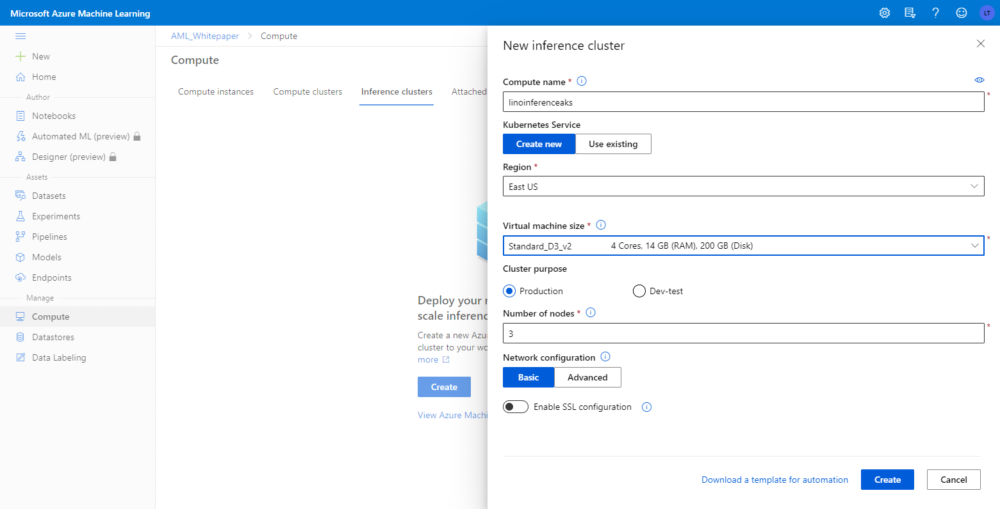

# Productivity features in Azure ML

[1. The case of productivity in ML](#1-the-case-of-productivity-in-ml)

[2. Easier and quicker data access](#2-easier-and-quicker-data-access)

- [2.1. Accessing data sources with datastores](#21-accessing-data-sources-with-datastores)
  
- [2.2. Loading data with datasets](#22-loading-data-with-datasets)
- [2.3. Improved productivity for common data management tasks](#23-improved-productivity-for-common-data-management-tasks)
  - [2.3.1. Wrangle, explore and clean data](#231-wrangle-explore-and-clean-data)
  - [2.3.2. Access data from Azure services and datastores](#232-access-data-from-azure-services-and-datastores)
  - [2.3.3. Load, transform and write data with Azure Machine Learning](#233-load-transform-and-write-data-with-azure-machine-learning)
  
[3. Use complex processes to increase productivity](#3-use-complex-processes-to-increase-productivity)

- [3.1. Automated ML: Boost productivity and access ML for all skills](#31-automated-ml-boost-productivity-and-access-ml-for-all-skills)

- [3.2. Automate and reuse logic with ML Pipelines](#32-automate-and-reuse-logic-with-ml-pipelines)

- [3.3. Use a model registry to increase the efficiency of model management (model versioning)](#33-use-a-model-registry-to-increase-the-efficiency-of-model-management)

- [3.4. Efficient management of end-to-end processes with MLOps - DevOps for Machine Learning](#34-efficient-management-of-end-to-end-processes-with-mlops---devops-for-machine-learning)

- [3.5. Reduce delivery times with streamlined model deployment](#35-reduce-delivery-times-with-streamlined-model-deployment)

  - [3.5.1. Overview of deployment target options](#351-overview-of-deployment-target-options)
  - [3.5.2. Overview of Real-time inferencing](#352-overview-of-real-time-inferencing)
  - [3.5.3. Overview of Batch inferencing](#353-overview-of-batch-inferencing)
  - [3.5.4. Overview of inferencing at the IoT edge](#354-inferencing-at-the-iot-edge)

[4. Simplify allocation and use of resources](#4-simplify-allocation-and-use-of-resources)

- [4.1. Create development environments quickly with compute instances](#41-create-development-environments-quickly-with-compute-instances)

- [4.2. Get quick access to compute power with compute clusters](#42-get-quick-access-to-compute-power-using-compute-clusters)

- [4.3. Use models in production with inference clusters](#43-use-models-in-production-with-inference-clusters)

[5. Increase productivity with powerful authoring tools](#5-increase-productivity-with-powerful-authoring-tools)

- [5.1. Authoring with UX - Azure ML Studio](#51-authoring-with-ux---azure-ml-studio)

  - [5.1.1. Manage Datastores and Datasets](#511-manage-datastores-and-datasets)
  - [5.1.2. Design and run Automated ML experiments with the Automated ML UX](#512-design-and-run-automated-ml-experiments-with-the-automated-ml-ux)
  - [5.1.3. Design and run complex processes with the pipeline UX](#513-design-and-run-complex-processes-with-the-pipeline-ux)
  - [5.1.4. Training and evaluating a model using Azure Machine Learning Visual Interface](#514-training-and-evaluating-a-model-using-azure-machine-learning-visual-interface)

- [5.2. Authoring with code](#52-authoring-with-code)

  - [5.2.1. Overview of Compute instances, Jupyter Notebooks and Azure ML SDK](#521-overview-of-compute-instances-jupyter-notebooks-and-azure-ml-sdk)
  - [5.2.2. Integrated Environment for modeling: Training and Evaluating models using Azure Notebooks and Azure Machine Learning compute](#522-integrated-environment-for-modeling-training-and-evaluating-models-with-azure-machine-learning-compute)
  - [5.2.3. OSS Frameworks support: ONNX, Tensorflow, PyTorch, scikit-learn](#523-oss-frameworks-support-onnx-tensorflow-pytorch-scikit-learn)
  
## 1. The case of productivity in ML

For the longest time, working in the Machine Learning space required the use and expertise of many different tools, platforms and languages.  It was almost like the very old days of programming where Developers had to get the compiler, the linker, the debugger and the editor from different vendors and try to integrate all of them in order to successfully obtain and final executable of some sort.

ML has been in that state in the past where Data Scientists have their favorite language, platform and tool to work with their data and models using Python, R, Scala, etc... and then the Data engineers had their separate tools and languages to work with the outcome from the Data Scientists to end up deploying the models.
What was missing was the collaboration factor and the speed in moving the ML process from one stage to the next.

Today with the vast technology advancements, we can witness the Azure Machine Learning platform that allows the benefit of having multiple Data Scientists, Data Engineers, DevOp Engineers and IoT Engineers to share the same platform and process no matter which language, data collection methodology, algorithm, model choices and deployment methods.
The choices are also significant based on the need and complexity of the expirement, The Automatic ML and Visual UX elements in Azure Machine Learning can lead to powerful execution and speed in expeirmenting with complex data structures and models in order to produce preferred evaluated models that meets the experiment's criteria to deploy for use.

That powerful and productive aspect of using Azure Machine Learning can always be accompanied by the power of notebooks to use your favorite language and libraries to run your data, models and deployment through heavily customized path to fit the experiment to what level it requires.

## 2. Easier and quicker data access

### 2.1. Accessing data sources with datastores

 In every Machine Learning project you will always deal with Data Collection, Data Preparation, Algorithm, Model training, Model Evaluation and deployment. With time, you will also witness the fact of having to retrain your models based on fundamental changes since the last time the business circomstances have changed.

  The figure below encapsulates the norm in the Machine Learning process.
  
  

### 2.2. Loading data with datasets

To start the process, the data collected is, of course, of utter importance as it will be the major factor on the success of your model. Azure provides a productive mechanism for Data Scientists to deal with data access workflows

Whether you are a Data Engineer, ML Engineer, DevOps Engineer, IoT Engineer or other member of a team that needs to collaborate on a Machine Learning project, it is important to know that in Azure you can all access a single copy of the data in storage and train your model directly without the need to work with connection strings or file paths.

There are two types of Datasets in Azure that can help in a Machine Learning project:
  
- FileDataset

With this type you can mount one or more files from your datastore on your compute and access it in your ML project. The files can be any format, this flexibility allows for many scenarios for ML and also for Deep Learning.
  
- TabularDataset

With this type you can use .csv, .tsv, .parquet, .json files and also from SQL query results to use the data in Pandas or Spark Dataframes with ease.

The Azure Machine Learning Studio offers a [productive way to register datasets](https://docs.microsoft.com/en-us/azure/machine-learning/how-to-create-register-datasets) easily whether from local files or existing datastores or from external datasets.

### 2.3. Improved productivity for common data management tasks

#### 2.3.1. Wrangle, explore and clean data

The amount of data we generate daily is mind boggling, It is measured at approximitely 2.5 quintillion bytes of data each day. 90% of the world data has been generated in the last 2 years alone.  With the growth of IoT in so many verticals, this trend will only get larger into the future.

With this amount of data, it is a given that we will find a lot of problems with the data generated, whether it is missing values, noisy, unreliable or out right wrong data. So it is the responsability of the Data Scientist to clean the data and make it ready for a Machine Learning Experiments to insure solid outcome from the models and algorithms used to reach the seeked goal.  That cleaning of data is called Data Wrangling.

A major part of the Azure Machine Learning productivity is how it allows Data Scientists to Discover and Explore the data that will be used in the experimentation of their models. The discovery and exploration step uses data summarization and visualization techniques to audit the dataset, to gain a better understanding of data quality and structure and highlight important and interesting aspects of the dataset.

Azure Machine Learning Studio gives Data Scientists a tool to inspect the data visually whether using Python in notebooks or in the ML UX built into the studio itself.

#### 2.3.2. Access data from Azure services and datastores

[Accessing data from various Azure services and working with AML datastores](https://github.com/solliancenet/Azure-Machine-Learning-Dev-Guide/blob/master/data-acquisition-understanding/accessing-data.md)

- [Azure Blob Container](https://docs.microsoft.com/azure/storage/blobs/storage-blobs-overview)
- [Azure File Share](https://docs.microsoft.com/azure/storage/files/storage-files-introduction)
- [Azure Data Lake](https://docs.microsoft.com/azure/data-lake-store/data-lake-store-overview)
- [Azure Data Lake Gen2](https://docs.microsoft.com/azure/storage/blobs/data-lake-storage-introduction)
- [Azure SQL Database](https://docs.microsoft.com/azure/sql-database/sql-database-technical-overview)
- [Azure PostgreSQL](https://docs.microsoft.com/azure/postgresql/overview)
- [Databricks File System](https://docs.azuredatabricks.net/user-guide/dbfs-databricks-file-system.html)

**Note**: Use of blob storage and blob datastores is the recommended approach, at this time. You can use either standard and premium storage, depending on your needs. Although more expensive, premium storage provides faster throughput speeds, which may help to improve performance during training runs, specifically if you are training against large data sets.

#### 2.3.3. Load, transform and write data with Azure Machine Learning

To start working with datasets in Azure Machine Learning, you will need to have an exsisting workspace or create a new one.  That can be accomplished visually in the portal by creating a new Workspace or by running some simple code in a Jupyter notebook using the Python SDK:

```python
import azureml.core
from azureml.core import Workspace

ws = Workspace.create(name='aml-workspace',
                      subscription_id='<azure-subscription-id>',
                      resource_group='aml-whitepaper-rg',
                      create_resource_group=True,
                      location='eastus'
                     )
```
If a workspace already exists and you want to use it instead of creating anew one, you could easily use the Workspace.fom.config() instead of the Workspace.create() call.

You can always use the productivity of the Azure ML Studio to assign or create a workspace as well


## 3. Use complex processes to increase productivity

### 3.1. Automated ML: Boost productivity and access ML for all skills

Traditional machine learning model development is resource-intensive, requiring significant domain knowledge and time to produce and compare dozens of models. With automated machine learning, you'll accelerate the time it takes to get production-ready ML models with great ease and efficiency. AutoML allows data scientists, analysts, and developers to build ML models with high scale, efficiency, and productivity all while sustaining model quality.

The question might be when to use AutoML? The answer to that is the expertise and programming knowledge available on the team, does the team have the metrics specified for the outcome?
AutoML will provide a significant boost to productivity no matter the level of expertise of the data scientists on the project, it will save resources and time and it will provide best of bread data science best practices out of the box.

There are two ways to deal with AutoML in Azure Machine Learning
- Through the Azure Machine Learning Python SDK - Code based
- Through the Azure Machine Learning Studio - low/no code approach

Yes, using the code approach might be more powerful, but the productivity of the visual interface in the studio can take you very far unless you intend to support training of models on Azure Databricks clusters or use advanced featurizations. 

### 3.2. Automate and reuse logic with ML Pipelines

Azure Machine Learning pipeline is an ordered sequence of steps to perform a complete logical workflow. Pipelines are performed in the context of an Azure Machine Learning Experiment.

It is totally fine not to use AML pipelines and just concentrate on doing the work in a Jupyter notebook or simply straight in a Python script, but pipelines become a huge productivity asset to any AML project when the complextity of the project increases and mostly when the iterative process begins after the first deployment.

You might be familiar with Azure Pipelines where you have a repository of source code and you establish a Continuous Integration and Continuous Deployment workflow where a team of developers, testers, project managers and others can create a workflow process to build, test and deploy a project to staging or production. The same is true for Azure Machine Learning Pipelines where you can execute independant tasks to establish a unique workflow.  It might be importing data, validating a dataset, cleaning or transforming data, using or uploading a model, training the model, evaluating the model and finally deploying the model to run experiments.
It is almosty like turning the worflow into an Object Oriented workflow that tasks of an Azure Machine Learning process can be encapsulated and reused in the same experiments or across multiple experiments and sometimes even across workspaces.

The productivity of the Azure Machine Learning workflow is very clear whether you will use the Azure CLI to manage the Pipelines in Python code in a Jupyter notebook or simple build the tasks visually in the ML UX.

To use best practices in building an Azure Machine Learning pipeline, you should consider the following:
- Make the ML tasks independent from each other to allow a team to use what they need and not duplicate efforts.  They can just borrow a task from a different workflow that they need for their goal.
- Get comfortable with triggers and scheduled tasks to deal with data changes in the workflow
- Start the pipelines early in the ML project, not half way through the project when you start seeing a need for pipelines.  Get in the habit of using pipelines early on, even if you don't need them right away for simplicity in the begining

### 3.3. Use a model registry to increase the efficiency of model management

[Manage Models with Azure Machine Learning and related services](
https://azure.github.io/learnAnalytics-UsingAzureMachineLearningforAIWorkloads/lab06-managing_models_with_aml/0_README.html)

Whether you are using the Azure CLI using Python script to manage your models or using the visual interface to easily access a wide choices of formats for your models, a Model Management account can be easily created to manage your models. Model management is essential to both model development and deployment. We use a model management account to register models and bundle models and code (including dependencies) into manifests. Manifests are in turn used to create Docker images, and those images in turn build containerized web services that run instances of our deployed application, locally or in the cloud.

The fact that you can register and version a model is a significant productivity feature that allows several members of the experiment to load the registered model even if it is build with multiple files as a logical container. The fact that any changes to the model will automatically be versioned upon saving, eliminates the concern of overriding the work of others and also establishes an audit trail for the lifecycle of the model during the experiment and beyond.


### 3.4. Efficient management of end-to-end processes with MLOps - DevOps for Machine Learning

Very similar to DevOps, MLOps insures efficiency of workflows but for Machine Learning processes.

- Faster development of models
- Faster experimentation of models
- Faster testing cycles for the quality of the models

The best and most productive aspects of using MLOps for any Machine Learning team are:

- You can reproduce and repeat any task concerning data, training of models and scoring of models
- You can easily reproduce environments
- Audit trail and logging for who made changes and when they were made.
- Built in notification system for alerts during the lifecycle of a workflow
- Built in Monitoring system to compare results between models and ML infrastructure.

Find more details on the productivity advantages provided by MLOps in [MLOps: Model management, deployment, and monitoring with Azure Machine Learning](https://docs.microsoft.com/en-us/azure/machine-learning/concept-model-management-and-deployment).

### 3.5. Reduce delivery times with streamlined model deployment

#### 3.5.1. Overview of deployment target options

[What are compute targets in Azure Machine Learning?](https://docs.microsoft.com/en-us/azure/machine-learning/concept-compute-target)

[Deployment targets](https://docs.microsoft.com/en-us/azure/machine-learning/concept-compute-target#deploy)

There are many ways to deploy models using the Azure Machine Learning services whether in code or visually.  The targets are always based on the purpose behind the deployment whether it is for testing and debugging or real time inference or batch interferance.  The Azure machine Learning offering can provide a productive solution for all these scenarios.

#### 3.5.2. Overview of Real-time inferencing

The use of Azure Kubernetes Services (AKS) for high-scale production deployments is available to provide fast response time and autoscaling of the deployed service. AKS is the only option available in the ML UX.

#### 3.5.3. Overview of Batch inferencing

Machine learning models are often used to generate predictions from large numbers of observations in a batch process. To accomplish this, you can use Azure Machine Learning to publish a batch inference pipeline.


#### 3.5.4. Inferencing at the IoT edge

Now with the power available in IoT Edge devices, the ability to deploy the Azure Machine Learning model and make predictions entirley on the Edge devices is extremely powerful. Azure Machine Learning services make this process productive and easily accomplished.
You can use IoT Edge modules to deploy code that implements your business logic directly to your IoT Edge devices. 

## 4. Simplify allocation and use of resources

### 4.1. Create development environments quickly with compute instances

[What is an Azure Machine Learning compute instance?](https://docs.microsoft.com/en-us/azure/machine-learning/concept-compute-instance)

The productivity of using AML extends to using ready to go compute instances where you can build and deploy models using integrated notebooks and the following tools in Azure Machine Learning studio:
- Jupyter
- JupyterLab
- RStudio (preview)
Compute instance is fully integrated with Azure Machine Learning workspace and studio. You can share notebooks and data with other data scientists in the workspace. You can also setup VS Code remote development using SSH

Naturally, you can always use the graphical interface to create and access your computes

It saves a significant amount of time than building your own workstation to work on Machine Learning Experiments as it will include all the devices, R, Python, Azure SDK and CLI, many other tools and environments that are needed and preferred by Data Scientists and Engineers/


### 4.2. Get quick access to compute power using compute clusters

Compute Clusters also known as Compute Targets can be local machines or cloud based resources that Azure Machine Learning make easily available to attach to a an Azure Machine Learning workspace for model deployments.
In an AML workspace you can easily Create, Attach and Configure a compute cluster with a single or multi-node compute.  Once created the entire cluster can be shared with other users of the workspace making it a very productive way of collaborating between team members by sharing these resources.

The cluster can be used to distribute the model training process across a cluster of CPU or GPU compute nodes.
The choices are plenty on how to work with AML Compute targets, uou can use the visual interface in the studio as you can see in the image below, you can use the Azure CLI extensions for Azure Machine Learning or you can even use Visual Studio Code extensions for AML to accomplish the same goals.


### 4.3. Use models in production with inference clusters

Compute targets as Azure Machine Learning compute instance, and Azure Machine Learning compute clusters support GPU for training and experimentation, using GPU for inference when deployed as a web service is supported only on Azure Kubernetes Service. The fact that you can easily setup your inference cluster from the graphical interface, make it easy and productive to work with a complex subject and start training and experimenting with deployed models.



## 5. Increase productivity with powerful authoring tools

### 5.1. Authoring with UX - Azure ML Studio

Azure ML Studio allows non-Data Scientists to build data models easily using data flow diagrams and drag and drop gestures. The Azure ML Studio platform minimizes the amount of code required for an experiment and offers a vast amount of choices for proven libraries to sample experiments.

#### 5.1.1. Manage Datastores and Datasets

Azure Machine Learning Studio allows you to use data from several sources with ease
- Local files (csv, tsv, text, zip, Excel, Parquet and many more...)
- Online Data Sources (http url, Azure Blob, Azure SQL, Cosmos DB, Hadoop and more...)
- From other datasets saved from other experiments
- From SQL Server Database


#### 5.1.2. Design and run Automated ML experiments with the Automated ML UX

As you will see below, the ML Studio makes it easy and productive to quickly create an experiement for Auto ML with minimum amount of knowledge about the Data Science requirement behind the scenes


After creating the Auto ML Experiment, you just need to create or choose a dataset to apply to the experiment.  In our case below, we are choosing a Flight Dataset where we need to predict whether a flight will be delaied by 15 minutes or not.


Once you choose the Dataset, you will be asked to configure a RUN by choosing an experiment name, the Target column in the dataset that you are asking to predict, in our case it is the colum "DepDel15" and finally the Compute power you need and its configuration.  If you have a Compute already configured, you can pick it from the list or you can create a new Compute right from the screen.


The next step will be to decide on the task type, the algorithm that you need the experiment to use whether it is classification, regression, etc...  In our case we want a classification for example


Once the task type is identified and click "Finish", the RUN will start


The RUN Details screen shows a lot of information about the experiment, status, task type, owner of the experiment, Dataset input, Compute target, experiment name and other identifications to make it easy to understand the collective information about our experiment
Be patience, this step take 15 to 20 minutes to prepare the experiment and run it successfully on the compute target.  The iteration on each experiment after that initial setup is 2 to 3 minutes each.


You can always click on the "View all run Settings" to get all info about the task type in progress


The Data Guard Rails tab gives you the option of run by Automated AL when featurization is enabled.  It is a sequence of checks to ensure high quality data is being used to train models.


Once enough time has passed to allow all the runs to complete you can check all the models on the Models tab to check the algortihms used, the percentage of sampling and the accuracity of the result to make an educated decision on the best model to use for your experiment.


#### 5.1.3. Design and run complex processes with the Pipeline UX

It is simple and productive to start a pipeline in the ML UX and you have choice between accomplishing this task visually in the UX or in code using a Notebook.


The ML UX becames a designer and Navigator to allow you to visually drag and drop activities whether for Data input, output, transformations or choosing a model with specific algorithm to accomplish the task as an atomic encapsulated step that could be repeated later on as part of run.


[Building pipelines with the UX](https://docs.microsoft.com/en-us/azure/machine-learning/concept-ml-pipelines#building-pipelines-with-the-UX)

#### 5.1.4. Training and Evaluating a model using Azure Machine Learning Visual Interface

In the ML UX you can visually drag and drop different modules to train a model and evaluate a model with split data from aquired datasets.  A process that can also be encapuslated to be repeated in later time with different experiements.


### 5.2. Authoring with code

#### 5.2.1. Overview of Compute instances, Jupyter Notebooks and Azure ML SDK

If you decide to use a notebook and accomplish the task in code, the Azure Machine Learning Python SDK defines a Pipeline as an object that contains an ordered sequence of PipelineStep Object that can be reused in a sequence of steps.  You can assign an Azure Machine Learning pipleline to an Azure Machine Learning workspace and a pipeline step is associated with a compute target.

```python
ws = Workspace.from_config() 
blob_store = Datastore(ws, "linoblogstorage")
compute_target = ws.compute_targets["STANDARD_NC6"]
experiment = Experiment(ws, 'LinoExperiment') 

input_data = Dataset.File.from_files(
    DataPath(datastore, 'lijnogroups/test.pkl'))

output_data = PipelineData("output_data", datastore=blob_store)

input_named = input_data.as_named_input('input')

steps = [ PythonScriptStep(
    script_name="train.py",
    arguments=["--input", input_named.as_download(), "--output", output_data],
    inputs=[input_data],
    outputs=[output_data],
    compute_target=compute_target,
    source_directory="myfolder"
) ]

pipeline = Pipeline(workspace=ws, steps=steps)

pipeline_run = experiment.submit(pipeline)
pipeline_run.wait_for_completion()
```

#### 5.2.2. Integrated Environment for modeling: Training and Evaluating models with Azure Machine Learning compute

[Better models made easy with Automated Machine Learning](https://github.com/solliancenet/tech-immersion-data-ai/blob/master/ai-exp3/README.md)

Azure Machine Learning service fully supports open-source technologies. So you can use tons of open-source Python packages with machine learning components. Examples are PyTorch, TensorFlow, and scikit-learn. Support for rich tools makes it productive to interactively explore and prepare data and then develop and test models. Examples are Jupyter notebooks or the Azure Machine Learning for Visual Studio Code extension.


Azure Machine Learning service also includes features that automate model generation and tuning to help you create models with ease, efficiency, and accuracy. Automated machine learning is the process of taking training data with a defined target feature, and iterating through combinations of algorithms and feature selections to automatically select the best model for your data based on the training scores. The traditional machine learning model development process is highly resource-intensive, and requires significant domain knowledge and time investment to run and compare the results of dozens of models. Automated machine learning simplifies this process by generating models tuned from the goals and constraints you defined for your experiment, such as the time for the experiment to run or which models to blacklist.

The model explainability is turn on by default now in Azure Machine Learning for Automated ML and it can retrieve the explanation from the best run for engineered features in the experiment.
The following code is able to use ExplanationClient to download the engineered feature explanations from the best run

```python
from azureml.explain.model._internal.explanation_client import ExplanationClient
client = ExplanationClient.from_run(best_run)
engineered_explanations = client.download_model_explanation(raw=False)
print(engineered_explanations.get_feature_importance_dict())
```

#### 5.2.3. OSS Frameworks support: ONNX, Tensorflow, PyTorch, scikit-learn

[ONNX and Azure Machine Learning: Create and accelerate ML models](https://docs.microsoft.com/en-us/azure/machine-learning/concept-onnx)

Microsoft and a community of partners created ONNX as an open standard for representing machine learning models. Models from many frameworks including TensorFlow, PyTorch, SciKit-Learn, Keras, Chainer, MXNet, MATLAB, and SparkML can be exported or converted to the standard ONNX format. Once the models are in the ONNX format, they can be run on a variety of platforms and devices. The productivity offered by this openess allows Data Scientists and Engineers to move easily between platforms and frameworks to accomplish their tasks no matter the environment.

