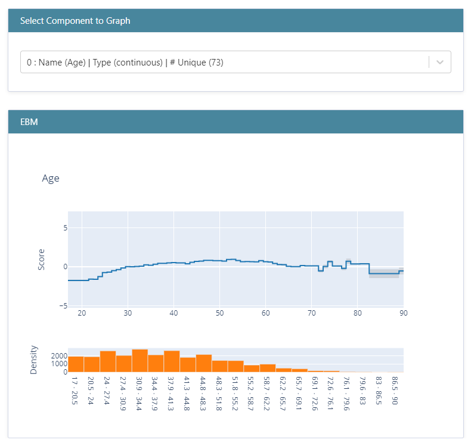
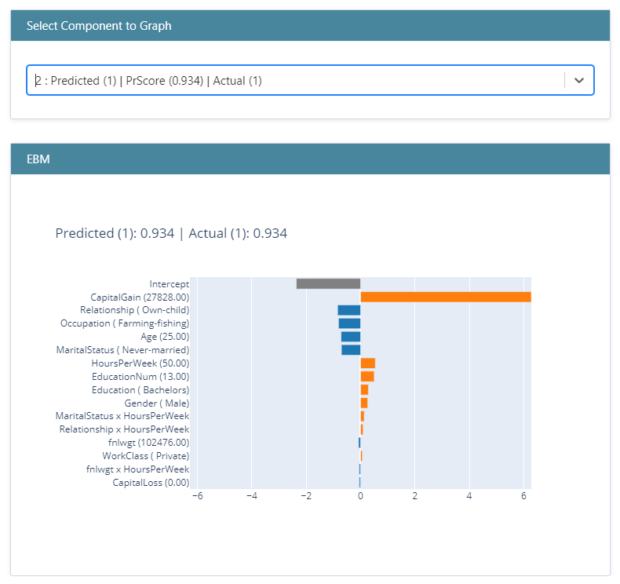
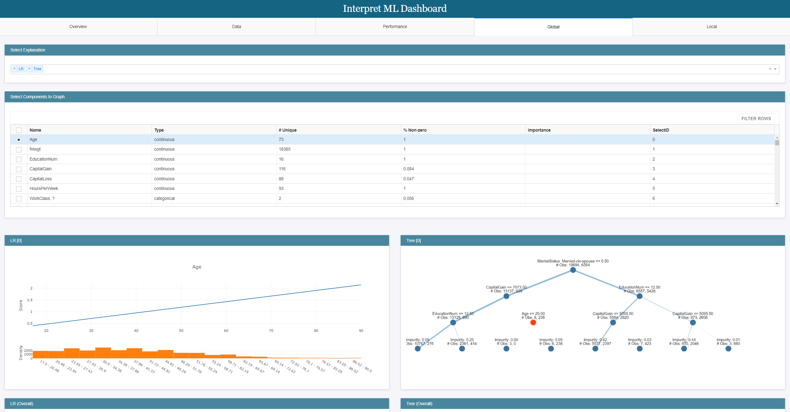
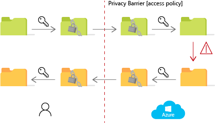
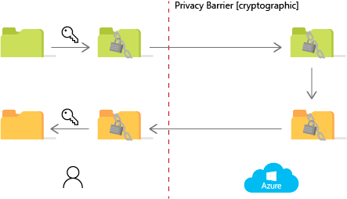

# Responsible ML

[1. Responsible AI and Responsible ML](#1-responsible-ai-and-responsible-ml)

- [1.1. Challenges in modern ML](#11-challenges-in-modern-ml)

- [1.2. Responsible ML in Azure Machine Learning: Understand, Protect and Control](#12-responsible-ml-in-azure-machine-learning-understand-protect-and-control)
  
  - [1.2.1. Understand](#121-understand)
  - [1.2.2. Protect](#122-protect)
  - [1.2.3. Control](#123-control)

[2. Understand](#2-understand)

- [2.1. Interpretability](#21-interpretability)
  
  - [2.1.1. Overview of model interpretability](#211-overview-of-model-interpretability)
  - [2.1.2. Model interpretability in Azure ML](#212-model-interpretability-in-azure-ml)
  - [2.1.3. InterpretML toolkit](#213-interpretml-toolkit)

  [2.2. Fairness](#22-fairness)

  - [2.2.1. What is fairness in machine learning systems?](#221-what-is-fairness-in-machine-learning-systems)
  - [2.2.2. Fairlearn toolkit](#222-fairlearn-toolkit)
  - [2.2.3. Evaluating fairness-related metrics](#223-evaluating-fairness-related-metrics)
  - [2.2.4. Mitigating disparity](#224-mitigating-disparity)
  - [2.2.5. The Fairlearn Dashboard](#225-the-fairlearn-dashboard)
  - [2.2.6. The Azure ML Fairness SDK](#226-the-azure-machine-learning-fairness-sdk)

[3. Protect](#3-protect)

- [3.1. Differential Privacy](#31-differential-privacy)

  - [3.1.1. Overview](#311-overview)
  - [3.1.2. WhiteNoise](#312-whitenoise)
  - [3.1.3. WhiteNoise Core](#313-whitenoise-core)
  - [3.1.4. WhiteNoise System](#314-whitenoise-system)
  - [3.1.5. Using differential privacy in Azure ML](#315-using-differential-privacy-in-azure-machine-learning)

- [3.2. Confidential Machine Learning](#32-confidential-machine-learning)

  - [3.2.1. Homomorphic encryption](#321-homomorphic-encryption)
  - [3.2.2. The Microsoft SEAL (Simple Encrypted Arithmetic Library)](#322-the-microsoft-seal-simple-encrypted-arithmetic-library)
  - [3.2.3. The Encrypted inference SDK](#323-the-encrypted-inference-sdk)

[4. Control](#4-control)

- [4.1. Control the end-to-end machine learning process with MLOps](#41-control-the-end-to-end-machine-learning-process-with-mlops)

- [4.2. Track the audit trail](#42-track-the-audit-trail)

- [4.3. Document the machine learning lifecycle with datasheets](#42-document-the-machine-learning-lifecycle-with-datasheets)

  - [4.3.1. Introduction to datasheets](#431-introduction-to-datasheets)
  - [4.3.2. ABOUT ML](#432-about-ml)
  - [4.3.3. Use Azure ML SDK to implement datasheets for models](#433-use-azure-ml-sdk-to-implement-datasheets-for-models)

## 1. Responsible AI and Responsible ML

As with the significant advances of the past on which it builds — including electricity, the telephone, and transistors — AI will bring about profound changes, some of which are hard to imagine today. As was the case with most of the previous significant technological advances, we'll need to be thoughtful about how we address the societal issues that these changes bring about. Most importantly, we all need to work together to ensure that AI is developed responsibly so that people will trust it and deploy it broadly to increase business and personal productivity and help solve societal problems. This will require a shared understanding of the ethical and societal implications of these new technologies. This, in turn, will help pave the way toward a common framework of principles to guide researchers and developers as they deliver a new generation of AI-enabled systems and capabilities, and governments as they consider a new generation of rules and regulations to protect the safety and privacy of citizens and ensure that the benefits of AI are broadly accessible.

Designing AI to be trustworthy requires creating solutions that reflect ethical principles that are deeply rooted in important and timeless values. Microsoft focused on **six principles** that should guide the development of AI. Specifically, AI systems should be fair, reliable, safe, private and secure, inclusive, transparent, and accountable. These principles are critical to addressing the societal impacts of AI and building trust as the technology becomes more and more a part of the products and services that people use at work and home every day.


An excellent summary of research supporting Responsible AI has been recently [published by Microsoft Research](https://www.microsoft.com/en-us/research/blog/research-collection-responsible-ai/).

As one can easily see from the diagram above, Responsible AI covers an extensive range of disciplines, topics, and fields outside the scope of this whitepaper. Our discussion focuses on the narrower topic of Responsible ML and [Microsoft's three responsible ML pillars](https://docs.microsoft.com/en-us/azure/machine-learning/concept-responsible-ml) - Understand, Protect, and Control.


### 1.1. Challenges in modern ML

Modern ML comes with several challenges that motivate us to think carefully about the responsible creation and application of ML. Exploring some of these may help us developing a sense of the importance of responsible ML.

**Increasing inequality**
  
When machine learning models are trained on datasets with issues, they may induce or increase inequality between various demographics. A recent example of this situation can be found in healthcare. Some datasets came with features that are proxies for wealth, which makes any resulting models biased against the lower-income demographic.

**Potential weaponization**
  
ML is being weaponized to improve vectors of attack in cybersecurity. For example, ML is being used to profile vulnerable groups to enhance phishing attacks delivered by email.
In an even more dangerous scenario, do we want to defer the decision to harm or kill a human being to a machine learning model (e.g., one that drives that decision in an autonomous killer drone)?

**Unintentional bias**

One example of this was a major online advertising system that showed an ad for high-income jobs to men more often than it showed the ad to women.

**Adversarial attacks**
  
What happens when you as the passenger see a stop sign, but your self-driving car is fooled into seeing something else by someone who carefully applied a specially designed sticker to the sign?

**Deep fakes**
  
There have already been videos of world leaders made to appear saying something they would never say. Deep fakes enable the weaponization of misinformation and pose a severe threat to news and media reliability.

**Intentional data poisoning and bias**
  
Models are often built with some amount of public data. Imagine the damage that could be caused when someone intentionally manipulates the public data used for training, and the data scientists building the models don't check it for manipulation (because they trust the data since it's public record).

 **Hype**
  
Hype should be considered one of the biggest threats to Machine Learning. There is a lot of hype created around Machine Learning which drives, in many cases, totally unrealistic expectations. The combination of minimizing ML limitations and maximizing ML promises can leave us at best disillusioned and at worst experiencing loss of life.

As one can easily see from the situations above, the implications of using ML at the scale we already do today are very serious. The responsible use of ML should be at the core of all ML-related initiatives in modern organizations.

### 1.2. Responsible ML in Azure Machine Learning: Understand, Protect and Control

As ML reaches critical momentum across industries and applications, it becomes essential to ensure the safe and responsible use of ML. ML deployments are increasingly impacted by the lack of customer trust in these solutions' transparency, accountability, and fairness. Microsoft is committed to advancing ML (and of AI in a broader context), driven by the above-described pillars that put people first and tools to enable this in practice.

As introduced above, the three pillars of Microsoft's Responsible ML approach are:

- **Understand** - interpret and explain model behavior, assess and mitigate model unfairness
- **Protect** - prevent data exposure with differential privacy, work with encrypted data using homomorphic encryption, employ confidential machine learning
- **Control** - control the end-to-end machine learning process, document the machine learning lifecycle with datasheets

#### 1.2.1. Understand

As ML becomes deeply integrated into our daily business processes, transparency is critical. Azure Machine Learning helps you to not only understand model behavior but also assess and mitigate unfairness.

**Interpret and explain model behavior**

- "Azure Machine Learning helps us build AI responsibly and build trust with our customers. Using the interpretability capabilities in the fraud detection efforts for our loyalty program, we can understand models better, identify genuine cases of fraud, and reduce the possibility of erroneous results."* — Daniel Engberg, Head of Data Analytics and Artificial Intelligence, Scandinavian Airlines

Model interpretability capabilities in Azure Machine Learning, powered by the [**InterpretML toolkit**](https://github.com/interpretml/interpret), enable developers and data scientists to understand model behavior and provide model explanations to business stakeholders and customers.

Model interpretability is used to build accurate ML models and understand the behavior of a wide variety of models, including deep neural networks, during both training and inferencing phases.
Finally, it is used to perform a what-if analysis to determine the impact on model predictions when feature values are changed.

**Assess and mitigate model unfairness**

- "Azure Machine Learning and its Fairlearn capabilities offer advanced fairness and explainability that have helped us deploy trustworthy AI solutions for our customers while enabling stakeholder confidence and regulatory compliance."*  — Alex Mohelsky, EY Canada Partner and Advisory Data, Analytic, and AI Leader

A challenge with building AI systems today is the inability to prioritize fairness. Using [**Fairlearn**](https://github.com/fairlearn/fairlearn) with Azure Machine Learning, developers and data scientists can leverage specialized algorithms to ensure fairer outcomes for everyone.
Fairness capabilities are used to assess model fairness during both model training and deployment and to mitigate unfairness while optimizing model performance. As an essential part of the platform, interactive visualizations help you compare a set of recommended models that reduce unfairness.

Out of the six general responsible AI principles enumerated at the beginning of this whitepaper, the following two can be translated to the **Understand** pillar:

**fairness**

*AI systems should treat all people fairly*

Despite all its benefits, AI could unintentionally treat people unfairly or reinforce existing societal biases. AI systems should treat everyone fairly and avoid affecting similarly situated groups of people in different ways. For example, imagine a sizeable financial lending institution developed a risk scoring system for loan approvals. But because the training data reflected that loan officers have historically favored male borrowers, most approved loans were for male borrowers. Without an audit, this unfairness would've persisted in the system, unintentionally adversely affecting millions.
We believe that mitigating unfairness starts with understanding the implications and limitations of AI predictions and recommendations. Ultimately, people should supplement AI decisions with sound human judgment and be held accountable for consequential decisions affecting others.
It's crucial that developers understand how different types of unfairness can be introduced into data, machine learning models, or systems that leverage multiple models and then use tools, methodologies, and other resources to help detect and mitigate those biases. It is also vital to have robust governance processes and continually monitor models for drift or deterioration.

**Transparency**

*AI systems should be understandable.*

Transparency and accountability are two foundational principles underlying the above four values of responsible AI, as they are essential for ensuring the effectiveness of the rest.

When AI systems are used to help make decisions that impact people’s lives, people must understand how those decisions were made. An approach that is most likely to engender trust with users and those affected by these systems is to provide explanations that include contextual information about how an AI system works and interacts with data. Such information will make it
easier to identify and raise awareness of potential bias, errors, and unintended outcomes.

Simply publishing the algorithms underlying AI systems will rarely provide meaningful transparency. With the latest (and often most promising) AI techniques, such as deep neural networks, there typically isn’t any algorithmic output that would help people understand the subtle patterns that systems find. This is why we need a more holistic approach in which AI system designers describe the system’s key elements as thoroughly and clearly as possible.

There are three components of transparency. First, transparency relies on a foundation of traceability, with teams documenting their goals, definitions, design choices, and any assumptions made in the development of the system.
Second, transparency requires communication—it’s important that those who are building and using AI systems are forthcoming about when, why, and how they choose to develop and deploy them, as well as their systems’ limitations. The third facet of transparency is intelligibility. Intelligibility means that people should be able to understand and monitor the technical behavior of AI systems fully. This understanding helps data scientists evaluate and debug models and make informed decisions about improving
the model over time. It also allows executives, boards, employees, and customers determine how much to trust a model’s predictions or recommendations.
  
#### 1.2.2. Protect

ML is increasingly used in scenarios that involve sensitive information like medical patients or census data. Current practices, such as redacting or masking data, can be limiting for ML. To address this issue, differential privacy and confidential machine learning techniques can be used to help organizations build solutions while maintaining data privacy and confidentiality.

**Prevent data exposure with differential privacy**

Using the new [differential privacy toolkit](https://github.com/opendifferentialprivacy/whitenoise-core) with Azure Machine Learning, data science teams can build ML solutions that preserve privacy and help prevent reidentification of an individual’s data. These differential privacy techniques have been developed in collaboration with researchers at Harvard’s Institute for Quantitative Social Science (IQSS) and the School of Engineering.

Differential privacy protects sensitive data by:

- Injecting statistical noise in data to help prevent disclosure of private information without significant accuracy loss.
- Managing exposure risk by tracking the information budget used by individual queries and limiting further queries as appropriate.
  
**Safeguard data with confidential machine learning**

In addition to data privacy, organizations are looking to ensure all ML assets’ security and confidentiality.

To enable secure model training and deployment, Azure Machine Learning provides a robust set of data and networking protection capabilities. These include support for Azure Virtual Networks, private links to connect to ML workspaces, dedicated compute hosts, and customer-managed keys for encryption in transit and at rest.

Building on this secure foundation, Azure Machine Learning also enables data science teams at Microsoft to build models over confidential data in a safe environment without seeing the data. All ML assets are kept confidential during this process. This approach is fully compatible with open-source ML frameworks and a wide range of hardware options. We are excited to bring these confidential machine learning capabilities to all developers and data scientists later this year.

Out of the six general responsible AI principles enumerated at the beginning of this whitepaper, the following two can be translated to the **Protect** pillar:

**Privacy & Security**

*AI systems should be secure and respect privacy.*
  
With AI, privacy and data security issues require incredibly close attention because access to data is essential for AI systems to make accurate and informed predictions and decisions about people.

As more and more of our lives are captured in digital form, the question of how to preserve our privacy and secure our personal data is becoming more important and more complicated. While protecting privacy and security is important to all technology development, recent advances require that we pay even closer attention to these issues to create the levels of trust needed to realize AI's full benefits. Simply put, people will not share data about themselves — data that is essential for AI to help inform decisions about people — unless they are confident that their privacy is protected and their data secured.

Like other cloud technologies, AI systems must comply with privacy laws that require transparency about the collection, use, and storage of data and mandate that consumers have appropriate controls so that they can choose how their data is used. AI systems should also be designed to use private information following privacy standards and protected from bad actors who might seek to steal private information or inflict harm. Industry processes should be developed and implemented for the following: tracking relevant information about customer data (such as when it was collected and the terms governing its collection); accessing and using that data; and auditing access and use.

**Inclusiveness**

*AI systems should empower everyone and engage people.*

If we are to ensure that AI technologies benefit and empower everyone, they must incorporate and address a broad range of human needs and experiences. Inclusive design practices will help system developers understand and address potential barriers in a product or environment that could unintentionally exclude people. This means that AI systems should be designed to understand the context, needs and
expectations of the people who use them.

 AI can be a powerful tool for increasing access to information, education, employment, government services, and social and economic opportunities. Real-time speech-to-text transcription, visual recognition services, and predictive text functionality that
suggests words as people type are just a few examples of AI-enabled services that are already empowering those with
hearing, visual and other impairments.
AI experiences can positively impact when they offer both emotional intelligence and cognitive intelligence, a balance that can improve predictability and comprehension. For example, AI-based personal agents can exhibit user awareness by confirming and,
as necessary, correcting understanding of the user's intent and recognizing and adjusting to the people, places, and events that are most important to users. Personal agents should provide information and make recommendations in ways that are contextual and expected. They should provide information that helps people understand what inferences the system is making about them. Over time, such successful
interactions will increase usage of AI systems and trust in their performance.

#### 1.2.3. Control

To build responsibly, the ML development process should be repeatable, reliable and hold stakeholders accountable. Azure Machine Learning enables decision-makers, auditors, and everyone in the ML lifecycle to support a responsible process.

**Track ML assets using audit trail**

Azure Machine Learning provides capabilities to automatically track lineage and maintain an audit trail of ML assets. Details—such as run history, training environment, and data and model explanations—are all captured in a central registry, allowing organizations to meet various audit requirements.

**Document the machine learning lifecycle with datasheets to increase accountability**

Documenting the correct information in the machine learning process is key to making responsible decisions at each stage. Datasheets are a way to document machine learning assets that are used and created as part of the machine learning lifecycle.

Models tend to be thought of as "opaque boxes" and often, there is little information about them. Because machine learning systems are becoming more pervasive and are used for decision making, using datasheets is a step towards developing more responsible machine learning systems.

Some model information you might want to document as part of a datasheet:

- Intended use
- Model architecture
- Training data used
- Evaluation data used
- Training model performance metrics
- Fairness information.

Out of the six general responsible AI principles enumerated at the beginning of this whitepaper, the following two can be translated to the **Control** pillar:

**Reliability & Safety**

*AI systems should perform reliably and safely.*

It's critical that AI systems operate reliably, safely, and consistently under normal circumstances and in unexpected conditions.
To understand the need for a reliable and safe solution, one needs only to imagine AI's role in managing an organization's liquidity and underwriting
functions. Such functions are systemically important to the financial stability of a bank or insurance company. The system's reliability also plays a crucial role in managing financial business functions, especially managing market volatility. As such, rigorous testing is essential during system development and deployment to prevent unexpected performance failures and ensure systems don't evolve in inconsistent ways with original expectations. After testing and deployment, it's equally important that organizations properly operate, maintain, and protect their AI systems over the lifespan of their use. If not maintained properly, they can become unreliable or inaccurate.
Also, because AI should augment and amplify human capabilities, people should play a critical role in making decisions about how and when an AI system is deployed, and whether it's appropriate to continue to use it over time. Since AI systems often do not see or understand the bigger societal picture, human judgment will be vital to identifying potential blind spots and biases in AI systems. Developers should be aware of these challenges as they build and deploy systems and share information with their customers to monitor and understand system behavior to identify and correct any unintended actions that may surface quickly.

**Accountability**

Finally, as with other technologies and products, despite the complexity of the systems they build, the people who design and deploy AI systems must be accountable for how their technology impacts the world. To establish accountability norms
for AI, we should draw upon experience and practices in other areas, including healthcare and privacy.
Accountability implies a structure put in place to guard the principles and ensure they are followed in everything that's done. Those who develop and use AI systems should consider such practices and periodically check whether they are being adhered to
and working effectively. Internal review boards can provide oversight and guidance on which practices should be adopted to address the concerns discussed above and on fundamental questions regarding the development and deployment of AI systems.

## 2. Understand

### 2.1. Interpretability

#### 2.1.1. Overview of model interpretability

Interpretability is critical for data scientists, auditors, and business decision-makers alike to ensure compliance with company policies, industry standards, and government regulations:

- Data scientists need the ability to explain their models to executives and stakeholders so that they can understand the value and accuracy of their findings. They also require interpretability to debug their models and make informed decisions about how to improve them.

- Legal auditors require tools to validate models concerning regulatory compliance and monitor how models' decisions impact humans.

- Business decision-makers need peace-of-mind by having the ability to provide transparency for end-users. This allows them to earn and maintain trust.

Enabling the capability of explaining a machine learning model is important during two main phases of model development:

During the training phase, as model designers and evaluators can use a model's interpretability output to verify hypotheses and build trust with stakeholders. They also use the insights into the model for debugging, validating model behavior that matches their objectives, and checking for model unfairness or insignificant features.

- During the inferencing phase, having transparency around deployed models empowers executives to understand "when deployed" how the model is working and how its decisions are treating and impacting people in real life.

#### 2.1.2. Model interpretability in Azure ML

In Azure Machine Learning, the interpretability classes are made available through multiple SDK packages.

- `azureml.interpret`, the main package containing functionalities supported by Microsoft.

- `azureml.contrib.interpret`, preview, and experimental functionalities that you can try.

Use ```pip install azureml-interpret``` and ```pip install azureml-contrib-interpret`` for general use.

>Important
>
>Content in the contrib namespace is not fully supported. As the experimental functionalities become mature, they will gradually be moved to the main namespace. .

Using the classes and methods in the SDK, you can:

- Explain model prediction by generating feature importance values for the entire model and/or individual data points.
- Achieve model interpretability on real-world datasets at scale, during training, and inference.
- Use an interactive visualization dashboard to discover patterns in data and explanations at training time
  
In machine learning, features are the data fields used to predict a target data point. For example, to predict credit risk, data fields for age, account size, and account age might be used. In this case, age, account size, and account age are features. Feature importance tells you how each data field affected the model's predictions. For example, age may be heavily used in the prediction, while account size and age do not affect the prediction values significantly. This process allows data scientists to explain resulting predictions so that stakeholders have visibility into what features are most important in the model.

#### 2.1.3. InterpretML toolkit

InterpretML is an open-source package that incorporates state-of-the-art machine learning interpretability techniques under one roof. With this package, you can train interpretable glassbox models and explain blackbox systems. InterpretML helps you understand your model's global behavior or understand the reasons behind individual predictions.

Interpretability is essential for:

- Model debugging - Why did my model make this mistake?
- Detecting fairness issues - Does my model discriminate?
- Human-AI cooperation - How can I understand and trust the model's decisions?
- Regulatory compliance - Does my model satisfy legal requirements?
- High-risk applications - Healthcare, finance, judicial, ...

**Installation**

Python 3.5+ | Linux, Mac, Windows

```sh
pip install interpret
```

**Interpret**

**Introducing the Explainable Boosting Machine (EBM)**

EBM is an interpretable model developed at Microsoft Research<sup>[*](#citations)</sup>. It uses modern machine learning techniques like bagging, gradient boosting, and automatic interaction detection to breathe new life into traditional GAMs (Generalized Additive Models). This makes EBMs as accurate as state-of-the-art techniques like random forests and gradient boosted trees. However, unlike these blackbox models, EBMs produce lossless explanations and are editable by domain experts.

| Dataset/AUROC | Domain  | Logistic Regression | Random Forest | XGBoost        | Explainable Boosting Machine |
|---------------|---------|:-------------------:|:-------------:|:--------------:|:----------------------------:|
| Adult Income  | Finance | .907±.003           | .903±.002     | .922±.002      | **_.928±.002_**              |
| Heart Disease | Medical | .895±.030           | .890±.008     | .870±.014      | **_.916±.010_**              |
| Breast Cancer | Medical | **_.995±.005_**     | .992±.009     | **_.995±.006_**| **_.995±.006_**              |
| Telecom Churn | Business| .804±.015           | .824±.002     | .850±.006      | **_.851±.005_**              |
| Credit Fraud  | Security| .979±.002           | .950±.007     | **_.981±.003_**| .975±.005                    |

[*Notebook for reproducing table*](https://nbviewer.jupyter.org/github/interpretml/interpret/blob/master/benchmarks/EBM%20Classification%20Comparison.ipynb)

**Supported Techniques**

|Interpretability Technique|Type|Examples|
|--|--|--------------------|
|Explainable Boosting|glassbox model|[Notebooks](https://nbviewer.jupyter.org/github/interpretml/interpret/blob/master/examples/python/notebooks/Interpretable%20Classification%20Methods.ipynb)|
|Decision Tree|glassbox model|[Notebooks](https://nbviewer.jupyter.org/github/interpretml/interpret/blob/master/examples/python/notebooks/Interpretable%20Classification%20Methods.ipynb)|
|Decision Rule List|glassbox model|Coming Soon|
|Linear/Logistic Regression|glassbox model|[Notebooks](https://nbviewer.jupyter.org/github/interpretml/interpret/blob/master/examples/python/notebooks/Interpretable%20Classification%20Methods.ipynb)|
|SHAP Kernel Explainer|blackbox explainer|[Notebooks](https://nbviewer.jupyter.org/github/interpretml/interpret/blob/master/examples/python/notebooks/Explaining%20Blackbox%20Classifiers.ipynb)|
|SHAP Tree Explainer|blackbox explainer|Coming Soon|
|LIME|blackbox explainer|[Notebooks](https://nbviewer.jupyter.org/github/interpretml/interpret/blob/master/examples/python/notebooks/Explaining%20Blackbox%20Classifiers.ipynb)|
|Morris Sensitivity Analysis|blackbox explainer|[Notebooks](https://nbviewer.jupyter.org/github/interpretml/interpret/blob/master/examples/python/notebooks/Explaining%20Blackbox%20Classifiers.ipynb)|
|Partial Dependence|blackbox explainer|[Notebooks](https://nbviewer.jupyter.org/github/interpretml/interpret/blob/master/examples/python/notebooks/Explaining%20Blackbox%20Classifiers.ipynb)|

**Train a glassbox model**

Let's fit an Explainable Boosting Machine.

```python
from interpret.glassbox import ExplainableBoostingClassifier

ebm = ExplainableBoostingClassifier()
ebm.fit(X_train, y_train)

# or substitute with LogisticRegression, DecisionTreeClassifier, RuleListClassifier, ...
# EBM supports pandas dataframes, numpy arrays, and handles "string" data natively.
```

Understand the model

```python
from interpret import show

ebm_global = ebm.explain_global()
show(ebm_global)
```



<br/>

Understand individual predictions

```python
ebm_local = ebm.explain_local(X_test, y_test)
show(ebm_local)
```



<br/>

And if you have multiple models, compare them

```python
show([logistic_regression, decision_tree])
```


<br/>
<br/>

**Interpret-text**

Interpret-Text incorporates community-developed interpretability techniques for NLP models and a visualization dashboard to view the results. Users can run their experiments across multiple state-of-the-art explainers and efficiently perform a comparative analysis on them. Using these tools, users will explain their machine learning models globally on each label or locally for each document. In particular, this open-source toolkit:

1. Actively incorporates innovative text interpretability techniques and allows the community to expand its offerings further
2. Creates a common API across the integrated libraries
3. Provides an interactive visualization dashboard to empower its users to gain insights into their data
  
**DICE**

Explanations are critical for machine learning, especially as machine learning-based systems are being used to inform decisions in societally critical domains such as finance, healthcare, education, and criminal justice.
However, most explanation methods depend on an approximation of the ML model to create an interpretable explanation. For example, consider a person who applied for a loan and was rejected by a financial company's loan distribution algorithm. Typically, the company may explain why the loan was denied, for example, due to "poor credit history". However, such an explanation does not help the person decide *what they should do next* to improve their chances of being approved in the future. Critically, the most important feature may not be enough to flip the algorithm's decision, and in practice, may not even be changeable, such as gender and race.

DiCE implements [counterfactual (CF) explanations](https://arxiv.org/abs/1711.00399)  that provide this information by showing feature-perturbed versions of the same person who would have received the loan, e.g., ``you would have received the loan if your income was higher by $10,000``. In other words, it provides "what-if" explanations for model output and can be a helpful complement to other explanation methods, both for end-users and model developers.

Barring simple linear models, however, it isn't easy to generate CF examples that work for any machine learning model. DiCE is based on [recent research](https://arxiv.org/abs/1905.07697) that generates CF explanations for any ML model. The core idea is to find such explanations as an optimization problem, similar to finding adversarial examples. The critical difference is that for explanations, we need perturbations that change the output of a machine learning model but are also diverse and feasible to change. Therefore, DiCE supports generating a set of counterfactual explanations and has tunable parameters for diversity and proximity of the explanations to the original input. It also supports simple constraints on features to ensure the feasibility of the generated counterfactual examples.

### 2.2. Fairness

#### 2.2.1. What is fairness in machine learning systems?

Artificial intelligence and machine learning systems can display unfair behavior. One way to define unfair behavior is by its harm or impact on people. There are many types of harm that AI systems can give rise to

Two common types of AI-caused harms are:

- Harm of allocation: An AI system extends or withholds opportunities, resources, or information for specific groups. Examples include hiring, school admissions, and lending, where a model might be much better at picking good candidates among a specific group of people than among other groups.

- Harm of quality-of-service: An AI system does not work as well for one group of people as it does for another. For example, a voice recognition system might fail to work as well for women as it does for men.

To reduce unfair behavior in AI systems, you have to assess and mitigate these harms.

#### 2.2.2. Fairlearn toolkit

Fairlearn is an open-source Python package that empowers developers of artificial intelligence (AI) systems to assess their system's fairness and mitigate any observed unfairness issues.

The Fairlearn open-source package has two components:

- **Assessment Dashboard**: A Jupyter notebook widget for assessing how a model's predictions affect different groups. It also enables comparing multiple models by using fairness and performance metrics.
- **Mitigation Algorithms**: A set of algorithms to mitigate unfairness in binary classification and regression.
  
Together, these components enable data scientists and business leaders to navigate any trade-offs between fairness and performance and select the mitigation strategy that best fits their needs.

Besides the source code, the Fairlearn repository also contains Jupyter notebooks with examples of Fairlearn usage.

#### 2.2.3. Evaluating fairness-related metrics

Fairlearn is an open-source Python package that allows machine learning systems developers to assess their systems' fairness and mitigate the observed fairness issues.

In the Fairlearn open-source package, fairness is conceptualized through an approach known as **group fairness**, which asks: ***Which groups of individuals are at risk for experiencing harms?*** The relevant groups, also known as subpopulations, are defined through **sensitive features** or sensitive attributes. Sensitive features are passed to an estimator in the Fairlearn open-source package as a vector or a matrix called `sensitive_features`. The term suggests that the system designer should be sensitive to these features when assessing group fairness.

Something to be mindful of is whether these features contain privacy implications due to private data. But the word "sensitive" doesn't imply that these features shouldn't be used to make predictions.

>Note
>
>A fairness assessment is not a purely technical exercise. The Fairlearn open-source package can help you assess a model's fairness, but it will not perform the assessment for you. The Fairlearn open-source package helps identify quantitative metrics to determine fairness, but developers must also perform a qualitative analysis to evaluate their own models' fairness. The sensitive features noted above are an example of this kind of qualitative analysis.

During the assessment phase, fairness is quantified through disparity metrics. **Disparity metrics** can evaluate and compare model's behavior across different groups either as ratios or as differences.

The Fairlearn open-source package supports two classes of disparity metrics:

The disparity in model performance: These sets of metrics calculate the disparity (difference) in the selected performance metric values across different subgroups. Some examples include:

- disparity in accuracy rate
  - disparity in error rate
  - disparity in precision
  - disparity in recall
  - disparity in MAE
  - many others
- Disparity in selection rate: This metric contains the difference in selection rate among different subgroups. An example of this is the disparity in loan approval rate. Selection rate means the fraction of data points in each class classified as 1 (in binary classification) or distribution of prediction values (in regression).

#### 2.2.4. Mitigating disparity

**Parity constraints**
The Fairlearn open-source package includes a variety of unfairness mitigation algorithms. These algorithms support a set of constraints on the predictor's behavior called parity constraints or criteria. Parity constraints require some aspects of the predictor behavior to be comparable across the groups that sensitive features define (e.g., different races). The mitigation algorithms in the Fairlearn open-source package use such parity constraints to mitigate the observed fairness issues.

>Note
>
>Mitigating unfairness in a model means reducing the unfairness, but this technical mitigation cannot eliminate this unfairness completely. The unfairness mitigation algorithms in the Fairlearn open-source package can provide suggested mitigation strategies to help reduce unfairness in a machine learning model. Still, they are not solutions to eliminate unfairness completely. There may be other parity constraints or criteria that should be considered for each particular developer's machine learning model. Developers using Azure Machine Learning must determine for themselves if the mitigation sufficiently eliminates any unfairness in their intended use and deployment of machine learning models.

The Fairlearn open-source package supports the following types of parity constraints:

Parity constraint | Purpose | Machine learning task
--- | --- | ---
Demographic parity | Mitigate allocation harms | Binary classification, Regression
Equalized odds  |  Diagnose allocation and quality-of-service harms |  Binary classification
Equal opportunity |  Diagnose allocation and quality-of-service harms  | Binary classification
Bounded group loss |  Mitigate quality-of-service harms  | Regression

**Mitigation algorithms**
  
The Fairlearn open-source package provides post-processing and reduction unfairness mitigation algorithms:

- **Reduction**: These algorithms take a standard black-box machine learning estimator (e.g., a LightGBM model) and generate a set of retrained models using a sequence of re-weighted training datasets. For example, applicants of a specific gender might be up-weighted or down-weighted to retrain models and reduce disparities across different gender groups. Users can then pick a model that provides the best trade-off between accuracy (or other performance metrics) and disparity, which generally would need to be based on business rules and cost calculations.
- **Post-processing**: These algorithms take an existing classifier and the sensitive feature as input. Then, they derive a transformation of the classifier's prediction to enforce the specified fairness constraints. The most significant advantage of threshold optimization is its simplicity and flexibility, as it does not need to retrain the model.
  
Algorithm | Description | Machine learning task | Sensitive features | Supported parity constraints | Algorithm Type
--- | --- | --- | --- | ---  | ---
`ExponentiatedGradient`  |  Black-box approach to fair classification described in [A Reductions Approach to Fair Classification](https://arxiv.org/abs/1803.02453) | Binary classification  | Categorical |  Demographic parity, equalized odds |  Reduction
`GridSearch` | Black-box approach to fair classification described in [A Reductions Approach to Fair Classification](https://arxiv.org/abs/1803.02453) | Binary classification | Binary | Demographic parity, equalized odds | Reduction
`GridSearch` | Black-box approach that implements a grid-search variant of Fair Regression with the algorithm for bounded group loss described in [Fair Regression: Quantitative Definitions and Reduction-based Algorithms](https://arxiv.org/abs/1905.12843) | Regression  | Binary |Bounded group loss | Reduction
`ThresholdOptimizer` | Post-processing algorithm based on the paper [Equality of Opportunity in Supervised Learning](https://arxiv.org/abs/1610.02413). This technique takes as input an existing classifier and the sensitive feature and derives a monotone transformation of the classifier's prediction to enforce the specified parity constraints. | Binary classification | Categorical | Demographic parity, equalized odds | Post-processing

#### 2.2.5.  The Fairlearn dashboard

The Fairlearn dashboard is a Jupyter notebook widget for assessing how a model's predictions impact different groups (e.g., different ethnicities) and compare multiple models along with different fairness and performance metrics.

**Setup and a single-model assessment**

To assess a single model's fairness and performance, the dashboard widget can be launched within a Jupyter notebook as follows:

```python
from fairlearn.widget import FairlearnDashboard

# A_test containts your sensitive features (e.g., age, binary gender)
# sensitive_feature_names containts your sensitive feature names
# y_true contains ground truth labels
# y_pred contains prediction labels

FairlearnDashboard(sensitive_features=A_test,
                  sensitive_feature_names=['BinaryGender', 'Age'],
                  y_true=Y_test.tolist(),
                  y_pred=[y_pred.tolist()])
```

Additionally, the dashboard can be uploaded to Azure Machine Learning and access in the Azure Machine Learning workspace under the matching experiment run.

```python
from azureml.contrib.fairness import upload_dashboard_dictionary, download_dashboard_by_upload_id

#  Create a dictionary of model(s) you want to assess for fairness 
sf = { 'Race': A_test.race, 'Sex': A_test.sex}
ys_pred = { lr_reg_id:lr_predictor.predict(X_test) }
from fairlearn.metrics._group_metric_set import _create_group_metric_set

dash_dict = _create_group_metric_set(y_true=y_test,
                                    predictions=ys_pred,
                                    sensitive_features=sf,
                                    prediction_type='binary_classification')

exp = Experiment(ws, "Test_Fairness_Census_Demo")
print(exp)

run = exp.start_logging()

# Upload the dashboard to Azure Machine Learning
try:
    dashboard_title = "Fairness insights of Logistic Regression Classifier"
    # Set validate_model_ids parameter of upload_dashboard_dictionary to False if you have not registered your model(s)
    upload_id = upload_dashboard_dictionary(run,
                                            dash_dict,
                                            dashboard_name=dashboard_title)
    print("\nUploaded to id: {0}\n".format(upload_id))

    # To test the dashboard, you can download it back and ensure it contains the right information
    downloaded_dict = download_dashboard_by_upload_id(run, upload_id)
finally:
    run.complete()
```

After the launch, the widget walks the user through the assessment setup, where the user is asked to select

1. the sensitive feature of interest (e.g., binary gender or age), and

2. the performance metric (e.g., model precision) along which to evaluate the overall model performance as well as any disparities across groups. These selections are then used to obtain the visualization of the model's impact on the subgroups (e.g., model precision for females and model precision for males).

The following figures illustrate the setup steps, where binary gender is selected as a sensitive feature and accuracy rate is selected as the performance metric.


After the setup, the dashboard presents the model assessment in two panels:

**False Positives and False Negatives**


This panel shows:

1. The performance of your model with respect to your selected performance metric (e.g., accuracy rate) overall as well as on different subgroups based on your selected sensitive feature (e.g., accuracy rate for females, accuracy rate for males).
2. The disparity (difference) in the values of the selected performance metric across different subgroups.
3. The distribution of errors in each subgroup (e.g., female, male).

For binary classification, the errors are further split into overprediction (predicting 1 when the true label is 0), and underprediction (predicting 0 when the true label is 1).

**Disparity in predictions**


This panel shows a bar chart that contains the selection rate in each group, meaning the fraction of data classified as 1 (in binary classification) or distribution of prediction values (in regression).

**Comparing multiple models**

The dashboard also compares multiple models, such as the models produced by different learning algorithms and different mitigation approaches, including `fairlearn.reductions.GridSearch``, fairlearn.reductions.ExponentiatedGradient`, and `fairlearn.postprocessing.ThresholdOptimizer`.

As before, the user is first asked to select the sensitive feature and the performance metric. The *model comparison* view then depicts all the provided models' performance, and disparity in a scatter plot. This allows the user to examine trade-offs between performance and fairness. Each of the dots can be clicked to open the assessment of the corresponding model. The figure below shows the model comparison view with *binary gender* selected as a sensitive feature and *accuracy rate* chosen as the performance metric.


#### 2.2.6. The Azure Machine Learning Fairness SDK

The Azure Machine Learning Fairness SDK, `azureml-contrib-fairness`, integrates the open-source Python package, Fairlearn, within Azure Machine Learning. To learn more about Fairlearn's integration within Azure Machine Learning, check out these [sample notebooks](https://github.com/Azure/MachineLearningNotebooks/tree/master/contrib/fairness). For more information on Fairlearn, see the [example guide](https://fairlearn.github.io/auto_examples/notebooks/index.html) and [sample notebooks](https://github.com/fairlearn/fairlearn/tree/master/notebooks).

More details about how to use Azure Machine Learning with the Fairlearn open-source package to assess the fairness of ML models can be found [here](https://docs.microsoft.com/en-us/azure/machine-learning/how-to-machine-learning-fairness-aml).

## 3. Protect

### 3.1. Differential Privacy

#### 3.1.1. Overview

As the amount of data that an organization collects and uses for analyses increases, so do privacy and security concerns. Analyses require data. Typically, the more data used to train models, the more accurate they are. When personal information is used for these analyses, the data must remain private throughout its use.

Differential privacy is a set of systems and practices that help keep the data of individuals safe and private.


In traditional scenarios, raw data is stored in files and databases. When users analyze data, they typically use the raw data. This is a concern because it might infringe on an individual's privacy. Differential privacy tries to deal with this problem by adding "noise" or randomness to the data so that users can't identify any individual data points. At the least, such a system provides plausible deniability. A small amount of statistical noise is added to each result to mask the contribution of individual datapoints. The noise is significant enough to protect an individual's privacy, but still small enough that it will not materially impact the accuracy of the answers extracted by analysts and researchers.

In differentially private systems, data is shared through requests called **queries**. When a user submits a query for data, operations known as **privacy mechanisms** add noise to the requested data. Privacy mechanisms return an approximation of the data instead of the raw data.
The amount of information revealed from each query is calculated and deducted from an overall privacy-loss budget, which will stop additional queries when personal privacy may be compromised. This can be thought of as a built-in shutoff switch in place that prevents the system from showing data when it may begin compromising someone’s privacy.
This privacy-preserving result appears in a **report**. Reports consist of two parts, the actual data computed and a description of how the data was created.

**Differential privacy metrics**

Differential privacy tries to protect against the possibility that a user can produce an indefinite number of reports to eventually reveal sensitive data. A value known as epsilon measures how noisy or private a report is. Epsilon has an inverse relationship to noise or privacy. The lower the epsilon, the more noisy (and private) the data is.

Epsilon values are non-negative. Values below 1 provide full plausible deniability. Anything above 1 comes with a higher risk of exposure to the actual data. As you implement differentially private systems, you want to produce reports with epsilon values between 0 and 1.

Another value directly correlated to epsilon is delta. Delta is a measure of the probability that a report is not entirely private. The higher the delta, the higher the epsilon. Because these values are correlated, epsilon is used more often.

**Privacy budget**

To ensure privacy in systems where multiple queries are allowed, differential privacy defines a rate limit. This limit is known as a **privacy budget**. Privacy budgets are allocated an epsilon amount, typically between 1 and 3, to limit reidentification risk. As reports are generated, privacy budgets keep track of the epsilon value of individual reports as well as the aggregate for all reports. After a privacy budget is spent or depleted, users can no longer access data.

Reliability of data
Although the preservation of privacy should be the goal, there is a tradeoff between the usability and reliability of the data. In data analytics, accuracy can be thought of as a measure of uncertainty introduced by sampling errors. This uncertainty tends to fall within certain bounds. **Accuracy** from a differential privacy perspective instead measures the reliability of the data, which is affected by the uncertainty introduced by the privacy mechanisms. In short, a higher level of noise or privacy translates to data that has a lower epsilon, accuracy, and reliability. Although the data is more private, it's not reliable, the less likely it is to be used.

#### 3.1.2. WhiteNoise

The code for a new open-source differential privacy platform, named WhiteNoise, is now live on [GitHub](https://github.com/opendifferentialprivacy). The project is jointly developed by Microsoft and Harvard’s Institute for Quantitative Social Science (IQSS) and the School of Engineering and Applied Sciences (SEAS) as part of the [OpenDP initiative](https://projects.iq.harvard.edu/opendp). This project gives developers around the world the opportunity to leverage expert differential privacy implementations, review and stress test them, and join the community and make contributions.

Insights from datasets can help solve the most challenging societal problems in health, the environment, economics, and other areas. Unfortunately, because many datasets contain sensitive information, legitimate concerns about compromising privacy currently prevent the use of potentially valuable stores of data. Differential privacy makes it possible to extract valuable insights from datasets while safeguarding the privacy of individuals.

The WhiteNoise platform is designed to collect components that can be flexibly configured to enable developers to use the right combination for their environments.

#### 3.1.3. WhiteNoise Core

In the [Core](https://github.com/opendifferentialprivacy/whitenoise-core), the toolkit provides a pluggable open source library of differentially private algorithms and mechanisms with implementations based on mature differential privacy research. The library offers a fast, memory-safe native runtime.

**WhiteNoise.Core** library includes the following privacy mechanisms for implementing a differentially private system:

**Component** | **Description**
--- | ---
Analysis | A graph description of arbitrary computations.
Validator | A Rust library that contains a set of tools for checking and deriving the necessary conditions for an analysis to be differentially private.
Runtime | The medium to execute the analysis. The reference runtime is written in Rust, but runtimes can be written using any computation framework such as SQL and Spark depending on your data needs.
Bindings | Language bindings and helper libraries to build analyses. Currently WhiteNoise provides Python bindings.

#### 3.1.4. WhiteNoise System

In addition, the System library provides the APIs for defining an analysis and a validator for evaluating these analyses and composing the total privacy loss on a dataset. The runtime and validator are built in Rust, while Python support is available and R support is forthcoming.

The following tools and services are included in **WhiteNose.System** repository:

Component  |  Description
--- | ---
Data Access | Library that intercepts and processes SQL queries and produces reports. This library is implemented in Python and supports the following ODBC and DBAPI data sources: <ul><li>PostgreSQL</li><li>SQL Server</li><li>Spark</li><li>Preston</li><li>Pandas </li></ul>
Service  |  Execution service that provides a REST endpoint to serve requests or queries against shared data sources. The service is designed to allow the composition of differential privacy modules that operate on requests containing different delta and epsilon values, also known as heterogeneous requests. This reference implementation accounts for additional impact from queries on correlated data.
Evaluator  |Stochastic evaluator that checks for privacy violations, accuracy, and bias. The evaluator supports the following tests:<ul><li>Privacy Test - Determines whether a report adheres to the conditions of differential privacy.</li><li>Accuracy Test - Measures whether the reliability of reports falls within the upper and lower bounds given a 95% confidence level.</li><li>Utility Test - Determines whether the confidence bounds of a report are close enough to the data while still maximizing privacy.</li><li>Bias Test - Measures the distribution of reports for repeated queries to ensure they are not unbalanced</li></ul>

#### 3.1.5. Using differential privacy in Azure Machine Learning

Let's see how to apply differential privacy best practices to Azure Machine Learning models by using the WhiteNoise Python packages.

##### **WhiteNoise Standalone installation**
  
The libraries are designed to work from distributed Spark clusters, and can be installed just like any other package.

The instructions below assume that your `python` and `pip` commands are mapped to `python3` and `pip3`.

Use `pip` to install the [WhiteNoise Python packages](https://pypi.org/project/opendp-whitenoise/).

```python
pip install opendp-whitenoise
```

To verify that the packages are installed, launch a python prompt and type:

```python
import opendp.whitenoise.core
import opendp.whitenoise.sql
```

If the imports succeed, the libraries are installed and ready to use.

##### **Using WhiteNoise with Docker**

You can also use WhiteNoise packages with Docker.

Pull the `opendp/whitenoise` image to use the libraries inside a Docker container that includes Spark, Jupyter, and sample code.

```sh

docker pull opendp/whitenoise:privacy
```

Once you've pulled the image, launch the Jupyter server:

```sh
docker run --rm -p 8989:8989 --name whitenoise-run opendp/whitenoise:privacy
```

This starts a Jupyter server at port 8989 on your localhost, with password `pass@word99`. Assuming you used the command line above to start the container with name whitenoise-privacy, you can open a bash terminal in the Jupyter server by running:

```sh
docker exec -it whitenoise-run bash
```

The Docker instance clears all state on shutdown, so you will lose any notebooks you create in the running instance. To remedy this, you can bind mount a local folder to the container when you launch it:

```sh
docker run --rm -p 8989:8989 --name whitenoise-run --mount type=bind,source=/Users/your_name/my-notebooks,target=/home/privacy/my-notebooks opendp/whitenoise:privacy
```

Any notebooks you create under the my-notebooks folder will be stored in your local filesystem.

##### **Performing data analysis**

To prepare a differentially private release, you need to choose a data source, a statistic, and some privacy parameters, indicating the level of privacy protection.

This sample references the California Public Use Microdata (PUMS), representing anonymized records of citizen demographics:

```Python
import os
import sys
import numpy as np
import opendp.whitenoise.core as wn

data_path = os.path.join('.', 'data', 'PUMS_california_demographics_1000', 'data.csv')
var_names = ["age", "sex", "educ", "race", "income", "married", "pid"]
```

In this example, we compute the mean and the variance of the age. We use a total epsilon of 1.0 (epsilon is our privacy parameter, spreading our privacy budget across the two quantities we want to compute. Learn more about privacy metrics.

```Python

with wn.Analysis() as analysis:
    # load data
    data = wn.Dataset(path = data_path, column_names = var_names)

    # get mean of age
    age_mean = wn.dp_mean(data = wn.cast(data['age'], type="FLOAT"),
                          privacy_usage = {'epsilon': .65},
                          data_lower = 0.,
                          data_upper = 100.,
                          data_n = 1000
                         )
    # get variance of age
    age_var = wn.dp_variance(data = wn.cast(data['age'], type="FLOAT"),
                             privacy_usage = {'epsilon': .35},
                             data_lower = 0.,
                             data_upper = 100.,
                             data_n = 1000
                            )
analysis.release()

print("DP mean of age: {0}".format(age_mean.value))
print("DP variance of age: {0}".format(age_var.value))
print("Privacy usage: {0}".format(analysis.privacy_usage))
```

The results look something like those below:

```text
DP mean of age: 44.55598845931517
DP variance of age: 231.79044646429134
Privacy usage: approximate {
  epsilon: 1.0
}
```

There are some important things to note about this example. First, the `Analysis` object represents a data processing graph. In this example, the mean and variance are computed from the same source node. However, you can include more complex expressions that combine inputs with outputs in arbitrary ways.

The analysis graph includes `data_upper` and `data_lower` metadata, specifying the lower and upper bounds for ages. These values are used to precisely calibrate the noise to ensure differential privacy. These values are also used in some handling of outliers or missing values.

Finally, the analysis graph keeps track of the total privacy budget spent.

You can use the library to compose more complex analysis graphs, with several mechanisms, statistics, and utility functions:

Statistics | Mechanisms | Utilities
--- | --- | ---
Count | Gaussian | Cast
Histogram | Geometric | Clamping
Mean | Laplace | Digitize
Quantiles |  | Filter
Sum  |  | Imputation
Variance/Covariance | | Transform
See the [basic data analysis notebook](https://github.com/opendifferentialprivacy/whitenoise-samples/blob/master/analysis/basic_data_analysis.ipynb) for more details.

##### Approximate utility of differentially private releases

Because differential privacy operates by calibrating noise, the utility of releases may vary depending on the privacy risk. Generally, the noise needed to protect each individual becomes negligible as sample sizes grow large but overwhelm the result for releases that target a single individual. Analysts can review the accuracy information for a release to determine how useful the release is:

```Python

with wn.Analysis() as analysis:
    # load data
    data = wn.Dataset(path = data_path, column_names = var_names)

    # get mean of age
    age_mean = wn.dp_mean(data = wn.cast(data['age'], type="FLOAT"),
                          privacy_usage = {'epsilon': .65},
                          data_lower = 0.,
                          data_upper = 100.,
                          data_n = 1000
                         )
analysis.release()

print("Age accuracy is: {0}".format(age_mean.get_accuracy(0.05)))
```

The result of that operation should look similar to that below:

```text

Age accuracy is: 0.2995732273553991
```

This example computes the mean above and uses the get_accuracy function to request accuracy at an alpha of 0.05. An alpha of 0.05 represents a 95% interval, in that the released value will fall within the reported accuracy bounds about 95% of the time. In this example, the reported accuracy is 0.3, which means the released value will be within an interval of width 0.6, about 95% of the time. It is not correct to think of this value as an error bar since the released value will fall outside the reported accuracy range at the rate specified by alpha. Values outside the range may be outside in either direction.

Analysts may query get_accuracy for different alpha values to get narrower or broader confidence intervals without incurring additional privacy costs.

##### Generate a histogram

The built-in `dp_histogram` function creates differentially private histograms over any of the following data types:

A continuous variable, where the set of numbers has to be divided into bins
A boolean or dichotomous variable that can only take on two values.
A categorical variable, where there are distinct categories enumerated as strings
Here is an example of an Analysis specifying bins for a continuous variable histogram:

```Python

income_edges = list(range(0, 100000, 10000))

with wn.Analysis() as analysis:
    data = wn.Dataset(path = data_path, column_names = var_names)

    income_histogram = wn.dp_histogram(
            wn.cast(data['income'], type='int', lower=0, upper=100),
            edges = income_edges,
            upper = 1000,
            null_value = 150,
            privacy_usage = {'epsilon': 0.5}
        )
```

Because the individuals are disjointly partitioned among histogram bins, the privacy cost is incurred only once per histogram, even if the histogram includes many bins.

For more on histograms, see the [histograms notebook](https://github.com/opendifferentialprivacy/whitenoise-samples/blob/master/analysis/histograms.ipynb).

##### Generate a covariance matrix

WhiteNoise offers three different functionalities with its `dp_covariance`function:

- Covariance between two vectors
- Covariance matrix of a matrix
- Cross-covariance matrix of a pair of matrices

Here is an example of computing a scalar covariance:

```Python

with wn.Analysis() as analysis:
    wn_data = wn.Dataset(path = data_path, column_names = var_names)

    age_income_cov_scalar = wn.dp_covariance(
      left = wn.cast(wn_data['age'], 
      type = "FLOAT"), 
      right = wn.cast(wn_data['income'], 
      type = "FLOAT"), 
      privacy_usage = {'epsilon': 1.0},
      left_lower = 0., 
      left_upper = 100., 
      left_n = 1000, 
      right_lower = 0., 
      right_upper = 500_000.,
      right_n = 1000)
```

For more information, see the [covariance notebook](https://github.com/opendifferentialprivacy/whitenoise-samples/blob/master/analysis/covariance.ipynb).

### 3.2. Confidential Machine Learning

#### 3.2.1. Homomorphic encryption

In traditional cloud storage and computation solutions, the cloud needs to have unencrypted access to customer data to compute on it. This access exposes the data to cloud operators. Data privacy relies on access control policies implemented by the cloud and trusted by the customer.

While traditional encryption schemes can be used to outsource data storage to the cloud privately, the data cannot be used for computations without first decrypting it. This results in a massive loss of utility. For example, a secure cloud service may require a user to download their encrypted data, decrypt it locally, and perform necessary computations instead of simply returning an encrypted result to the user.

Homomorphic encryption solves this problem, as it allows for computations to be done on encrypted data without requiring access to a secret (decryption) key. The results of the computations are encrypted and can be revealed only by the owner of the secret key. Using homomorphic encryption, cloud operators will never have unencrypted access to the data they're storing and computing on. Computations are performed directly on encrypted data. Data privacy relies on state-of-the-art cryptography, and the data owner controls all information releases.

The first homomorphic encryption scheme was invented in 2009, and several improved schemes were created over the following years. There were a few notable and publicly available implementations. Their use required extensive understanding of the complicated mathematics underlying homomorphic encryption and were not readily usable by average software developers.

For more information on homomorphic encryption at Microsoft, see [Microsoft Research](https://www.microsoft.com/en-us/research/project/homomorphic-encryption/).

#### 3.2.2. The Microsoft SEAL (Simple Encrypted Arithmetic Library)

Microsoft SEAL is an open-source homomorphic encryption library that allows additions and multiplications to be performed on encrypted integers or real numbers.

The goal of this library aims is to make homomorphic encryption easy to use and available for everyone. Microsoft SEAL provides a convenient and straightforward API with state-of-the-art performance. It comes with several detailed and thoroughly commented examples, demonstrating how the library can be used correctly and securely and explaining any necessary background material.

In traditional cloud storage and computation solutions, customers need to trust the service provider to store and manage their data appropriately, e.g., not to share it with third parties without the customer's consent. Microsoft SEAL replaces this trust with state-of-the-art cryptography, allowing cloud services to provide both encrypted storage and computation capabilities while still guaranteeing that their customer's data will never be exposed to anyone in unencrypted form.

Traditional Cloud Storage and Computation | Microsoft SEAL Cloud Storage and Computation
----| ----
  | 
The cloud needs to have unencrypted access to customer data. Data privacy relies on access control policies implemented by the cloud and trusted by the customer. | Cloud operators don't have unencrypted access to the data they are storing and computing on. Computations are performed directly on encrypted data. Data privacy relies on state-of-the-art cryptography (mathematics), and all information release will be controlled by the customer.

Keep in mind that only some computations are possible on encrypted data. Microsoft SEAL homomorphic encryption library allows additions and multiplications on encrypted integers or real numbers. Encrypted comparison, sorting, or regular expressions are not usually feasible to evaluate on encrypted data using this technology. Therefore, only specific privacy-critical cloud computations on parts of programs can be implemented using Microsoft SEAL.

Microsoft SEAL comes with two different homomorphic encryption schemes with very different properties. The *BFV scheme* allows modular arithmetic to be performed on encrypted integers. The *CKKS scheme* allows additions and multiplications on encrypted real or complex numbers but yields only approximate results. In applications such as summing up encrypted, real numbers, evaluating machine learning models on encrypted data, or computing distances of encrypted locations, CKKS is the best choice. For applications where exact values are necessary, the BFV scheme is the only choice.

Also, note that homomorphic encryption isn't very efficient. Since homomorphic encryption comes with a substantial performance overhead, computations that are already costly to perform on unencrypted data probably aren't feasible on encrypted data.

Another consideration regarding homomorphic encryption is that the encrypted data is often larger than unencrypted data, so it may not make sense to encrypt entire large databases, for example, with this technology. Instead, scenarios where strict privacy requirements prohibit unencrypted cloud computation, but the computations themselves are relatively lightweight, are meaningful use cases.

Typically, homomorphic encryption schemes have a single secret key, which the data owner holds. Therefore, homomorphic encryption isn't reasonable for scenarios where multiple private data owners want to engage in collaborative computation.

It's not always easy or straightforward to translate an unencrypted computation into a computation on encrypted data. Even if new users can program and run a specific computation using Microsoft SEAL, the difference between efficient and inefficient implementation can be great. It can be hard to know how to improve performance.

While the homomorphic encryption primitive itself is secure, it doesn't guarantee that the apps and protocols that use it are secure.

To learn more about homomorphic encryption and the Microsoft SEAL library, see [Microsoft SEAL](https://www.microsoft.com/en-us/research/project/microsoft-seal/) from Microsoft Research, and the [SEAL](https://github.com/microsoft/SEAL) code project on GitHub.

### 3.2.3. The Encrypted inference SDK

To get started with homomorphic encryption in Azure Machine Learning, use the [encrypted-inference](https://pypi.org/project/encrypted-inference/) Python bindings for Microsoft SEAL.

This package allows calling a remotely deployed inferencing service that operates on encrypted input data. The data is encrypted using homomorphic encryption with the Microsoft SEAL library. This SDK handles calls to Microsoft SEAL to create a secret key and encrypt the input data, returning an encrypted query as a byte array. The byte array must then be communicated to a server component, where a model is deployed. The server performs the prediction, obtaining an encrypted result, which this SDK can decrypt with the secret key. In this process, the server is guaranteed never to learn the client's query.

There are some simple steps to get started with the *encrypted-inference* package when configuring your environment.

```Python
!pip install encrypted-inference==0.9
```

Create an environment for inferencing and add the `encrypted-inference` package as a conda dependency.

Next, in the scoring script, your run(input_data) function, which uses the model to predict a value based on the input data,will fetch homomorphic encryption-based public keys uploaded by the service caller.

To make encrypted predictions, you should create a new `EILinearRegressionClient`, a homomorphic encryption-based client, and public keys.

```Python
from encrypted.inference.eiclient import EILinearRegressionClient

# Create a new Encrypted inference client and a new secret key.
edp = EILinearRegressionClient(verbose=True)

public_keys_blob, public_keys_data = edp.get_public_keys()
```

To share the keys with the inference server, you should upload homomorphic encryption-generated public keys to the workspace default blob store.

Next, using the EILinearRegressionClient, the test data must be encrypted, as shown in the lines below.

```Python
#choose any one sample from the test data 
sample_index = 1

#encrypt the data
raw_data = edp.encrypt(X_test[sample_index])
```

The encrypted raw data, converted into the proper JSON format, is passed to the deployed inference service. The result of the service call needs to be decrypted using the decrypt method of the EILinearRegressionClient.

Please check this detailed sample code in this article on [how to deploy an encrypted inferencing web service](https://docs.microsoft.com/en-us/azure/machine-learning/how-to-homomorphic-encryption-seal).

## 4. Control

### 4.1. Control the end-to-end machine learning process with MLOps

DevOps has become ubiquitous in the world of classical development. Almost all projects that exceed a certain level of complexity become inevitably DevOps projects. Yet, there is one category of projects that are stepping out of the line. You’ve guessed it right, it’s the category of Data Science projects.

When it comes to DevOps, Data Science projects pose a range of unique challenges, whether it’s about the technical side of things, the philosophy of the people involved, or the actors involved. Think about a straightforward example: versioning. While in a “classical” development project, versioning refers almost exclusively to source code, in the world of data science, it gets another critical aspect: data versioning. It’s not enough to know the version of the code for your model, it’s equally important to know the “version” of the data it was trained on. Another interesting question is, for example, what does a “build” mean in the world of data science? Or a “release”?

This section is dedicated to MLOps, which is the discipline that deals with the application of “classical” DevOps principles to projects that have at least one data science component. As the title implies, MLOps is `DevOps for AI`.


MLOps empowers data scientists and machine learning engineers to bring together their knowledge and skills to simplify going from model development to release/deployment. ML Ops enables you to track, version, test, certify and reuse assets in every part of the machine learning lifecycle and provides orchestration services to streamline managing this lifecycle. This allows practitioners to automate the end-to-end Machine Learning lifecycle to update models frequently, test new models, and continuously roll-out new ML models alongside your other applications and services.

Please also check the [MLOpsPython Git repo](https://github.com/microsoft/MLOpsPython) for a reference architecture on MLOps with Azure ML which will help you understand how to build a Continuous Integration and Continuous Delivery pipeline for an ML/AI project.

Another good reference on the subject is this [Microsoft Cloud Workshop on MLOps with Azure ML](https://github.com/microsoft/MCW-ML-Ops), a practical example of how to design and implement end-to-end solutions that fully operationalize deep learning models, inclusive of all application components that depend on the model.

### 4.2. Track the audit trail

Azure ML allows you to track the end-to-end audit trail of all of your ML assets by using metadata.

- Azure ML integrates with Git to track information on which repository/branch/commit your code came from.
- Azure ML Datasets help you track, profile, and version data.
- Interpretability allows you to explain your models, meet regulatory compliance, and understand how models arrive at a result for a given input.
- Azure ML Run history stores a snapshot of the code, data, and computes used to train a model.
- The Azure ML Model Registry captures all of the metadata associated with your model (which experiment trained it, where it is being deployed, if its deployments are healthy).
- Integration with Azure allows you to act on events in the ML lifecycle. For example, model registration, deployment, data drift, and training (run) events.

**Git integration**

Azure Machine Learning fully supports Git repositories for tracking work - you can clone repositories directly onto your shared workspace file system, use Git on your local workstation, or use Git from a CI/CD pipeline.

When submitting a job to Azure Machine Learning, if source files are stored in a local git repository, then information about the repo is tracked as part of the training process.

Since Azure Machine Learning tracks information from a local git repo, it isn’t tied to any specific central repository. Your repository can be cloned from GitHub, GitLab, Bitbucket, Azure DevOps, or any other git-compatible service.

For more details, see [Git integration for Azure ML](https://docs.microsoft.com/en-us/azure/machine-learning/concept-train-model-git-integration).

**Azure ML Datasets**

By creating a dataset, you create a reference to the data source location, along with a copy of its metadata. Because the data remains in its existing location, you incur no extra storage cost and don't risk your data sources' integrity. Also, datasets are lazily evaluated, which aids in workflow performance speeds. You can create datasets from datastores, public URLs, and Azure Open Datasets.

With Azure Machine Learning datasets, you can:

- Keep a single copy of data in your storage, referenced by datasets.
- Seamlessly access data during model training without worrying about connection strings or data paths.
- Share data and collaborate with other users.

For more details, see [Azure ML datasets](https://docs.microsoft.com/en-us/azure/machine-learning/how-to-create-register-datasets).

**Integration with Azure**

Azure Machine Learning manages the entire lifecycle of the machine learning process, including model training, model deployment, and monitoring. You can use Event Grid to react to Azure Machine Learning events, such as the completion of training runs, the registration and deployment of models, and the detection of data drift, by using modern serverless architectures. You can then subscribe and consume events such as run status changed, run completion, model registration, model deployment, and data drift detection within a workspace.

When to use Event Grid for event-driven actions:

- Send emails on run failure and run completion
- Use an Azure function after a model is registered
- Streaming events from Azure Machine Learning to various endpoints
- Trigger an ML pipeline when drift is detected

For more details, see [Trigger applications, processes, or CI/CD workflows based on Azure Machine Learning events](https://docs.microsoft.com/en-us/azure/machine-learning/how-to-use-event-grid).

### 4.3. Document the machine learning lifecycle with datasheets

Documenting the machine learning lifecycle contributes to responsible AI development by leveraging more transparency into "black box" models and translating the increasing number of AI ethics principles into the day-to-day operations and practice. By asking the right question at the right time in the AI development process, teams will become more likely to identify potential issues and take appropriate mitigating actions.

#### 4.3.1. Introduction to datasheets

Accountability is a vital aspect of Responsible ML development. Azure Machine Learning brings together assets and metadata needed to document the ML process.

Datasheets are a way to document machine learning assets used and created as part of the machine learning lifecycle.  Documenting the correct information with datasheets is key to making responsible decisions at each stage in the process.

For example, in the context of datasets, it can provide information such as:

- How and why a dataset was created
- How the dataset should and shouldn't be used
- Highlight potential ethical and legal considerations
  
The electronics industry inspires the concept. It is standard for electronic components to include datasheets with information such as operating characteristics, recommended usage, and other information.

In addition to datasets, datasheets can be used other machine learning assets used and created as part of the machine learning lifecycle. Models are such an asset where datasheets are extremely helpful. Models tend to be thought of as "black boxes" and often, there is little information about them. Because machine learning systems are becoming more pervasive and are used for decision making, using datasheets is a step towards developing more responsible machine learning systems. Datasheets for models can help improve transparency by helping system developers think deeply about the systems they implement and provide users with information on how a model was built and its intended use.

#### 4.3.2. ABOUT ML

Annotation and Benchmarking on Understanding and Transparency of Machine Learning Lifecycles (ABOUT ML), an initiative from the Partnership in AI (PAI), is a set of guidelines for machine learning system developers to develop, test, and implement machine learning system documentation. Incorporating feedback from experts, people directly impacted by the technologies, and the general public, ABOUT ML aims to reflect the priorities and concerns of a diverse and multidisciplinary set of perspectives.

The current guidelines apply to models built using static data in models trained using various methods such as supervised learning, unsupervised learning, and reinforcement learning. The level of disclosure depends on whether the intended audience is external or internal.

 Starting from the idea that documentation is both an artifact and a process, with ABOUT ML, end products will be split into two workstreams:

 1. **The artifact workstream**: templates and a database of documentation questions, adapted by features like the domain of application and type of model
 1. **The process workstream**: a research-based guide to initiating and scaling a documentation pilot.

#### 4.3.3. Use Azure ML SDK to implement datasheets for models

In the machine learning training workflow, as part of the training process, once you have a trained model, you usually register it. As part of this registration process, you can include additional information about the model using the tags parameter in the Model class's register method.

See [Use Azure Machine Learning to track datasheets for models](https://github.com/microsoft/MLOps/blob/master/pytorch_with_datasheet/model_with_datasheet.ipynb).
